# 第 1 章 ClickHouse 入门

ClickHouse 是俄罗斯的 Yandex 于 2016 年开源的列式存储数据库（DBMS），使用 C++语言编写，主要用于在线分析处理查询（OLAP），能够使用 SQL 查询实时生成分析数据报告。

## 1.1 ClickHouse 的特点

### 1.1.1 列式存储

以下面的表为例：

|  Id  | name | age  |
| :--: | :--: | :--: |
|  1   | 张三 |  2   |
|  2   | 李四 |  22  |
|  3   | 王五 |  34  |

1）采用行式存储时，数据在磁盘上的组织结构为：

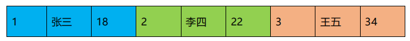

好处是想查某个人所有的属性时，可以通过一次磁盘查找加顺序读取就可以。

但是当想查所有人的年龄时，需要不停的查找，或者全表扫描才行，遍历的很多数据都是不需要的。

2）采用列式存储时，数据在磁盘上的组织结构为：

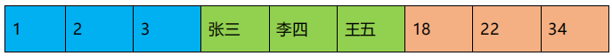

这时想查所有人的年龄只需把年龄那一列拿出来就可以了

3）列式储存的好处：

- 对于列的聚合，计数，求和等统计操作原因优于行式存储。
- 由于某一列的数据类型都是相同的，针对于数据存储更容易进行数据压缩，每一列选择更优的数据压缩算法，大大提高了数据的压缩比重。
- 由于数据压缩比更好，一方面节省了磁盘空间，另一方面对于 cache 也有了更大的发挥空间


### 1.1.2 DBMS 的功能

几乎覆盖了标准 SQL 的大部分语法，包括 DDL 和 DML，以及配套的各种函数，用户管理及权限管理，数据的备份与恢复。


### 1.1.3 多样化引擎

ClickHouse 和 MySQL 类似，把表级的存储引擎插件化，根据表的不同需求可以设定不同的存储引擎。目前包括合并树、日志、接口和其他四大类 20 多种引擎。


### 1.1.4 高吞吐写入能力

ClickHouse 采用类 **LSM Tree**的结构，数据写入后定期在后台 Compaction。通过类 LSM tree的结构，ClickHouse 在数据导入时全部是顺序 append 写，写入后数据段不可更改，在后台compaction 时也是多个段 merge sort 后顺序写回磁盘。**顺序写**的特性，充分利用了磁盘的吞吐能力，即便在 HDD 上也有着优异的写入性能。

官方公开 benchmark 测试显示能够达到 50MB-200MB/s 的写入吞吐能力，按照每行100Byte 估算，大约相当于 50W-200W 条/s 的写入速度。


### 1.1.5 数据分区与线程级并行

ClickHouse 将数据划分为多个 partition，每个 partition 再进一步划分为多个 index granularity(索引粒度)，然后通过多个 CPU核心分别处理其中的一部分来实现并行数据处理。**在这种设计下，单条 Query 就能利用整机所有 CPU。极致的并行处理能力，极大的降低了查询延时。**

所以，ClickHouse 即使对于大量数据的查询也能够化整为零平行处理。但是有一个弊端就是对于单条查询使用多 cpu，就不利于同时并发多条查询。

**所以对于高 qps 的查询业务，ClickHouse 并不是强项。**

### 1.1.6 性能对比

某网站精华帖，中对几款数据库做了性能对比。

1）单表查询

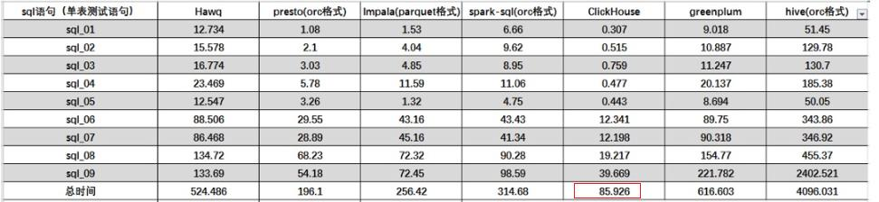

2）关联查询

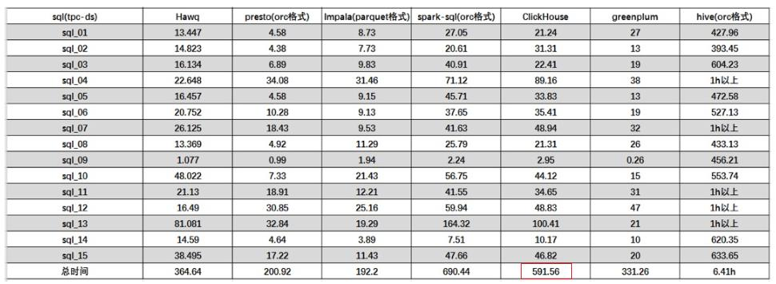

结论: 

**ClickHouse 像很多 OLAP 数据库一样，单表查询速度优于关联查询，而且 ClickHouse的两者差距更为明显。**


# 第 2 章 ClickHouse 的安装

todo


# 第 3 章 数据类型

## 3.1 整型

固定长度的整型，包括有符号整型或无符号整型。

整型范围（-2n-1~2n-1-1）：

- Int8 - [-128 : 127]
- Int16 - [-32768 : 32767]
- Int32 - [-2147483648 : 2147483647]
- Int64 - [-9223372036854775808 : 9223372036854775807]

无符号整型范围（0~2n-1）：

- UInt8 - [0 : 255]
- UInt16 - [0 : 65535]
- UInt32 - [0 : 4294967295]
- UInt64 - [0 : 18446744073709551615]

**使用场景： 个数、数量、也可以存储型 id**


## 3.2 浮点型

- Float32 - float
- Float64 – double

建议尽可能以整数形式存储数据。

例如，将固定精度的数字转换为整数值，如时间用毫秒为单位表示，因为浮点型进行计算时可能引起四舍五入的误差。

使用场景：

**一般数据值比较小，不涉及大量的统计计算，精度要求不高的时候。比如保存商品的重量。**


## 3.3 布尔型

没有单独的类型来存储布尔值。

可以使用 UInt8 类型，取值限制为 0 或 1。


## 3.4 Decimal 型

有符号的浮点数，可在加、减和乘法运算过程中保持精度。对于法，最低有效数字会被丢弃（不舍入）。

有三种声明：

- Decimal32(s)，相当于 Decimal(9-s,s)，有效位数为 1~9
- Decimal64(s)，相当于 Decimal(18-s,s)，有效位数为 1~18
- Decimal128(s)，相当于 Decimal(38-s,s)，有效位数为 1~38

s 标识小数位

使用场景：

 **一般金额字段、汇率、利率等字段为了保证小数点精度，都使用Decimal进行存储。**

## 3.5 字符串

1. String

   字符串可以任意长度的。它可以包含任意的字节集，包含空字节。

2. FixedString(N)
   固定长度 N 的字符串，N 必须是严格的正自然数。当服务端读取长度小于 N 的字符串时候，通过在字符串末尾添加空字节来达到 N 字节长度。 当服务端读长度大于 N 的字符串时候，将返回错误消息。

   与 String 相比，极少会使用 FixedString，因为使用起来不是很方便。

使用场景：

**名称、文字描述、字符型编码。 固定长度的可以保存一定长的内容，比如一些编码，性别等但是考虑到一定的变化风险，带收益不够明显，所以定长字符串使用意义有限。**

## 3.6 枚举类型

包括 Enum8 和 Enum16 类型。Enum 保存 'string'= integer 的对应关系。

Enum8 用 'String'= Int8 对描述。

Enum16 用 'String'= Int16 对描述。

1. 用法演示

   创建一个带有一个枚举 Enum8('hello' = 1, 'world' = 2) 类型的列

2. 这个 x 列只能存储类型定义中列出的值： ：'hello' 或'world'

   ```sh
   INSERT INTO t_enum VALUES ('hello'), ('world'), ('hello');
   ```

   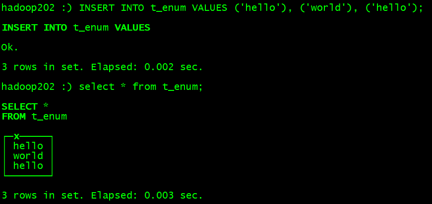

3. 如果尝试保存任何其他值，ClickHouse 抛出异常

   ```sh
   insert into t_enum values('a')
   ```

   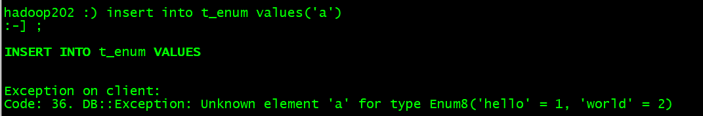

4. 如果需要看到对应行的数值，则必须将 Enum 值转换为整数类型

   ```sh
   SELECT CAST(x, 'Int8') FROM t_enum;!
   ```

   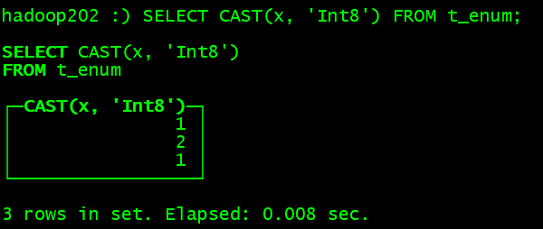

使用场景：

**对一些状态、类型的字段算是一种空间优化，也算是一种数据约束但是实际使用中往往因为一些数据内容的变化增加一定的维护成本，至是数据丢失问题。所以谨慎使用。**


## 3.7 时间类型

目前 ClickHouse 有三种时间类型

- Date 接受 年- 月- 日的字符串比如 ‘2019-12-16’
- Datetime 接受 年- 月- 日 时: 分: 秒的字符串比如 ‘2019-12-16 20:50:10’
- Datetime64 接受 年- 月- 日 时: 分: 秒. 亚秒的字符串比如‘2019-12-16 20:50:10.66’

日期类型，用两个字节存储，表示从 1970-01-01 (无符号) 到当前的日期值。

还有很多数据结构，可以参考官方文档：https://clickhouse.yandex/docs/zh/data_types/


## 3.8 数组

Array(T) ：由 T 类型元素组成的数组。

T 可以是任意类型，包含数组类型。 但不推荐使用多维数组ClickHouse 对多维数组的支持有限。例如，不能在 MergeTree 表中存储多维数组。

（1）创建数组方式 1，使用 array 函数

```sh
SELECT array(1, 2) AS x, toTypeName(x) ;
```

（2）创建数组方式 2：使用方括号

```sh
SELECT [1, 2] AS x, toTypeName(x);
```

# 第 4 章 表引擎

## 4.1 表引擎的使用

表引擎是 ClickHouse 的一大特色。可以说， 表引擎决定了如何存储表的数据。包括：

- 数据的存储方式和位置，写到哪里以及从哪里读取数据。
- 支持哪些查询以及如何支持。
- 并发数据访问。
- 索引的使用（如果存在）。
- 是否可以执行多线程请求。
- 数据复制参数。

**表引擎的使用方式就是必须显式在创建表时定义该表使用的引擎，以及引擎使用的相关参数。**

特别注意：**引擎的名称大小写敏感**


## 4.2 TinyLog

以列文件的形式保存在磁盘上，不支持索引，没有并发控制。一般保存少量数据的小表，生产环境上作用有限。可以用于平时练习测试用。

```sql
create table t_tinylog ( id String, name String) engine=TinyLog;
```


## 4.3 Memory

内存引擎，数据以未压缩的原始形式直接保存在内存当中，服务器重启数据就会消失。读写操作不会相互阻塞，不支持索引。简单查询下有非常非常高的性能表现（超过 10G/s）。

一般用到它的地方不多，除了用来测试，就是在需要非常高的性能，同时数据量又不太大（上限大概 1 亿行）的场景。


## 4.4 MergeTree

ClickHouse 中最强大的表引擎当属 MergeTree（合并树）引擎及该系列（*MergeTree）中的其他引擎，支持索引和分区，地位可以相当于 innodb 之于 Mysql。 而且基于 MergeTree，还衍生除了很多小弟，也是非常有特色的引擎。

1. 建表语句

   ```sql
   create table t_order_mt(
   id UInt32,
   sku_id String,
   total_amount Decimal(16,2),
   create_time Datetime
   ) engine =MergeTree
   partition by toYYYYMMDD(create_time)
   primary key (id)
   order by (id,sku_id);
   ```

2. 插入数据

   ```sql
   insert into t_order_mt values
   (101,'sku_001',1000.00,'2020-06-01 12:00:00') ,
   (102,'sku_002',2000.00,'2020-06-01 11:00:00'),
   (102,'sku_004',2500.00,'2020-06-01 12:00:00'),
   (102,'sku_002',2000.00,'2020-06-01 13:00:00'),
   (102,'sku_002',12000.00,'2020-06-01 13:00:00'),
   (102,'sku_002',600.00,'2020-06-02 12:00:00');
   ```

MergeTree 其实还有很多参数(绝大多数用默认值即可)，但是三个参数是更加重要的，也涉及了关于 MergeTree 的很多概念。

### 4.4.1 partition by 分区( 可选)

1. 作用：

   hive 的应该都不陌生，分区的目的主要是降低扫描的范围，优化查询速度

2.  如果不填

   只会使用一个分区。

3. 分区目录

   MergeTree 是以列文件+索引文件+表定义文件组成的，但是如果设定了分区那么这些文件就会保存到不同的分区目录中。

4.  并行

   分区后，面对涉及跨分区的查询统计，ClickHouse 会以分区为单位并行处理。

5. 数据写入与分区合并

   任何一个批次的数据写入都会产生一个临时分区，不会纳入任何一个已有的分区。写入后的某个时刻（大概10-15 分钟后），ClickHouse 会自动执行合并操作（等不及也可以手动通过 optimize 执行），把临时分区的数据，合并到已有分区中。

   ```sh
   optimize table xxxx final;
   ```

6. 例如：

   再次执行上面的插入操作

   ```sh
   insert into t_order_mt values
   (101,'sku_001',1000.00,'2020-06-01 12:00:00') ,
   (102,'sku_002',2000.00,'2020-06-01 11:00:00'),
   (102,'sku_004',2500.00,'2020-06-01 12:00:00'),
   (102,'sku_002',2000.00,'2020-06-01 13:00:00'),
   (102,'sku_002',12000.00,'2020-06-01 13:00:00'),
   (102,'sku_002',600.00,'2020-06-02 12:00:00');
   ```

   查看数据并没有纳入任何分区

   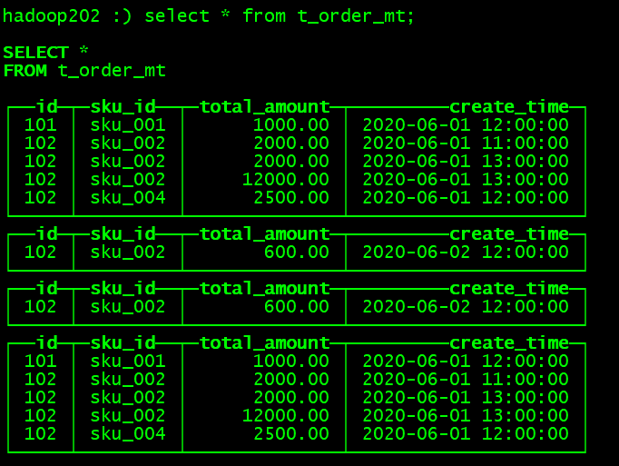
   
   手动 optimize 之后
   
   ```sh
   optimize table t_order_mt final;
   ```
   
   再次查询

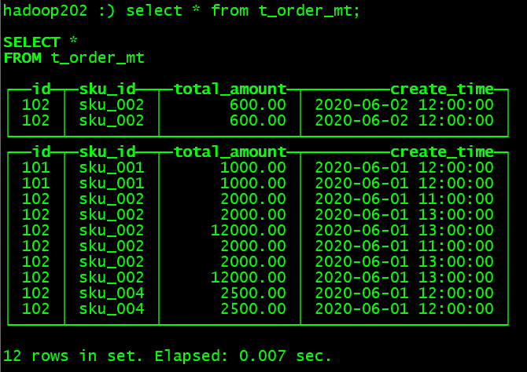

### 4.4.2 primary key 主键( 可选)

ClickHouse 中的主键，和其他数据库不太一样， **它只提供了数据的一级索引，但是却不是唯一约束**。这就意味着是可以存在相同 primary key 的数据的。

主键的设定主要依据是查询语句中的 where 条件。

根据条件通过对主键进行某种形式的二分查找，能够定位到对应的 index granularity,避免了全表扫描。

index granularity： 直接翻译的话就是**索引粒度，指在稀疏索引中两个相邻索引对应数据的间隔**。

ClickHouse 中的 MergeTree 默认是 8192。官方不建议修改这个值，除非该列存在大量重复值，比如在一个分区中几万行才有一个不同数据。

**稀疏索引**：

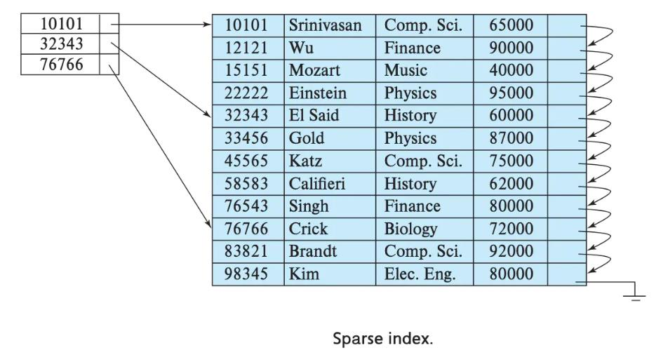

稀疏索引的好处就是可以用很少的索引数据，定位更多的数据，代价就是只能定位到索引粒度的第一行，然后再进行进行一点扫描。

### 4.4.3 order by （必选）

**order by 设定了分区内的数据按照哪些字段顺序进行有序保存。**

order by 是 MergeTree 中唯一一个必填项，甚至比 primary key 还重要，因为当用户不

设置主键的情况，很多处理会依照 order by 的字段进行处理（比如后面会讲的去重和汇总）。

- 要求：**主键必须是 order by 字段的前缀字段。**

比如 order by 字段是 (id,sku_id) 那么主键必须是 id 或者(id,sku_id)

### 4.4.4 二级索引

目前在 ClickHouse 的官网上二级索引的功能在 v20.1.2.4 之前是被标注为实验性的，在这个版本之后默认是开启的。

1. 老版本 使用二级索引前需要增加设置
   是否允许使用实验性的二级索引（v20.1.2.4 开始，这个参数已被删除，默认开启）

   ```sh
   set allow_experimental_data_skipping_indices=1;
   ```

2. 创建 测试表

   ```sql
   create table t_order_mt2(
   id UInt32,
   sku_id String,
   total_amount Decimal(16,2),
   create_time Datetime,
   INDEX a total_amount TYPE minmax GRANULARITY 5
   ) engine =MergeTree
   partition by toYYYYMMDD(create_time)
   primary key (id)
   order by (id, sku_id);
   ```

   其中 GRANULARITY N 是设定二级索引对于一级索引粒度的粒度。

3.  插入数据

   ```sql
   insert into t_order_mt2 values
   (101,'sku_001',1000.00,'2020-06-01 12:00:00') ,
   (102,'sku_002',2000.00,'2020-06-01 11:00:00'),
   (102,'sku_004',2500.00,'2020-06-01 12:00:00'),
   (102,'sku_002',2000.00,'2020-06-01 13:00:00'),
   (102,'sku_002',12000.00,'2020-06-01 13:00:00'),
   (102,'sku_002',600.00,'2020-06-02 12:00:00');
   ```

4.  对比效果

   那么在使用下面语句进行测试，可以看出二级索引能够为非主键字段的查询发挥作用。

   ```sh
   clickhouse-client --send_logs_level=trace <<< 'select
   * from t_order_mt2 where total_amount > toDecimal32(900., 2)';
   ```

   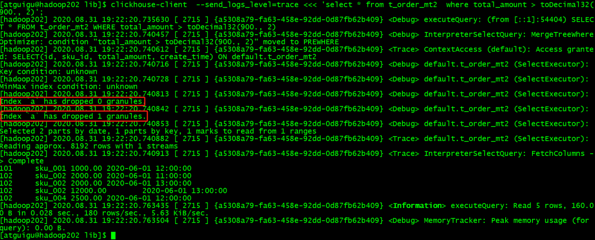

### 4.4.5 数据 TTL

TTL 即 Time To Live，MergeTree 提供了可以管理数据表或者列的生命周期的功能。

1. 列级别 TTL

   1. 创建测试表

      ```sql
      create table t_order_mt3(
      id UInt32,
      sku_id String,
      total_amount Decimal(16,2) TTL create_time+interval 10 SECOND,
      create_time Datetime
      ) engine =MergeTree
      partition by toYYYYMMDD(create_time)
      primary key (id)
      order by (id, sku_id);
      ```

   2. 插入数据（注意：根据实际时间改变）

      ```sql
      insert into t_order_mt3 values
      (106,'sku_001',1000.00,'2020-06-12 22:52:30'),
      (107,'sku_002',2000.00,'2020-06-12 22:52:30'),
      (110,'sku_003',600.00,'2020-06-13 12:00:00');
      ```

   3. 手动合并，查看效果 到期后，指定的字段数据归 0

      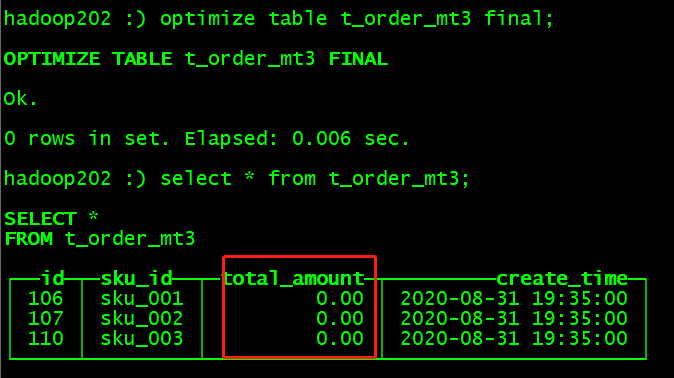

2. 表级 TTL

   下面的这条语句是数据会在 create_time 之后 10 秒丢失

   ```sql
   alter table t_order_mt3 MODIFY TTL create_time + INTERVAL 10 SECOND;
   ```

   涉及判断的字段必须是 Date 或者 Datetime 类型，推荐使用分区的日期字段。

   能够使用的时间周期：

   - SECOND
   - MINUTE
   - HOUR
   - DAY
   - WEEK
   - MONTH
   - QUARTER
   - YEAR

## 4.5 ReplacingMergeTree

ReplacingMergeTree 是 MergeTree 的一个变种，它存储特性完全继承 MergeTree，只是多了一个**去重**的功能。

尽管 MergeTree 可以设置主键，但是 primary key 其实没有唯一约束的功能。如果你想处理掉重复的数据，可以借助这个 ReplacingMergeTree。
