# 微服务(微服务概览与治理)

## 微服务概览

### 单体架构

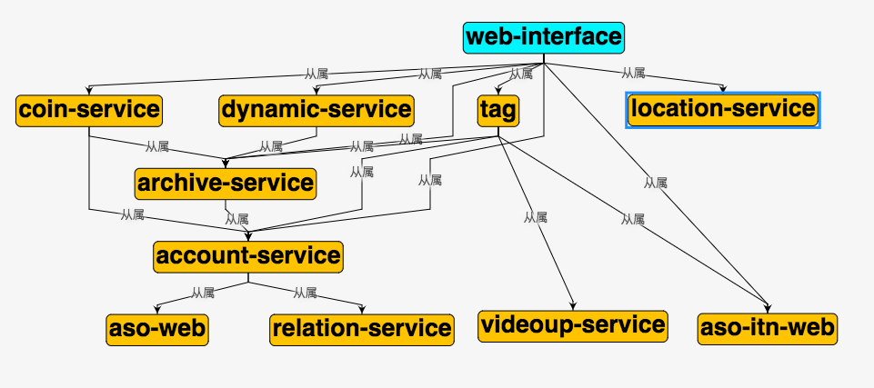

尽管也是模块化逻辑，但是最终它还是会打包并部署为单体式应用。其中最主要问题就是这个应用太复杂，以至于任何单个开发者都不可能搞懂它。应用无法扩展，可靠性很低，最终，敏捷性开发和部署变的无法完成。

我们应对的思路：

- 化繁为简，分而治之

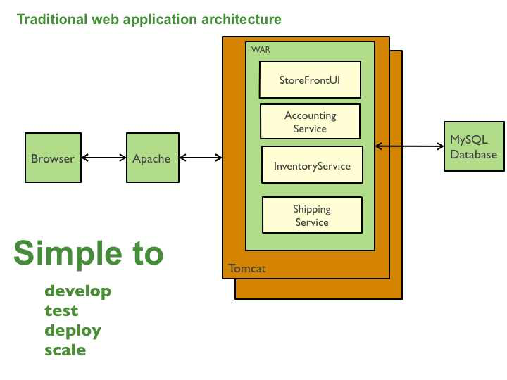

### 微服务起源 

大家经常谈论的是一个叫 SOA（面向服务的架构模式，它和微服务又是什么关系？你可以把微服务想成是 SOA 的一种实践。

- 小即是美：小的服务代码少，bug 也少，易测试，易维护，也更容易不断迭代完善的精致进而美妙。
- 单一职责：一个服务也只需要做好一件事，专注才能做好。
- 尽可能早地创建原型：尽可能早的提供服务 API，建立服务契约，达成服务间沟通的一致性约定，至于实现和完善可以慢慢再做。
- 可移植性比效率更重要：服务间的轻量级交互协议在效率和可移植性二者间，首要依然考虑兼容性和移植性。  


`You should instead think of Microservices as a specific approach for SOA in the same way that XP or Scrum arespecific approaches for Agile software development. ` 

### 微服务定义 

围绕业务功能构建的，服务关注单一业务，服务间采用轻量级的通信机制，可以全自动独立部署，可以使用不同的编程语言和数据存储技术。微服务架构通过业务拆分实现服务组件化，通过组件组合快速开发系统，业务单一的服务组件又可以独立部署，使得整个系统变得清晰灵活：

- *原子服务*
-  *独立进程*
-  *隔离部署*
-  *去中心化服务治理*

缺点：

- *基础设施的建设、复杂度高*


### 微服务不足  

Fred Brooks 在30年前写道，“**there are no silver bullets**”。但凡事有利就有弊，微服务也不是万能的。  

- 微服务应用是分布式系统，由此会带来固有的复杂性。开发者不得不使用 RPC 或者消息传递，来实现进程间通信；此外，必须要写代码来处理消息传递中速度过慢或者服务不可用等局部失效问题。
- 分区的数据库架构，同时更新多个业务主体的事务很普遍。这种事务对于单体式应用来说很容易，因为只有一个数据库。在微服务架构应用中，需要更新不同服务所使用的不同的数据库，从而对开发者提出了更高的要求和挑战。
- 测试一个基于微服务架构的应用也是很复杂的任务。
- 服务模块间的依赖，应用的升级有可能会波及多个服务模块的修改。
- 对运维基础设施的挑战比较大。  

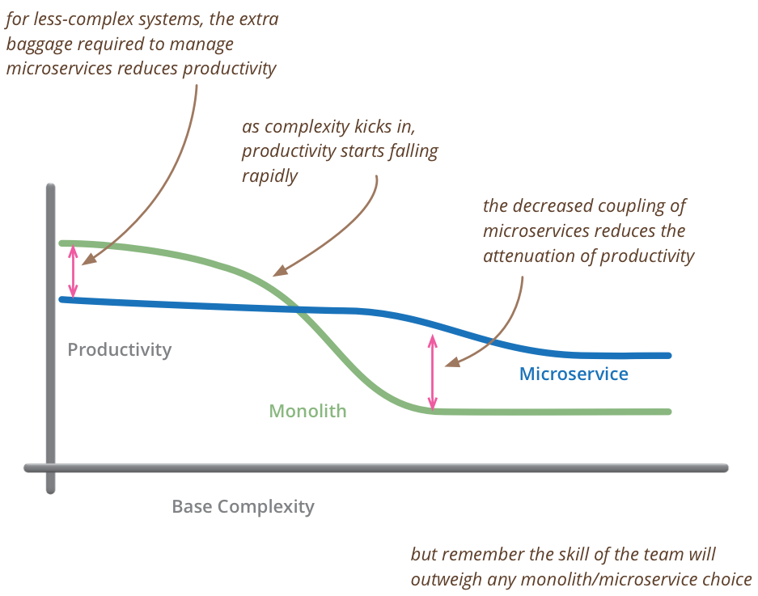

### 组件服务化  

传统实现组件的方式是通过库(library)，库是和应用一起运行在进程中，库的局部变化意味着整个应用的重新部署。 通过服务来实现组件，意味着将应用拆散为一系列的服务运行在不同的进程中，那么单一服务的局部变化只需重新部署对应的服务进程。我们用 Go 实施一个微服务：

- kit：一个微服务的基础库(框架)。
- service：业务代码 + kit 依赖 + 第三方依赖组成的业务微服务
- rpc + message queue：轻量级通讯

**本质上等同于，多个微服务组合(compose)完成了一个完整的用户场景(usecase)。**  

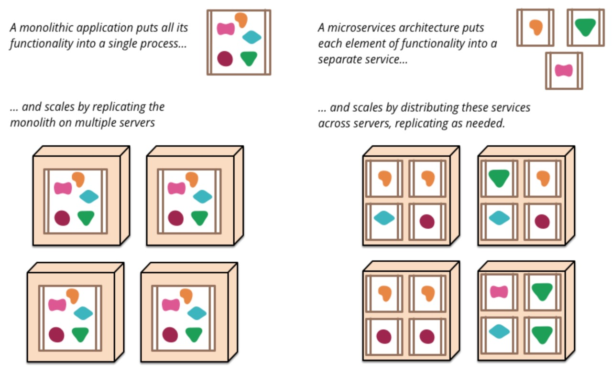

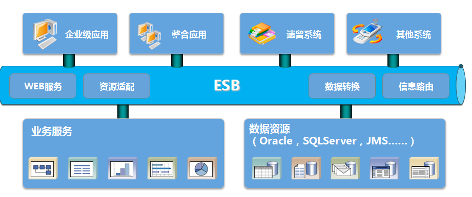

### 按业务组织服务  

按业务能力组织服务的意思是服务提供的能力和业务功能对应，比如：订单服务和数据访问服务，前者反应了真实的订单相关业务，后者是一种技术抽象服务不反应真实的业务。所以按微服务架构理念来划分服务时，是不应该存在数据访问服务这样一个服务的。

事实上传统应用设计架构的分层结构正反映了不同角色的沟通结构。所以若要按微服务的方式来构建应用，也需要对应调整团队的组织架构。每个服务背后的小团队的组织是跨功能的，包含实现业务所需的全面的技能。  

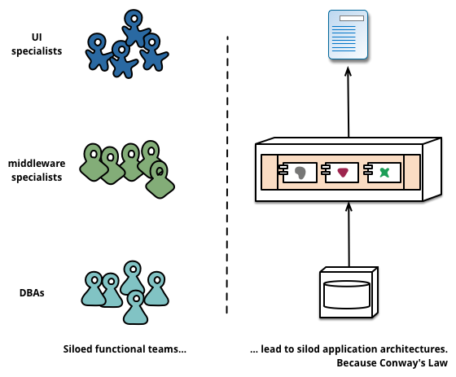

我们的模式：

大前端(移动/Web) =》 网关接入 =》业务服务 =》平台服务 =》基础设施(PaaS/Saas)

**开发团队对软件在生产环境的运行负全部责任！**

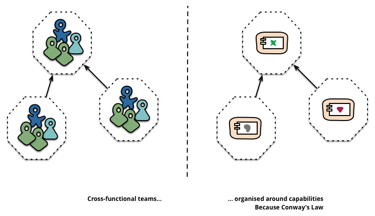

### 去中心化  

每个服务面临的业务场景不同，可以针对性的选择合适的技术解决方案。但也需要避免过度多样化，结合团队实际情况来选择取舍，要是每个服务都用不同的语言的技术栈来实现，想想维护成本真够高的。  

- 数据去中心化
- 治理去中心化
- 技术去中心化  

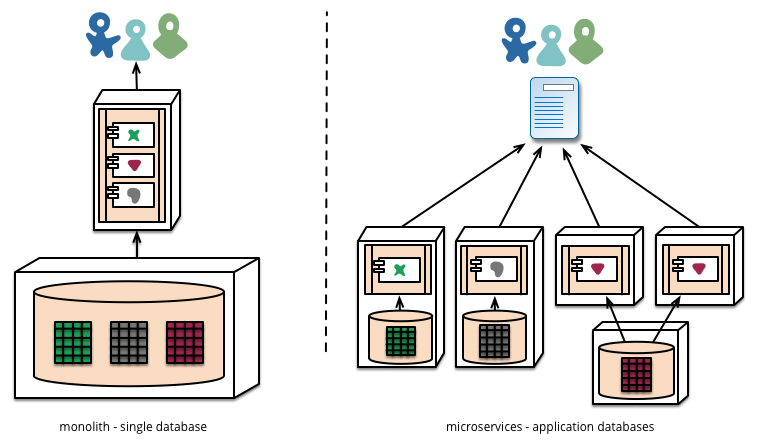

每个服务独享自身的数据存储设施(缓存，数据库等)，不像传统应用共享一个缓存和数据库，这样有利于服务的独立性，隔离相关干扰。  

### 基础设施自动化  

无自动化不微服务，自动化包括测试和部署。单一进程的传统应用被拆分为一系列的多进程服务后，意味着开发、调试、测试、监控和部署的复杂度都会相应增大，必须要有合适的自动化基础设施来支持微服务架构模式，否则开发、运维成本将大大增加。  

- CICD：Gitlab + Gitlab Hooks + k8s
- Testing：测试环境、单元测试、API自动化测试
- 在线运行时：k8s，以及一系列 Prometheus、ELK、Conrtol Panle  


### 可用性 & 兼容性设计  

著名的 Design For Failure 思想，微服务架构采用粗粒度的进程间通信，引入了额外的复杂性和需要处理的新问题，如网络延迟、消息格式、负载均衡和容错，忽略其中任何一点都属于对“分布式计算的误解”。  

- 隔离
- 超时控制
- 负载保护
- 限流
- 降级
- 重试
- 负载均衡  

一旦采用了微服务架构模式，那么在服务需要变更时我们要特别小心，服务提供者的变更可能引发服务消费者的兼容性破坏，时刻谨记保持服务契约(接口)的兼容性。  

`Be conservative in what you send, be liberal in what you accept.  `

发送时要保守，接收时要开放。按照伯斯塔尔法则的思想来设计和实现服务时，发送的数据要更保守，意味着最小化的传送必要的信息，接收时更开放意味着要最大限度的容忍冗余数据，保证兼容性。  

## 微服务设计  

### API Gateway  

我们进行了 SOA 服务化的架构演进，按照垂直功能进行了拆分，对外暴露了一批微服务，但是因为缺乏统一的出口面临了不少困难：  

- 客户端到微服务直接通信，强耦合。
- 需要多次请求，客户端聚合数据，工作量巨大，延迟高。
- 协议不利于统一，各个部门间有差异，需要端来兼容。
- 面向“端”的API适配，耦合到了内部服务。
- 多终端兼容逻辑复杂，每个服务都需要处理。
- 统一逻辑无法收敛，比如安全认证、限流。
- 我们之前提到了我们工作模型，要内聚模式配合  

**我们之前提到了我们工作模型，要内聚模式配合。**  

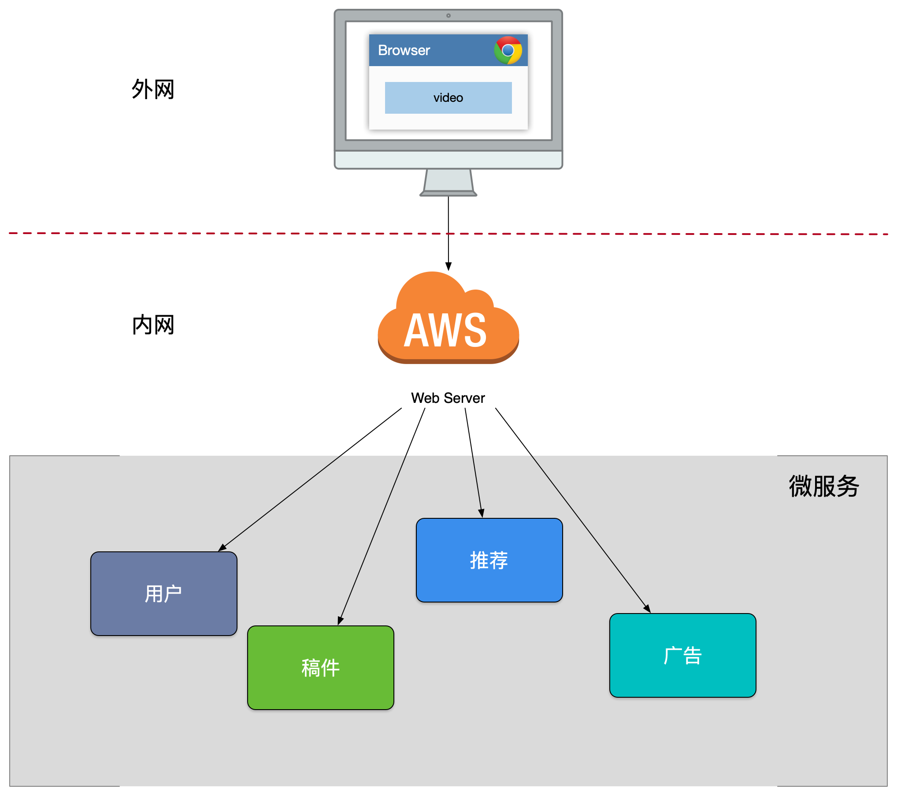

我们新增了一个 app-interface 用于统一的协议出口，在服务内进行大量的 dataset join，按照业务场景来设计粗粒度的 API，给后续服务的演进带来的很多优势：  

- 轻量交互：协议精简、聚合。
- 差异服务：数据裁剪以及聚合、针对终端定制化API。
- 动态升级：原有系统兼容升级，更新服务而非协议。
-  沟通效率提升，协作模式演进为移动业务+网关小组  

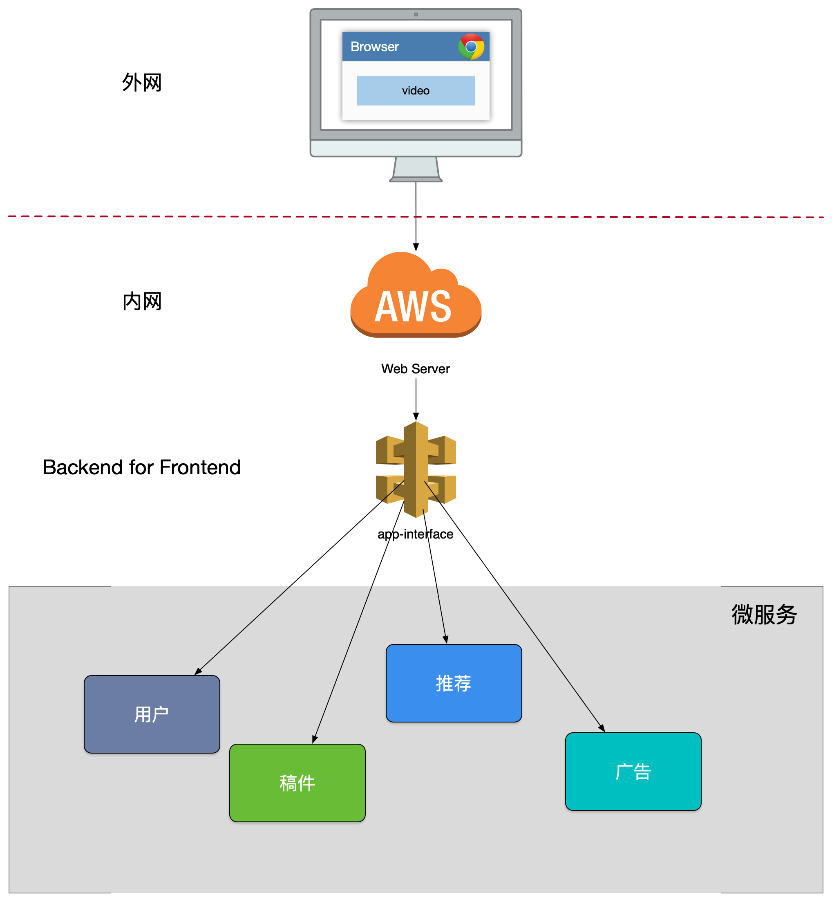

**BFF 可以认为是一种适配服务，将后端的微服务进行适配(主要包括聚合裁剪和格式适配等逻辑)，向无线端设备暴露友好和统一的 API，方便无线设备接入访问后端服务。**  

最致命的一个问题是整个 app-interface 属于**single point of failure**，严重代码缺陷或者流量洪峰可能引发集群宕机。  

- 单个模块也会导致后续业务集成复杂度高，根据康威法则，单块的无线BFF和多团队之间就出现不匹配问题，团队之间沟通协调成本高，交付效率低下。  
- 很多跨横切面逻辑，比如安全认证，日志监控，限流熔断等。随着时间的推移，代码变得越来越复杂，技术债越堆越多。  


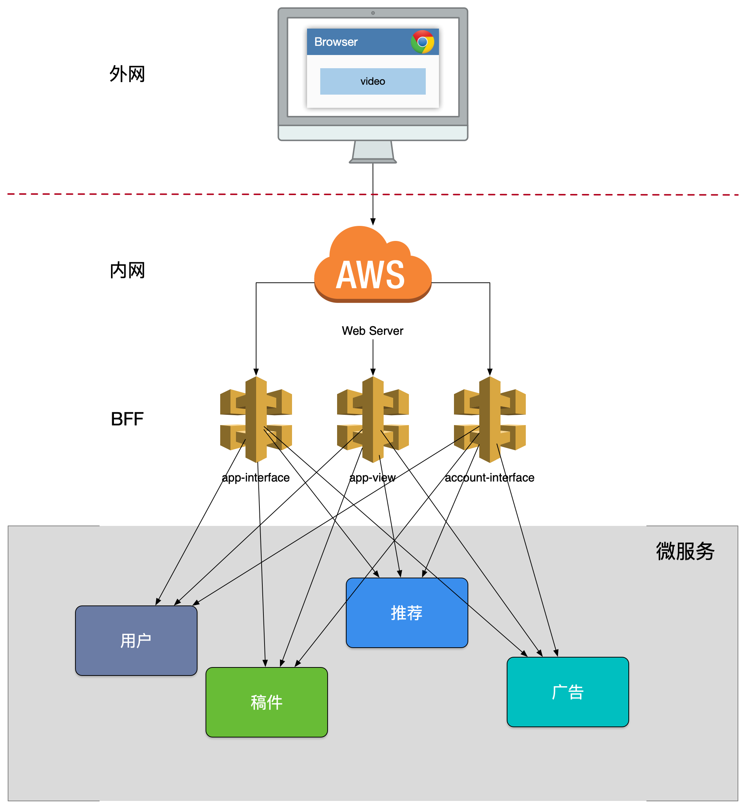

跨横切面(Cross-Cutting Concerns)的功能，需要协调更新框架升级发版(路由、认证、限流、安全)，因此全部上沉，引入了 API Gateway，把业务集成度高的 BFF 层和通用功能服务层 API Gateway 进行了分层处理。  

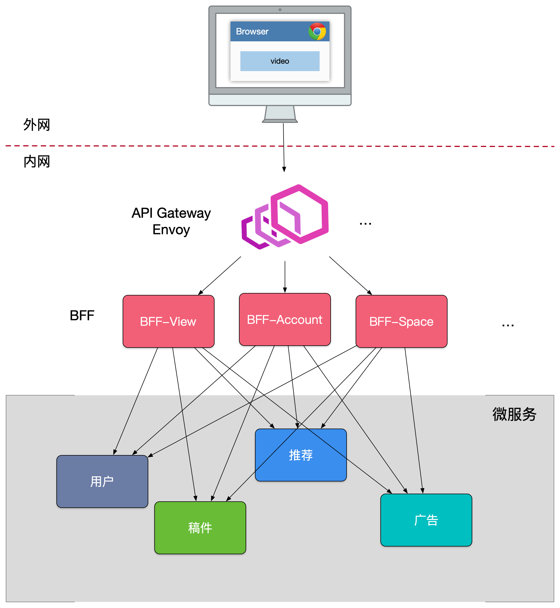

在新的架构中，网关承担了重要的角色，它是解耦拆分和后续升级迁移的利器。在网关的配合下，单块 BFF实现了解耦拆分，各业务线团队可以独立开发和交付各自的微服务，研发效率大大提升。另外，把跨横切面逻辑从 BFF 剥离到网关上去以后，BFF 的开发人员可以更加专注业务逻辑交付，实现了架构上的关注分离(Separation of Concerns)。  

我们业务流量实际为：

**移动端 -> API Gateway -> BFF -> Mircoservice，在BFE Web业务中，BFF 可以是 nodejs 来做服务端渲染(SSR，Server-Side Rendering)，注意这里忽略了上游的 CDN、4/7层负载均衡(ELB)。**  

### Mircoservice 划分  

微服务架构时遇到的第一个问题就是如何划分服务的边界。在实际项目中通常会采用两种不同的方式划分服务边界，即通过业务职能(Business Capability)或是 DDD 的限界上下文(Bounded Context)。  

- Business Capability

  由公司内部不同部门提供的职能。例如客户服务部门提供客户服务的职能，财务部门提供财务相关的职能。  

- Bounded Context  

  限界上下文是 DDD 中用来划分不同业务边界的元素，这里业务边界的含义是“解决不同业务问题”的问题域和对应的解决方案域，为了解决某种类型的业务问题，贴近领域知识，也就是业务。  

**这本质上也促进了组织结构的演进：Service per team**  

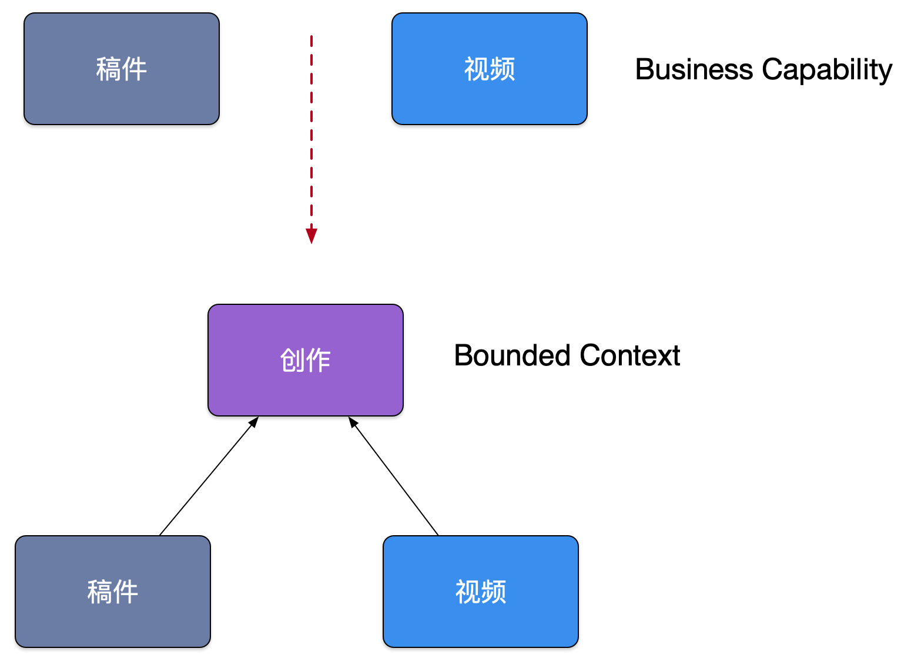

### CQRS  

CQRS，将应用程序分为两部分：命令端和查询端。命令端处理程序创建，更新和删除请求，并在数据更改时发出事件。查询端通过针对一个或多个物化视图执行查询来处理查询，这些物化视图通过订阅数据更改时发出的事件流而保持最新。  

在稿件服务演进过程中，我们发现围绕着创作稿件、审核稿件、最终发布稿件有大量的逻辑揉在一块，其中稿件本身的状态也有非常多种，但是最终前台用户只关注稿件能否查看，我们依赖稿件数据库 binlog 以及订阅binlog 的中间件 canal，将我们的稿件结果发布到消息队列 kafka 中，最终消费数据独立组建一个稿件查阅结果数据库，并对外提供一个独立查询服务，来拆分复杂架构和业务。  

**我们架构也从 Polling publisher -> Transaction log tailing 进行了演进(Pull vs Push)。**  


### Mircoservice 安全  

对于外网的请求来说，我们通常在 API Gateway进行统一的认证拦截，一旦认证成功，我们会使用 JWT 方式通过 RPC 元数据传递的方式带到BFF 层，BFF 校验 Token 完整性后把身份信息注入到应用的 Context 中，BFF 到其他下层的微服务，建议是直接在 RPC Request 中带入用户身份信息(UserID)请求服务。  

- API Gateway -> BFF -> Service  

  Biz Auth -> JWT -> Request Args  

对于服务内部，一般要区分身份认证和授权。  

- Full Trust  
- Half Trust  
- Zero Trust  


## gRPC & 服务发现  

### gRPC  

gRPC 是什么可以用官网的一句话来概括

`“A high-performance, open-source universalRPC framework”`

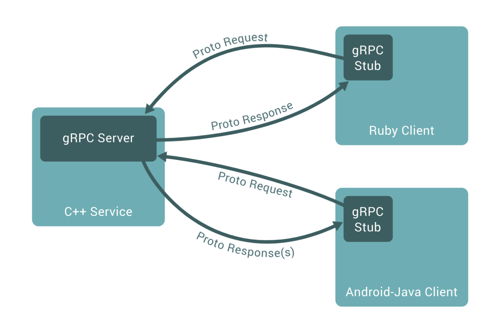

- 多语言：语言中立，支持多种语言。
-  轻量级、高性能：序列化支持 PB(Protocol Buffer)和JSON，PB 是一种语言无关的高性能序列化框架。
- 可插拔
- IDL：基于文件定义服务，通过 proto3 工具生成指定语言的数据结构、服务端接口以及客户端 Stub。
- 设计理念
- 移动端：基于标准的 HTTP2 设计，支持双向流、消息头压缩、单 TCP 的多路复用、服务端推送等特性，这些特性使得 gRPC 在移动端设备上更加省电和节省网络流量。
- 服务而非对象、消息而非引用：促进微服务的系统间粒度消息交互设计理念。   
- 负载无关的：不同的服务需要使用不同的消息类型和编码，例如 protocol buffers、JSON、XML 和 Thrift。
- 流：Streaming API。    
- 阻塞式和非阻塞式：支持异步和同步处理在客户端和服务端间交互的消息序列  。
- 元数据交换：常见的横切关注点，如认证或跟踪，依赖数据交换。  
- 标准化状态码：客户端通常以有限的方式响应 API 调用返回的错误。  

**不要过早关注性能问题，先标准化。**  

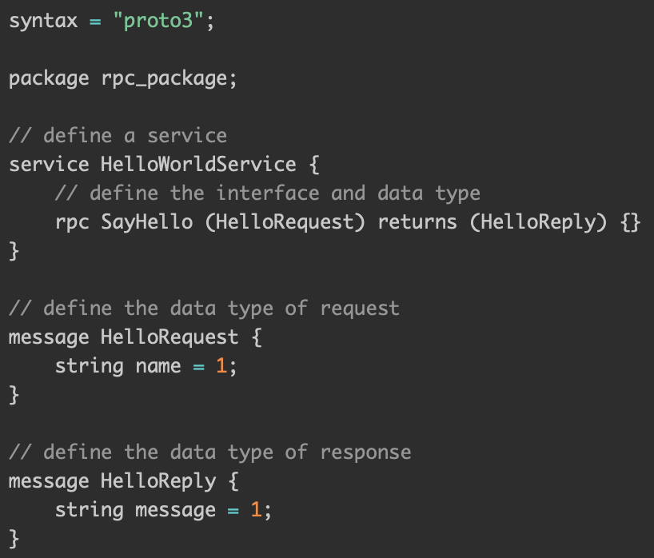

```sh
protoc --go_out=. --go_opt=paths=source_relative \
--go-grpc_out=. --go-grpc_opt=paths=source_relative \
helloworld/helloworld.proto
```

### gRPC - HealthCheck  

gRPC 有一个标准的健康检测协议，在 gRPC 的所有语言实现中基本都提供了生成代码和用于设置运行状态的功能。  

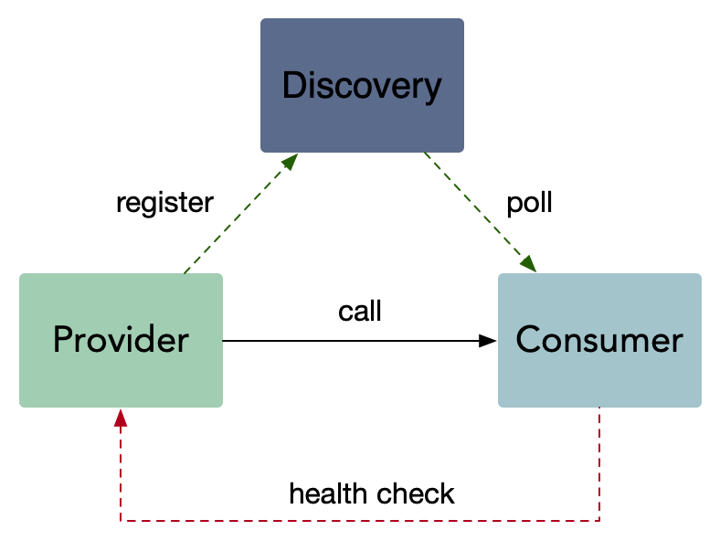

主动健康检查 health check，可以在服务提供者服务不稳定时，被消费者所感知，临时从负载均衡中摘除，减少错误请求。当服务提供者重新稳定后，health check成功，重新加入到消费者的负载均衡，恢复请求。health check，同样也被用于外挂方式的容器健康检测，或者流量检测(k8s liveness & readiness)。  

### 平滑发布  

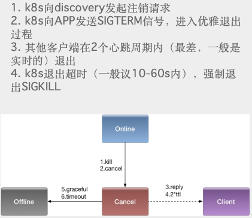

### 服务发现 - 客户端发现  

一个服务实例被启动时，它的网络地址会被写到注册表上；当服务实例终止时，再从注册表中删除；这个服务实例的注册表通过心跳机制动态刷新；客户端使用一个负载均衡算法，去选择一个可用的服务实例，来响应这个请求。  

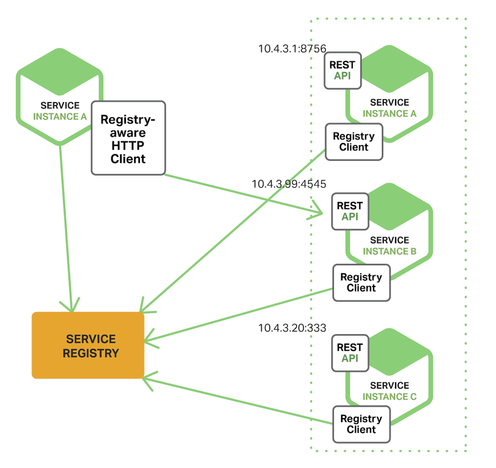

客户端通过负载均衡器向一个服务发送请求，这个负载均衡器会查询服务注册表，并将请求路由到可用的服务实例上。服务实例在服务注册表上被注册和注销(Consul Template+Nginx，kubernetes+etcd)。  

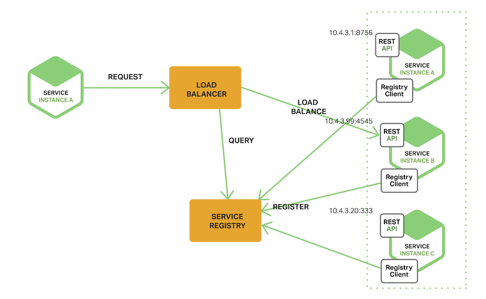

### 服务发现  

客户端发现：  

直连，比服务端服务发现少一次网络跳转，Consumer 需要内置特定的服务发现客户端和发现逻辑。  

服务端发现：

Consumer 无需关注服务发现具体细节，只需知道服务的 DNS 域名即可，支持异构语言开发，需要基础设施支撑，多了一次网络跳转，可能有性能损失。  


**微服务的核心是去中心化，我们使用客户端发现模式。**  

早期我们使用最熟悉的 Zookeeper 作为服务发现，但是实际场景是海量服务发现和注册，服务状态可以弱一致, 需要的是 AP 系统。  

- 分布式协调服务(要求任何时刻对 ZooKeeper的访问请
  求能得到一致的数据，从而牺牲可用性)。
- 网络抖动或网络分区会导致的 master 节点因为其他节
  点失去联系而重新选举或超过半数不可用导致服务注
  册发现瘫痪。
- 大量服务长连接导致性能瓶颈。

我们参考了 Eureka 实现了自己的 AP 发现服务，试想两个场景，牺牲一致性，最终一致性的情况：

- 注册的事件延迟
- 注销的事件延迟  

### Eureka 实现


- 通过 Family(appid) 和 Addr(IP:Port) 定位实例，除此之外还可以附加更多的元数据：权重、染色标签、集群等。  

  appid: 使用三段式命名，business.service.xxx  

- Provider 注册后定期(30s)心跳一次，注册，心跳，下线都需要进行同步，注册和下线需要进行长轮询推送。  

  新启动节点，需要 load cache，JVM 预热。  

  故障时，Provider 不建议重启和发布。  

- Consumer 启动时拉取实例，发起30s长轮询。  

  故障时，需要 client 侧 cache 节点信息。  

- Server 定期(60s) 检测失效(90s)的实例，失效则剔除。短时间里丢失了大量的心跳连接(15分钟内心跳低于期望值*85%)，开启自我保护，保留过期服务不删除。  

## 多集群 & 多租户  

### 多集群  

L0 服务，类似像我们账号，之前是一套大集群，一旦故障影响返回巨大，所以我们从几个角度考虑多集群的必要性：  

- 从单一集群考虑，多个节点保证可用性，我们通常使用 N+2 的方式来冗余节点。  
- 从单一集群故障带来的影响面角度考虑冗余多套集群。  
- 单个机房内的机房故障导致的问题。  


我们利用 paas 平台，给某个 appid 服务建立多套集群(物理上相当于两套资源，逻辑上维护 cluster 的概念)，对于不同集群服务启动后，从环境变量里可以获取当下服务的 cluster，在服务发现注册的时候，带入这些元信息。当然，不同集群可以隔离使用不同的缓存资源等。  

- 多套冗余的集群对应多套独占的缓存，带来更好的性能和冗余能力。
- 尽量避免业务隔离使用或者 sharding 带来的cache hit 影响（按照业务划分集群资源）。  

**业务隔离集群带来的问题是 cache hit ratio 下降，不同业务形态数据正交，我们推而求其次整个集群全部连接。**  

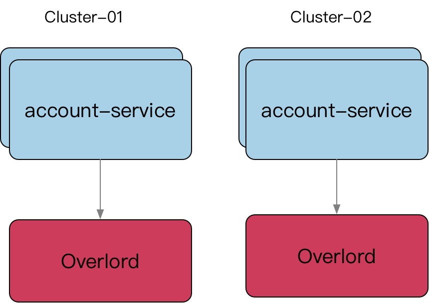

统一为一套逻辑集群（物理上多套资源池），即 gRPC 客户端默认忽略服务发现中的 cluster 信息，按照全部节点，全部连接。能不能找到一种算法从全集群中选取一批节点(子集)，利用划分子集限制连接池大小。  

- 长连接导致的内存和 CPU 开销，HealthCheck 可以高达30%。 
-  短连接极大的资源成本和延迟。  


合适的子集大小和选择算法  

- 通常20-100个后端，部分场景需要大子集，比如大批量读写操作。  
- 后端平均分给客户端。
- 客户端重启，保持重新均衡，同时对后端重启保持透明，同时连接的变动最小。  


### 多租户  

在一个微服务架构中允许多系统共存是利用微服务稳定性以及模块化最有效的方式之一，这种方式一般被称为多租户(multi-tenancy)。租户可以是测试，金丝雀发布，影子系统(shadowsystems)，甚至服务层或者产品线，使用租户能够保证代码的隔离性并且能够基于流量租户做路由决策。  

对于传输中的数据(data-in-flight)（例如，消息队列中的请求或者消息）以及静态数据(data-at-rest)（例如，存储或者持久化缓存），租户都能够保证隔离性和公平性，以及基于租户的路由机会。  

如果我们对服务 B 做出改变，我们需要确保它仍然能够和服务 A，C，D 正常交互。在微服务架构中，我们需要做这些集成测试场景，也就是测试和该系统中其他服务的交互。通常来说，微服务架构有两种基本的集成测试方式：并行测试和生产环境测试。  

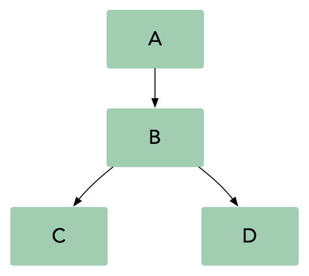

并行测试需要一个和生产环境一样的过渡(staging)环境，并且只是用来处理测试流量。在并行测试中，工程师团队首先完成生产服务的一次变动，然后将变动的代码部署到测试栈。这种方法可以在不影响生产环境的情况下让开发者稳定的测试服务，同时能够在发布前更容易的识别和控制 bug。尽管并行测试是一种非常有效的集成测试方法，但是它也带来了一些可能影响微服务架构成功的挑战：  

- 混用环境导致的不可靠测试。
- 多套环境带来的硬件成本。
- 难以做负载测试，仿真线上真实流量情况。  

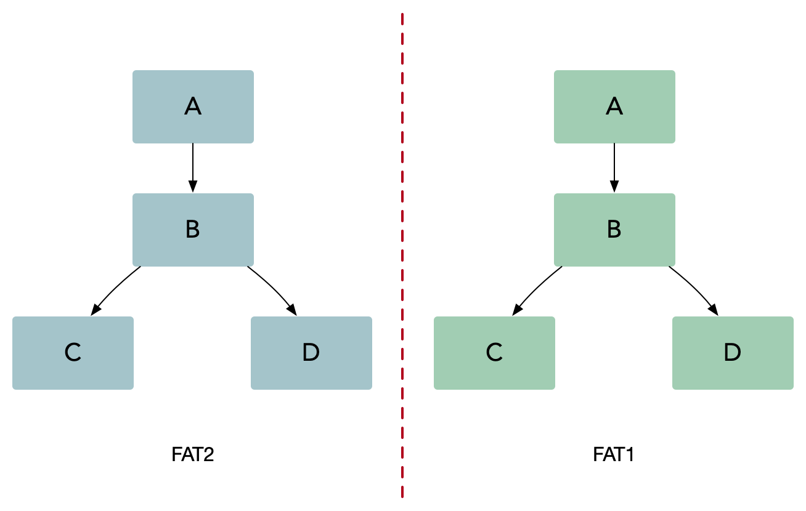

使用这种方法(内部叫染色发布)，我们可以把待测试的服务 B 在一个隔离的沙盒环境中启动，并且在沙盒环境下可以访问集成环境(UAT) C 和 D。我们把测试流量路由到服务 B，同时保持生产流量正常流入到集成服务。服务 B 仅仅处理测试流量而不处理生产流量。另外要确保集成流量不要被测试流量影响。生产中的测试提出了两个基本要求，它们也构成了多租户体系结构的基础：  

- 流量路由：能够基于流入栈中的流量类型做路由。
- 隔离性：能够可靠的隔离测试和生产中的资源，这样可以保证对于关键业务微服务没有副作用。  

**灰度测试成本代价很大，影响 1/N 的用户。其中 N 为节点数量。**  

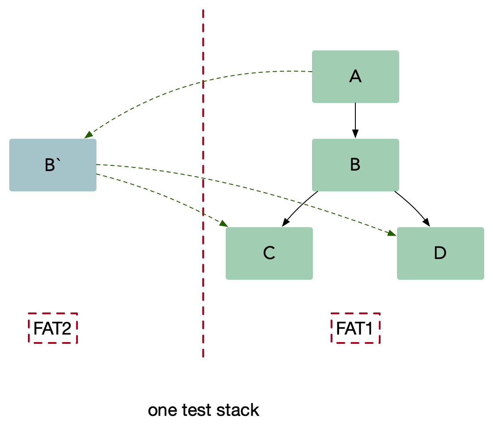

给入站请求绑定上下文(如: http header)， inprocess 使用 context 递，跨服务使用metadata 传递(如: opentracing baggage item)，在这个架构中每一个基础组件都能够理解租户信息，并且能够基于租户路由隔离流量，同时在我们的平台中允许对运行不同的微服务有更多的控制，比如指标和日志。在微服务架构中典型的基础组件是日志，指标，存储，消息队列，缓存以及配置。基于租户信息隔离数据需要分别处理基础组件。  

多租户架构本质上描述为：  

**跨服务传递请求携带上下文(context)，数据隔离的流量路由方案。**  

**利用服务发现注册租户信息，注册成特定的租户。**  

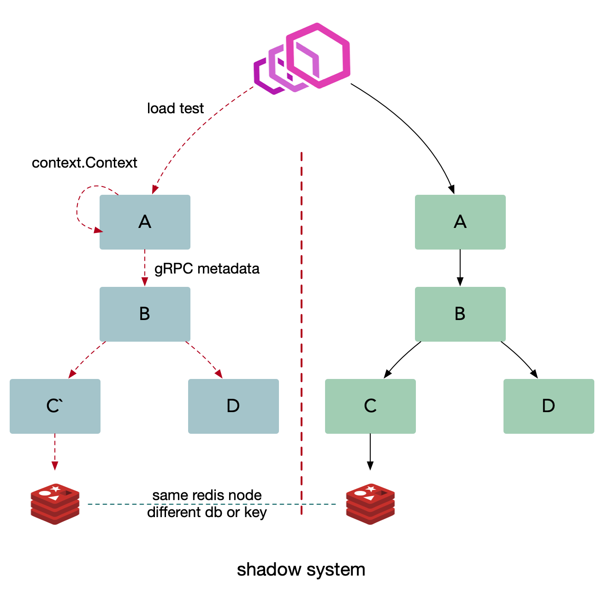