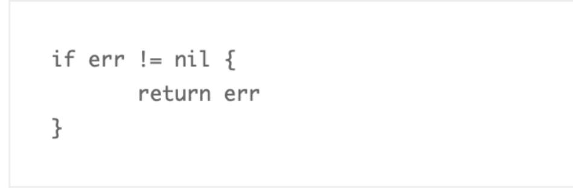

Go 语言实践 - error

## Error vs Exception

### Error

Go error  就是普通的一个接口，普通的值。


我们经常使用 errors.New() 来返回一个 error 对象。


基础库中大量自定义的 error。


errors.New() 返回的是内部 errorString 对象的指针。


Output:
Named Type Error


Output:
Error: EOF


### Error vs Exception

各个语言的演进历史：

- C
      单返回值，一般通过传递指针作为入参，返回值为 int 表示成功还是失败。

  ```c
      ngx_int_t ngx_create_path(ngx_file_t *file, ngx_path_t *path);
  ```

- C++
      引入了 exception，但是无法知道被调用方会抛出什么异常。

- Java
      引入了 checked exception，方法的所有者必须申明，调用者必须处理。在启动时抛出大量的异常是司空见惯的事情，并在它们的调用堆栈中尽职地记录下来。Java 异常不再是异常，而是变得司空见惯了。它们从良性到灾难性都有使用，异常的严重性由函数的调用者来区分。

  ```java
  java.Error & java.RuntimeException
  ```

  


Go 的处理异常逻辑是不引入 exception，支持多参数返回，所以你很容易的在函数签名中带上实现了 error interface 的对象，交由调用者来判定。


如果一个函数返回了 value, error，你不能对这个 value 做任何假设，必须先判定 error。唯一可以忽略 error 的是，如果你连 value 也不关心。

Go 中有 panic 的机制，如果你认为和其他语言的 exception 一样，那你就错了。当我们抛出异常的时候，相当于你把 exception 扔给了调用者来处理。

比如，你在 C++ 中，把 string 转为 int，如果转换失败，会抛出异常。或者在 java 中转换 string 为 date 失败时，会抛出异常。


Go panic 意味着 fatal error(就是挂了)。不能假设调用者来解决 panic，意味着代码不能继续运行。

**使用多个返回值和一个简单的约定，Go 解决了让程序员知道什么时候出了问题，并为真正的异常情况保留了 panic。**


对于真正意外的情况，那些表示不可恢复的程序错误，例如索引越界、不可恢复的环境问题、栈溢出，我们才使用 panic。对于其他的错误情况，我们应该是期望使用 error 来进行判定。

`you only need to check the error value if you care about the result.  -- Dave
This blog post from Microsoft’s engineering blog in 2005 still holds true today, namely:
My point isn’t that exceptions are bad. My point is that exceptions are too hard and I’m not smart enough to handle them.`

- 简单。
- 考虑失败，而不是成功(Plan for failure, not success)。
- 没有隐藏的控制流。
- 完全交给你来控制 error。
- Error are values。

## Error Type

### Sentinel Error

预定义的特定错误，我们叫为 sentinel error，这个名字来源于计算机编程中使用一个特定值来表示不可能进行进一步处理的做法。所以对于 Go，我们使用特定的值来表示错误。

```go
if err == ErrSomething { … }
```

类似的 io.EOF，更底层的 syscall.ENOENT。

使用 sentinel 值是最不灵活的错误处理策略，因为调用方必须使用 == 将结果与预先声明的值进行比较。当您想要提供更多的上下文时，这就出现了一个问题，因为返回一个不同的错误将破坏相等性检查。

甚至是一些有意义的 fmt.Errorf 携带一些上下文，也会破坏调用者的 == ，调用者将被迫查看 error.Error() 方法的输出，以查看它是否与特定的字符串匹配。

- 不依赖检查 error.Error 的输出。

  不应该依赖检测 error.Error 的输出，Error 方法存在于 error 接口主要用于方便程序员使用，但不是程序(编写测试可能会依赖这个返回)。这个输出的字符串用于记录日志、输出到 stdout 等。   

- Sentinel errors 成为你 API 公共部分。

- 如果您的公共函数或方法返回一个特定值的错误，那么该值必须是公共的，当然要有文档记录，这会增加API 的表面积。

  如果 API 定义了一个返回特定错误的 interface，则该接口的所有实现都将被限制为仅返回该错误，即使它们可以提供更具描述性的错误。

  比如 io.Reader。像 io.Copy 这类函数需要 reader 的实现者比如返回 io.EOF 来告诉调用者没有更多数据了，但这又不是错误。

- Sentinel errors 在两个包之间创建了依赖。

  sentinel errors 最糟糕的问题是它们在两个包之间创建了源代码依赖关系。例如，检查错误是否等于 io.EOF，您的代码必须导入 io 包。这个特定的例子听起来并不那么糟糕，因为它非常常见，但是想象一下，当项目中的许多包导出错误值时，存在耦合，项目中的其他包必须导入这些错误值才能检查特定的错误条件(in the form of an import loop)

- **结论: 尽可能避免 sentinel errors。**

  我的建议是避免在编写的代码中使用 sentinel errors。在标准库中有一些使用它们的情况，但这不是一个您应该模仿的模式。

### Error types

Error type 是实现了 error 接口的自定义类型。例如 MyError 类型记录了文件和行号以展示发生了什么。


因为 MyError 是一个 type，调用者可以使用断言转换成这个类型，来获取更多的上下文信息。 


与错误值相比，错误类型的一大改进是它们能够包装底层错误以提供更多上下文。

一个不错的例子就是 os.PathError 他提供了底层执行了什么操作、那个路径出了什么问题。


调用者要使用类型断言和类型 switch，就要让自定义的 error 变为 public。这种模型会导致和调用者产生强耦合，从而导致 API 变得脆弱。

**结论是尽量避免使用 error types，虽然错误类型比 sentinel errors 更好，因为它们可以捕获关于出错的更多上下文，但是 error types 共享 error values 许多相同的问题。**

**因此，我的建议是避免错误类型，或者至少避免将它们作为公共 API 的一部分。**

### Opaque errors

在我看来，这是最灵活的错误处理策略，因为它要求代码和调用者之间的耦合最少。

我将这种风格称为不透明错误处理，因为虽然您知道发生了错误，但您没有能力看到错误的内部。作为调用者，关于操作的结果，您所知道的就是它起作用了，或者没有起作用(成功还是失败)。

这就是不透明错误处理的全部功能–只需返回错误而不假设其内容。

- Assert errors for behaviour, not type
  在少数情况下，这种二分错误处理方法是不够的。例如，与进程外的世界进行交互(如网络活动)，需要调用方调查错误的性质，以确定重试该操作是否合理。在这种情况下，我们可以断言错误实现了特定的行为，而不是断言错误是特定的类型或值。考虑这个例子：

  

  

  

  **这里的关键是，这个逻辑可以在不导入定义错误的包或者实际上不了解 err 的底层类型的情况下实现——我们只对它的行为感兴趣。**

## Handling Error

### Indented flow is for errors

无错误的正常流程代码，将成为一条直线，而不是缩进的代码。


### Eliminate error handling by eliminating errors

下面的代码有啥问题？


统计 io.Reader 读取内容的行数


改进版本: 


例子2：


### Wrap erros

还记得之前我们 auth 的代码吧，如果 authenticate 返回错误，则 AuthenticateRequest 会将错误返回给调用方，调用者可能也会这样做，依此类推。在程序的顶部，程序的主体将把错误打印到屏幕或日志文件中，打印出来的只是：没有这样的文件或目录。


没有生成错误的 file:line 信息。没有导致错误的调用堆栈的堆栈跟踪。这段代码的作者将被迫进行长时间的代码分割，以发现是哪个代码路径触发了文件未找到错误。


但是正如我们前面看到的，这种模式与 sentinel errors 或 type assertions 的使用不兼容，因为将错误值转换为字符串，将其与另一个字符串合并，然后将其转换回 fmt.Errorf 破坏了原始错误，导致等值判定失败。

`you should only handle errors once. Handling an error means inspecting the error value, and making a single decision.`


我们经常发现类似的代码，在错误处理中，带了两个任务: 记录日志并且再次返回错误。


在这个例子中，如果在 w.Write 过程中发生了一个错误，那么一行代码将被写入日志文件中，记录错误发生的文件和行，并且错误也会返回给调用者，调用者可能会记录并返回它，一直返回到程序的顶部。


unable to write: io.EOF
could not write config: io.EOF


Go 中的错误处理契约规定，在出现错误的情况下，不能对其他返回值的内容做出任何假设。由于 JSON 序列化失败，buf 的内容是未知的，可能它不包含任何内容，但更糟糕的是，它可能包含一个半写的 JSON 片段。

由于程序员在检查并记录错误后忘记 return，损坏的缓冲区将被传递给 WriteAll，这可能会成功，因此配置文件将被错误地写入。但是，该函数返回的结果是正确的。


日志记录与错误无关且对调试没有帮助的信息应被视为噪音，应予以质疑。记录的原因是因为某些东西失败了，而日志包含了答案。

- The error has been logged. 错误要被日志记录。
- The application is back to 100% integrity. 应用程序处理错误，保证100%完整性。
- The current error is not reported any longer. 之后不再报告当前错误。

`github.com/pkg/errors`


通过使用 pkg/errors 包，您可以向错误值添加上下文，这种方式既可以由人也可以由机器检查。


- 在你的应用代码中，使用 errors.New 或者  errros.Errorf 返回错误。

  

- 如果调用其他的函数，通常简单的直接返回。

  

- 如果和其他库进行协作，考虑使用 errors.Wrap 或者 errors.Wrapf 保存堆栈信息。同样适用于和标准库协作的时候。 

  

- 直接返回错误，而不是每个错误产生的地方到处打日志。

- 在程序的顶部或者是工作的 goroutine 顶部(请求入口)，使用 %+v 把堆栈详情记录。

  

- 使用 errors.Cause 获取 root error，再进行和 sentinel error 判定。


总结:

- Packages that are reusable across many projects only return root error values.

  选择 wrap error 是只有 applications 可以选择应用的策略。具有最高可重用性的包只能返回根错误值。此机制与 Go 标准库中使用的相同(kit 库的 sql.ErrNoRows)。

- If the error is not going to be handled, wrap and return up the call stack.

  这是关于函数/方法调用返回的每个错误的基本问题。如果函数/方法不打算处理错误，那么用足够的上下文 wrap errors 并将其返回到调用堆栈中。例如，额外的上下文可以是使用的输入参数或失败的查询语句。确定您记录的上下文是足够多还是太多的一个好方法是检查日志并验证它们在开发期间是否为您工作。

- Once an error is handled, it is not allowed to be passed up the call stack any longer.

  一旦确定函数/方法将处理错误，错误就不再是错误。如果函数/方法仍然需要发出返回，则它不能返回错误值。它应该只返回零(比如降级处理中，你返回了降级数据，然后需要 return nil)。

## Go 1.13 errors

### Errors before Go 1.13

最简单的错误检查


有时我们需要对 sentinel error 进行检查


实现了 error interface 的自定义 error struct，进行断言使用获取更丰富的上下文


函数在调用栈中添加信息向上传递错误，例如对错误发生时发生的情况的简要描述。


使用创建新错误 fmt.Errorf 丢弃原始错误中除文本外的所有内容。正如我们在上面的QueryError 中看到的那样，我们有时可能需要定义一个包含底层错误的新错误类型，并将其保存以供代码检查。这里是 QueryError：


程序可以查看 QueryError 值以根据底层错误做出决策。


### Unwrap

go1.13为 errors 和 fmt 标准库包引入了新特性，以简化处理包含其他错误的错误。其中最重要的是: 包含另一个错误的 error 可以实现返回底层错误的 Unwrap 方法。如果 e1.Unwrap() 返回 e2，那么我们说 e1 包装 e2，您可以展开 e1 以获得 e2。

按照此约定，我们可以为上面的 QueryError 类型指定一个 Unwrap 方法，该方法返回其包含的错误:


go1.13 errors 包包含两个用于检查错误的新函数：Is 和 As。


### Wrapping errors with %w

如前所述，使用 fmt.Errorf 向错误添加附加信息。


在 Go 1.13中 fmt.Errorf 支持新的 %w 谓词。


用 %w 包装错误可用于 errors.Is 以及 errors.As:


### 作业

我们在数据库操作的时候，比如 dao 层中当遇到一个 sql.ErrNoRows 的时候，是否应该 Wrap 这个 error，抛给上层。为什么，应该怎么做请写出代码？

### Customizing error tests with Is and As methods


### Errors and package APIs


### errors & github.com/pkg/errors


## Go 2 Error Inspection

https://go.googlesource.com/proposal/+/master/design/29934-error-values.md

## References

```
https://dave.cheney.net/2012/01/18/why-go-gets-exceptions-right
https://dave.cheney.net/2015/01/26/errors-and-exceptions-redux
https://dave.cheney.net/2014/11/04/error-handling-vs-exceptions-redux
https://rauljordan.com/2020/07/06/why-go-error-handling-is-awesome.html
https://morsmachine.dk/error-handling
https://blog.golang.org/error-handling-and-go
https://www.ardanlabs.com/blog/2014/10/error-handling-in-go-part-i.html
https://www.ardanlabs.com/blog/2014/11/error-handling-in-go-part-ii.html
https://dave.cheney.net/2016/04/27/dont-just-check-errors-handle-them-gracefully
https://commandcenter.blogspot.com/2017/12/error-handling-in-upspin.html
https://blog.golang.org/errors-are-values
https://dave.cheney.net/2016/06/12/stack-traces-and-the-errors-package

https://www.ardanlabs.com/blog/2017/05/design-philosophy-on-logging.html
https://crawshaw.io/blog/xerrors
https://blog.golang.org/go1.13-errors
https://medium.com/gett-engineering/error-handling-in-go-53b8a7112d04
https://medium.com/gett-engineering/error-handling-in-go-1-13-5ee6d1e0a55c
```

