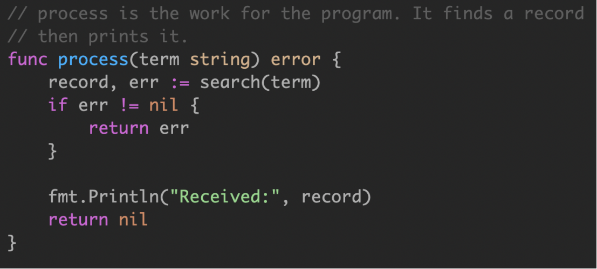
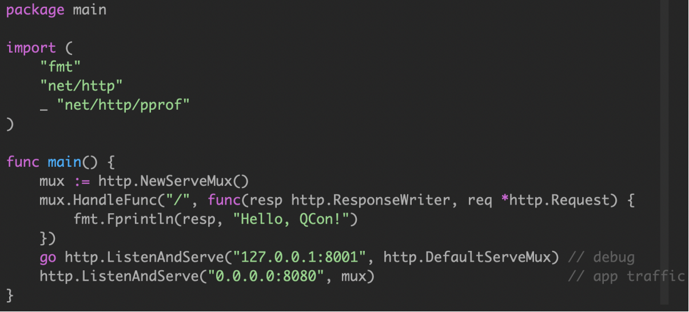
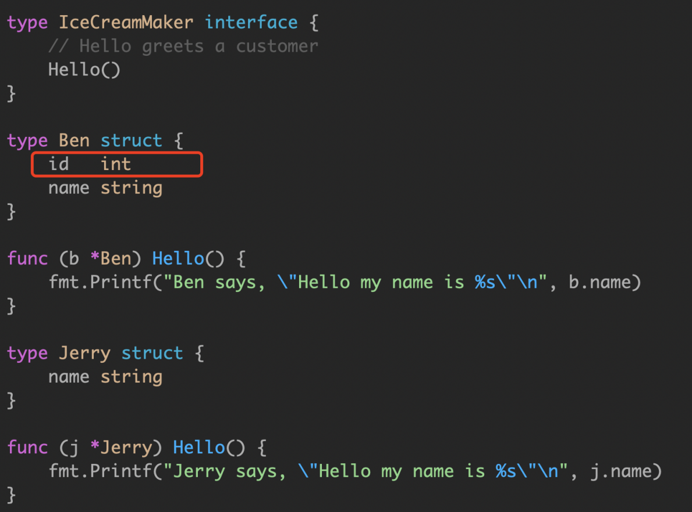
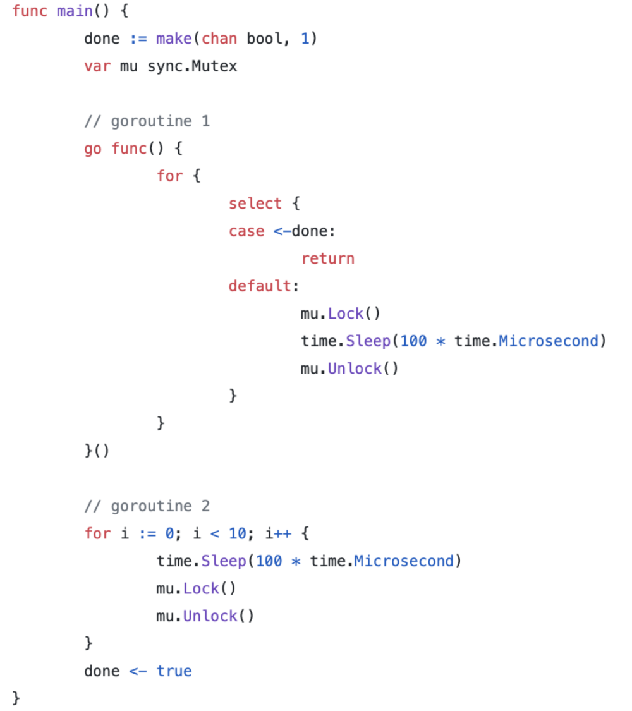
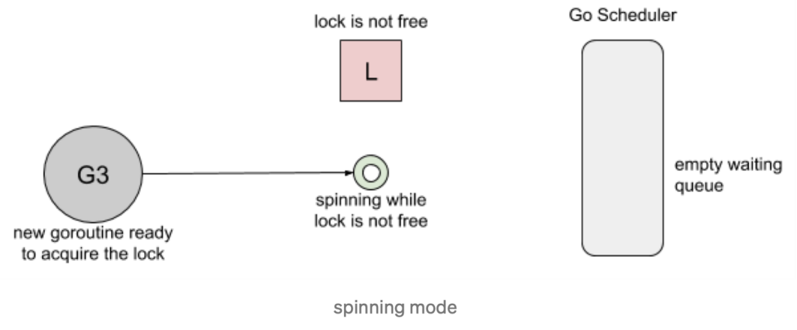
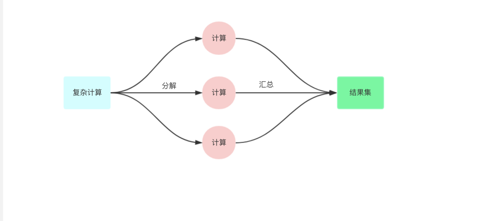
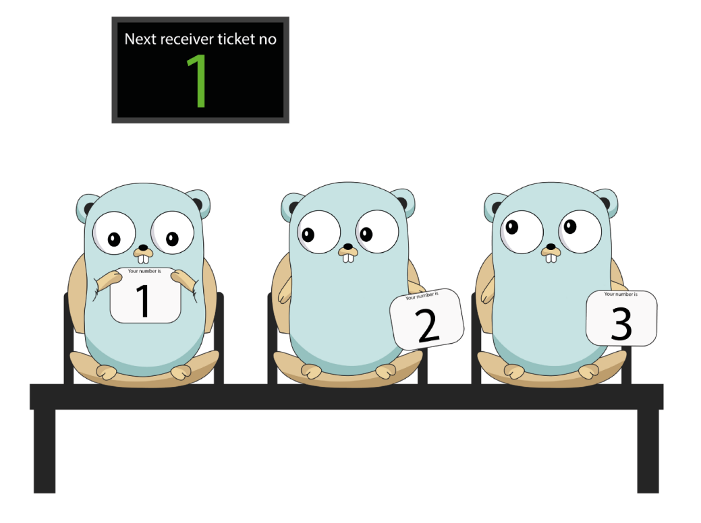
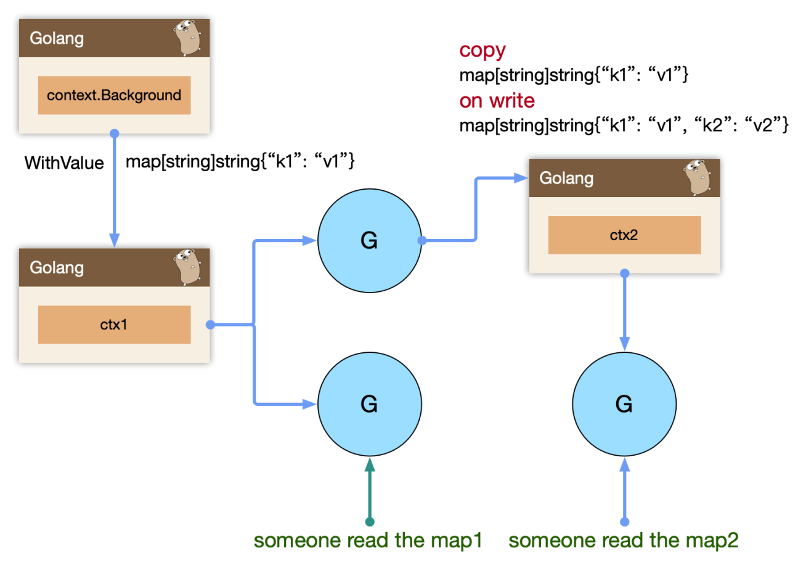

# Go 语言实践 - concurrency

## Goroutine

### Processes and Threads

操作系统会为该应用程序创建一个进程。作为一个应用程序，它像一个为所有资源而运行的容器。这些资源包括内存地址空间、文件句柄、设备和线程。

线程是操作系统调度的一种执行路径，用于在处理器执行我们在函数中编写的代码。一个进程从一个线程开始，即主线程，当该线程终止时，进程终止。这是因为主线程是应用程序的原点。然后，主线程可以依次启动更多的线程，而这些线程可以启动更多的线程。

无论线程属于哪个进程，操作系统都会安排线程在可用处理器上运行。每个操作系统都有自己的算法来做出这些决定。

### Goroutines and Parallelism

Go 语言层面支持的 go 关键字，可以快速的让一个函数创建为 goroutine，我们可以认为 main 函数就是作为 goroutine 执行的。操作系统调度线程在可用处理器上运行，Go运行时调度 goroutines 在绑定到单个操作系统线程的逻辑处理器中运行(P)。即使使用这个单一的逻辑处理器和操作系统线程，也可以调度数十万 goroutine 以惊人的效率和性能并发运行。

`Concurrency is not Parallelism.`

并发不是并行。并行是指两个或多个线程同时在不同的处理器执行代码。如果将运行时配置为使用多个逻辑处理器，则调度程序将在这些逻辑处理器之间分配 goroutine，这将导致 goroutine 在不同的操作系统线程上运行。但是，要获得真正的并行性，您需要在具有多个物理处理器的计算机上运行程序。否则，goroutines 将针对单个物理处理器并发运行，即使 Go 运行时使用多个逻辑处理器。

### Keep yourself busy or do the work yourself

空的 select 语句将永远阻塞。


如果你的 goroutine 在从另一个 goroutine 获得结果之前无法取得进展，那么通常情况下，你自己去做这项工作比委托它( go func() )更简单。

这通常消除了将结果从 goroutine 返回到其启动器所需的大量状态跟踪和 chan 操作。


### Leave concurrency to the caller

这两个 API 有什么区别？


- 将目录读取到一个 slice 中，然后返回整个切片，或者如果出现错误，则返回错误。这是同步调用的，ListDirectory 的调用方会阻塞，直到读取所有目录条目。根据目录的大小，这可能需要很长时间，并且可能会分配大量内存来构建目录条目名称的 slice。

- ListDirectory 返回一个 chan string，将通过该 chan 传递目录。当通道关闭时，这表示不再有目录。由于在 ListDirectory 返回后发生通道的填充，ListDirectory 可能内部启动 goroutine 来填充通道。


ListDirectory chan 版本还有两个问题：

- 通过使用一个关闭的通道作为不再需要处理的项目的信号，ListDirectory 无法告诉调用者通过通道返回的项目集不完整，因为中途遇到了错误。调用方无法区分空目录与完全从目录读取的错误之间的区别。这两种方法都会导致从 ListDirectory 返回的通道会立即关闭。
- 调用者必须继续从通道读取，直到它关闭，因为这是调用者知道开始填充通道的 goroutine 已经停止的唯一方法。这对 ListDirectory 的使用是一个严重的限制，调用者必须花时间从通道读取数据，即使它可能已经收到了它想要的答案。对于大中型目录，它可能在内存使用方面更为高校，但这种方法并不比原始的基于 slice 的方法快。


**filepath.WalkDir 也是类似的模型，如果函数启动 goroutine，则必须向调用方提供显式停止该goroutine 的方法。通常，将异步执行函数的决定权交给该函数的调用方通常更容易。**

### Never start a goroutine without knowning when it will stop

在这个例子中，goroutine 泄漏可以在 code review 快速识别出来。不幸的是，生产代码中的 goroutine 泄漏通常更难找到。我无法说明 goroutine 泄漏可能发生的所有可能方式，您可能会遇到：


search 函数是一个模拟实现，用于模拟长时间运行的操作，如数据库查询或 rpc 调用。在本例中，硬编码为200ms。

定义了一个名为 process 的函数，接受字符串参数，传递给 search。对于某些应用程序，顺序调用产生的延迟可能是不可接受的。



参考: 3/2.go

Any time you start a Goroutine you must ask yourself:

- When will it terminate?
- What could prevent it from terminating?

这个简单的应用程序在两个不同的端口上提供 http 流量，端口8080用于应用程序流量，端口8001用于访问 /debug/pprof 端点。


通过将 serveApp 和 serveDebug 处理程序分解为各自的函数，我们将它们与main.main 解耦，我们还遵循了上面的建议，并确保 serveApp 和 serveDebug 将它们的并发性留给调用者。

如果 serveApp 返回，则 main.main 将返回导致程序关闭，只能靠类似 supervisor 进程管理来重新启动。


然而，serveDebug 是在一个单独的 goroutine 中运行的，如果它返回，那么所在的 goroutine 将退出，而程序的其余部分继续运行。由于 /debug 处理程序很久以前就停止工作了，所以其他同学会很不高兴地发现他们无法在需要时从您的应用程序中获取统计信息。


ListenAndServer 返回 nil error，最终 main.main 无法退出。
log.Fatal 调用了 os.Exit，会无条件终止程序；defers 不会被调用到。


`Only use log.Fatal from main.main or init functions.`


https://github.com/da440dil/go-workgroup


### Incomplete Work

我们使用服务端埋点来跟踪记录一些事件。


无法保证创建的 goroutine 生命周期管理，会导致最场景的问题，就是在服务关闭时候，有一些事件丢失。

使用 sync.WaitGroup 来追踪每一个创建的 goroutine。


将 wg.Wait() 操作托管到其他 goroutine，owner goroutine 使用 context 处理超时。


我仍然不喜欢这个 demo，大量创建goroutine 来处理任务，代价高。参考 3/5.go


## Memory model

### Memory model

https://golang.org/ref/mem

如何保证在一个 goroutine 中看到在另一个 goroutine 修改的变量的值，如果程序中修改数据时有其他 goroutine 同时读取，那么必须将读取串行化。为了串行化访问，请使用 channel 或其他同步原语，例如 sync 和 sync/atomic 来保护数据。

`Happen-Before`

在一个 goroutine 中，读和写一定是按照程序中的顺序执行的。即编译器和处理器只有在不会改变这个 goroutine 的行为时才可能修改读和写的执行顺序。由于重排，不同的goroutine 可能会看到不同的执行顺序。例如，一个goroutine 执行 a = 1;b = 2;，另一个 goroutine 可能看到 b 在 a 之前更新。


### Memory Reordering

用户写下的代码，先要编译成汇编代码，也就是各种指令，包括读写内存的指令。CPU 的设计者们，为了榨干 CPU 的性能，无所不用其极，各种手段都用上了，你可能听过不少，像流水线、分支预测等等。其中，为了提高读写内存的效率，会对读写指令进行重新排列，这就是所谓的 内存重排，英文为 MemoryReordering。

这一部分说的是 CPU 重排，其实还有编译器重排。比如: 


但是，如果这时有另外一个线程同时干了这么一件事：

**在多核心场景下,没有办法轻易地判断两段程序是“等价”的。**

现代 CPU 为了“抚平” 内核、内存、硬盘之间的速度差异，搞出了各种策略，例如三级缓存等。为了让 (2) 不必等待 (1) 的执行“效果”可见之后才能执行，我们可以把 (1) 的效果保存到 store buffer：


**store buffer 对单线程是完美的**

先执行 (1) 和 (3)，将他们直接写入 store buffer，接着执行 (2) 和 (4)。“奇迹”要发生了：(2) 看了下 store buffer，并没有发现有 B 的值，于是从 Memory 读出了 0，(4) 同样从 Memory 读出了 0。最后，打印出了 00。


因此，对于多线程的程序，所有的 CPU 都会提供“锁”支持，称之为 barrier，或者 fence。它要求：barrier 指令要求所有对内存的操作都必须要“扩散”到 memory 之后才能继续执行其他对 memory 的操作。因此，我们可以用高级点的 atomic compare-and-swap，或者直接用更高级的锁，通常是标准库提供。

### Memory model

为了说明读和写的必要条件，我们定义了先行发生(Happens Before)。如果事件 e1 发生在 e2 前，我们可以说 e2 发生在 e1 后。如果 e1不发生在 e2 前也不发生在 e2 后，我们就说 e1 和 e2 是并发的。

**在单一的独立的 goroutine 中先行发生的顺序即是程序中表达的顺序。**

当下面条件满足时，对变量 v 的读操作 r 是被允许看到对 v 的写操作 w 的：

1. r 不先行发生于 w
2. 在 w 后 r 前没有对 v 的其他写操作


为了保证对变量 v 的读操作 r 看到对 v 的写操作 w，要确保 w 是 r 允许看到的唯一写操作。即当下面条件满足时，r 被保证看到 w：

1. w 先行发生于 r
2. 其他对共享变量 v 的写操作要么在 w 前，要么在 r 后。

**这一对条件比前面的条件更严格，需要没有其他写操作与 w 或 r 并发发生。**


单个 goroutine 中没有并发，所以上面两个定义是相同的：

读操作 r 看到最近一次的写操作 w 写入 v 的值。

当多个 goroutine 访问共享变量 v 时，它们必须使用同步事件来建立先行发生这一条件来保证读操作能看到需要的写操作。 

- 对变量 v 的零值初始化在内存模型中表现的与写操作相同。
- 对大于 single machine word 的变量的读写操作表现的像以不确定顺序对多个 single machine word的变量的操作。

https://www.jianshu.com/p/5e44168f47a3

## Package sync

### Share Memory By Communicating


传统的线程模型(通常在编写 Java、C++ 和Python 程序时使用)程序员在线程之间通信需要使用共享内存。通常，共享数据结构由锁保护，线程将争用这些锁来访问数据。在某些情况下，通过使用线程安全的数据结构(如Python的Queue)，这会变得更容易。

Go 的并发原语 goroutines 和 channels 为构造并发软件提供了一种优雅而独特的方法。Go 没有显式地使用锁来协调对共享数据的访问，而是鼓励使用 chan 在 goroutine 之间传递对数据的引用。这种方法确保在给定的时间只有一个goroutine 可以访问数据。

`Do not communicate by sharing memory; instead, share memory by communicating.`

### Detecting Race Conditions With Go

data race 是两个或多个 goroutine 访问同一个资源(如变量或数据结构)，并尝试对该资源进行读写而不考虑其他 goroutine。这种类型的代码可以创建您见过的最疯狂和最随机的 bug。通常需要大量的日志记录和运气才能找到这些类型的bug。

早在6月份的Go 1.1中，Go 工具引入了一个 race detector。竞争检测器是在构建过程中内置到程序中的代码。然后，一旦你的程序运行，它就能够检测并报告它发现的任何竞争条件。它非常酷，并且在识别罪魁祸首的代码方面做了令人难以置信的工作。

3/8.go
go build -race
go test -race


工具似乎检测到代码的争用条件。如果您查看race condition 报告下面，您可以看到程序的输出: 全局计数器变量的值为4。


试图通过 i++ 方式来解决原子赋值的问题，但是我们通过查看底层汇编:

	
实际上有三行汇编代码在执行以增加计数器。这三行汇编代码看起来很像原始的Go代码。在这三行汇编代码之后可能有一个上下文切换。尽管程序现在正在运行，但从技术上讲，这个bug 仍然存在。我们的 Go 代码看起来像是在安全地访问资源，而实际上底层的程序集代码根本就不安全。

**我们应该使用 Go 同步语义: Mutex**

3/7.go 我们第一感觉是 single machine word 应该是原子赋值，为啥 -race 会乱报。我们执行这个代码看看会发生什么。


Type 指向实现了接口的 struct，Data 指向了实际的值。Data 作为通过 interface 中任何方法调用的接收方传递。


对于语句 var maker IceCreamMaker=ben，编译器将生成执行以下操作的代码。

当 loop1() 执行 maker=jerry 语句时，必须更新接口值的两个字段。


Go memory model 提到过: 表示写入单个 machine word 将是原子的，但 interface 内部是是两个 machine word 的值。另一个goroutine 可能在更改接口值时观察到它的内容。

在这个例子中，Ben 和 Jerry 内存结构布局是相同的，因此它们在某种意义上是兼容的。想象一下，如果他们有不同的内存布局会发生什么混乱？

如果是一个普通的指针、map、slice 可以安全的更新吗？

没有安全的 data race(safe data race)。您的程序要么没有 data race，要么其操作未定义。

- 原子性
- 可见行



### sync.atomic

cfg 作为包级全局对象，在这个例子中被多个 goroutine 同时访问，因此这里存在 data race，会看到不连续的内存输出。

我们想到使用 Go 同步语义解决:

- Mutex
- RWMutex
- Atomic

3/config.go


Benchmark 是出结果真相的真理，即便我们知道可能 Mutex vs Atomic 的情况里，Mutex 相对更重。因为涉及到更多的 goroutine 之间的上下文切换 pack blocking goroutine，以及唤醒 goroutine。

go test -bench=.


Copy-On-Write 思路在微服务降级或者 local cache 场景中经常使用。写时复制指的是，写操作时候复制全量老数据到一个新的对象中，携带上本次新写的数据，之后利用原子替换(atomic.Value)，更新调用者的变量。来完成无锁访问共享数据。


### Mutex



这个案例基于两个 goroutine:

- goroutine 1 持有锁很长时间
- goroutine 2 每100ms 持有一次锁

都是100ms 的周期，但是由于 goroutine 1 不断的请求锁，可预期它会更频繁的持续到锁。我们基于 Go 1.8 循环了10次，下面是锁的请求占用分布:


**Mutex 被 g1 获取了700多万次，而 g2 只获取了10次。**

首先，goroutine1 将获得锁并休眠100ms。当goroutine2 试图获取锁时，它将被添加到锁的队列中- FIFO 顺序，goroutine 将进入等待状态。

然后，当 goroutine1 完成它的工作时，它将释放锁。此版本将通知队列唤醒 goroutine2。

goroutine2 将被标记为可运行的，并且正在等待 Go 调度程序在线程上运行.


然而，当 goroutine2 等待运行时，goroutine1将再次请求锁。

goroutine2 尝试去获取锁，结果悲剧的发现锁又被人持有了，它自己继续进入到等待模式。


我们看看几种 Mutex 锁的实现:

- Barging. 这种模式是为了提高吞吐量，当锁被释放时，它会唤醒第一个等待者，然后把锁给第一个等待者或者给第一个请求锁的人。

  

- Handsoff. 当锁释放时候，锁会一直持有直到第一个等待者准备好获取锁。它降低了吞吐量，因为锁被持有，即使另一个 goroutine 准备获取它。

  

一个互斥锁的 handsoff 会完美地平衡两个goroutine 之间的锁分配，但是会降低性能，因为它会迫使第一个 goroutine 等待锁。

- Spinning. 自旋在等待队列为空或者应用程序重度使用锁时效果不错。Parking 和 Unparking goroutines 有不低的性能成本开销，相比自旋来说要慢得多。

  

Go 1.8 使用了 Barging 和 Spining 的结合实现。当试图获取已经被持有的锁时，如果本地队列为空并且 P 的数量大于1，goroutine 将自旋几次(用一个 P 旋转会阻塞程序)。自旋后，goroutine park。在程序高频使用锁的情况下，它充当了一个快速路径。

Go 1.9 通过添加一个新的饥饿模式来解决先前解释的问题，该模式将会在释放时候触发 handsoff。所有等待锁超过一毫秒的 goroutine(也称为有界等待)将被诊断为饥饿。当被标记为饥饿状态时，unlock 方法会 handsoff 把锁直接扔给第一个等待者。


在饥饿模式下，自旋也被停用，因为传入的goroutines 将没有机会获取为下一个等待者保留的锁。


### errgroup

我们把一个复杂的任务，尤其是依赖多个微服务 rpc 需要聚合数据的任务，分解为依赖和并行，依赖的意思为: 需要上游 a 的数据才能访问下游 b 的数据进行组合。但是并行的意思为: 分解为多个小任务并行执行，最终等全部执行完毕。



https://pkg.go.dev/golang.org/x/sync/errgroup

核心原理: 利用 sync.Waitgroup 管理并行执行的 goroutine。 3/10.go

- 并行工作流
- 错误处理 或者 优雅降级
- context 传播和取消
- 利用局部变量+闭包

https://github.com/go-kratos/kratos/tree/master/pkg/sync/errgroup

### sync.Pool

sync.Pool 的场景是用来保存和复用临时对象，以减少内存分配，降低 GC 压力(Request-Driven 特别合适)。


Get 返回 Pool 中的任意一个对象。如果 Pool 为空，则调用 New 返回一个新创建的对象。

放进 Pool 中的对象，会在说不准什么时候被回收掉。所以如果事先 Put 进去 100 个对象，下次 Get 的时候发现 Pool 是空也是有可能的。不过这个特性的一个好处就在于不用担心 Pool 会一直增长，因为 Go 已经帮你在 Pool 中做了回收机制。

这个清理过程是在每次垃圾回收之前做的。之前每次GC 时都会清空 pool，而在1.13版本中引入了 victim cache，会将 pool 内数据拷贝一份，避免 GC 将其清空，即使没有引用的内容也可以保留最多两轮 GC。


**ring buffer（定长FIFO） + 双向链表的方式，头部只能写入，尾部可以并发读取**

## chan

channels 是一种类型安全的消息队列，充当两个 goroutine 之间的管道，将通过它同步的进行任意资源的交换。chan 控制 goroutines 交互的能力从而创建了 Go 同步机制。当创建的 chan 没有容量时，称为无缓冲通道。反过来，使用容量创建的 chan 称为缓冲通道。

要了解通过 chan 交互的 goroutine 的同步行为是什么，我们需要知道通道的类型和状态。根据我们使用的是无缓冲通道还是缓冲通道，场景会有所不同，所以让我们单独讨论每个场景。



### Unbuffered Channels

```go
ch := make(chan struct{})
```

无缓冲 chan 没有容量，因此进行任何交换前需要两个 goroutine 同时准备好。当 goroutine 试图将一个资源发送到一个无缓冲的通道并且没有goroutine 等待接收该资源时，该通道将锁住发送 goroutine 并使其等待。当 goroutine 尝试从无缓冲通道接收，并且没有 goroutine 等待发送资源时，该通道将锁住接收 goroutine 并使其等待。


**无缓冲信道的本质是保证同步。**

第一个 goroutine 在发送消息 foo 之后被阻塞，因为还没有接收者准备好。规范中对这种行为进行了很好的解释：https://golang.org/ref/spec#Channel_types

“If the capacity is zero or absent, the channel is unbuffered and communication succeeds only when both a sender and receiver are ready.”

https://golang.org/doc/effective_go.html#channels

“If the channel is unbuffered, the sender blocks until the receiver has received the value”

- Receive 先于 Send 发生。
- 好处: 100% 保证能收到。
- 代价: 延迟时间未知。


### Buffered Channels

buffered channel 具有容量，因此其行为可能有点不同。当 goroutine 试图将资源发送到缓冲通道，而该通道已满时，该通道将锁住 goroutine并使其等待缓冲区可用。如果通道中有空间，发送可以立即进行，goroutine 可以继续。当goroutine 试图从缓冲通道接收数据，而缓冲通道为空时，该通道将锁住 goroutine 并使其等待资源被发送。


### Latencies due to under-sized buffer

我们在 chan 创建过程中定义的缓冲区大小可能会极大地影响性能。我将使用密集使用 chan 的扇出模式来查看不同缓冲区大小的影响。在我们的基准测试中，一个 producer 将在通道中注入百万个整数元素，而5个 worker 将读取并将它们追加到一个名为 total 的结果变量中。


- Send 先于 Receive 发生。
- 好处: 延迟更小。
- 代价: 不保证数据到达，越大的 buffer，越小的保障到达。buffer = 1 时，给你延迟一个消息的保障。

### Go Concurrency Patterns

- Timing out
- Moving on
- Pipeline
- Fan-out, Fan-in
- Cancellation
  - Close 先于 Receive 发生(类似 Buffered)。
  - 不需要传递数据，或者传递 nil。
  - 非常适合去掉和超时控制。
- Contex

```
https://blog.golang.org/concurrency-timeouts
https://blog.golang.org/pipelines
https://talks.golang.org/2013/advconc.slide#1
https://github.com/go-kratos/kratos/tree/master/pkg/sync
```

### Design Philosophy

If any given Send on a channel CAN cause the sending goroutine to block:

- Not allowed to use a Buffered channel larger than 1.
  - Buffers larger than 1 must have reason/measurements.
- Must know what happens when the sending goroutine blocks.


If any given Send on a channel WON’T cause the sending goroutine to block:

- You have the exact number of buffers for each send.
  - Fan Out pattern
- You have the buffer measured for max capacity.
  - Drop pattern


Less is more with buffers.

- Don’t think about performance when thinking about buffers.
- Buffers can help to reduce blocking latency between signaling.
  - Reducing blocking latency towards zero does not necessarily mean better throughput.
  - If a buffer of one is giving you good enough throughput then keep it.
  - Question buffers that are larger than one and measure for size.
  - Find the smallest buffer possible that provides good enough throughput.

## Package context

### Request-scoped context

在 Go 服务中，每个传入的请求都在其自己的goroutine 中处理。请求处理程序通常启动额外的 goroutine 来访问其他后端，如数据库和 RPC服务。处理请求的 goroutine 通常需要访问特定于请求(request-specific context)的值，例如最终用户的身份、授权令牌和请求的截止日期(deadline)。当一个请求被取消或超时时，处理该请求的所有 goroutine 都应该快速退出(fail fast)，这样系统就可以回收它们正在使用的任何资源。


Go 1.7 引入一个 context 包，它使得跨 API 边界的请求范围元数据、取消信号和截止日期很容易传递给处理请求所涉及的所有 goroutine(显示传递)。

其他语言: Thread Local Storage(TLS)，XXXContext


如何将 context 集成到 API 中？

在将 context 集成到 API 中时，要记住的最重要的一点是，它的作用域是请求级别	的。例如，沿单个数据库查询存在是有意义的，但沿数据库对象存在则没有意义。

目前有两种方法可以将 context 对象集成到 API 中：

- The first parameter of a function call

  首参数传递 context 对象，比如，参考  net 包 Dialer.DialContext。此函数执行正常的 Dial 操作，但可以通过 context 对象取消函数调用。

  

- Optional config on a request structure

  在第一个 request 对象中携带一个可选的 context 对象。例如 net/http 库的 Request.WithContext，通过携带给定的 context 对象，返回一个新的 Request 对象。

  


### Do not store Contexts inside a struct type

Do not store Contexts inside a struct type; instead, pass a Context explicitly to each function that needs it. The Context should be the first parameter, typically named ctx:


Incoming requests to a server should create a Context.
使用 context 的一个很好的心智模型是它应该在程序中流动，应该贯穿你的代码。这通常意味着您不希望将其存储在结构体之中。它从一个函数传递到另一个函数，并根据需要进行扩展。理想情况下，每个请求都会创建一个 context 对象，并在请求结束时过期。

不存储上下文的一个例外是，当您需要将它放入一个结构中时，该结构纯粹用作通过通道传递的消息。如下例所示。


### context.WithValue

context.WithValue 内部基于 valueCtx 实现:


为了实现不断的 WithValue，构建新的 context，内部在查找 key 时候，使用递归方式不断从当前，从父节点寻找匹配的 key，直到 root context(Backgrond 和 TODO Value 函数会返回 nil)。


### Debugging or tracing data is safe to pass in a Context

context.WithValue 方法允许上下文携带请求范围的数据。这些数据必须是安全的，以便多个 goroutine 同时使用。这里的数据，更多是面向请求的元数据，不应该作为函数的可选参数来使用(比如 context 里面挂了一个sql.Tx 对象，传递到 Dao 层使用)，因为元数据相对函数参数更加是隐含的，面向请求的。而参数是更加显示的。


- 同一个 context 对象可以传递给在不同 goroutine 中运行的函数；上下文对于多个 goroutine 同时使用是安全的。对于值类型最容易犯错的地方，在于 context value 应该是 immutable 的，每次重新赋值应该是新的 context，即: `context.WithValue(ctx, oldvalue)`

https://pkg.go.dev/google.golang.org/grpc/metadata

`Context.Value should inform, not control`

`Use context values only for request-scoped data that transits processes and APIs, not for passing optional parameters to functions.`

比如 染色，API 重要性，Trace

https://github.com/go-kratos/kratos/blob/master/pkg/net/metadata/key.go

### context.WithValue

比如我们新建了一个基于 context.Background() 的 ctx1，携带了一个 map 的数据，map 中包含了 “k1”: “v1” 的一个键值对，ctx1 被两个 goroutine 同时使用作为函数签名传入，如果我们修改了 这个map，会导致另外进行读 context.Value 的 goroutine 和修改 map 的 goroutine，在 map 对象上产生 data race。因此我们要使用 copy-on-write 的思路，解决跨多个 goroutine 使用数据、修改数据的场景。


`Replace a Context using WithCancel, WithDeadline, WithTimeout, or WithValue.`

COW: 从 ctx1 中获取 map1(可以理解为 v1 版本的 map 数据)。构建一个新的 map 对象 map2，复制所有 map1 数据，同时追加新的数据 “k2”: “v2” 键值对，使用 context.WithValue 创建新的 ctx2，ctx2 会传递到其他的 goroutine 中。这样各自读取的副本都是自己的数据，写行为追加的数据，在 ctx2 中也能完整读取到，同时也不会污染 ctx1 中的数据。



`The chain of function calls between them must propagate the Context.`

### When a Context is canceled, all Contexts derived from it are also canceled

当一个 context 被取消时，从它派生的所有 context 也将被取消。WithCancel(ctx) 参数 ctx 认为是 parent ctx，在内部会进行一个传播关系链的关联。Done() 返回 一个 chan，当我们取消某个parent context, 实际上上会递归层层 cancel 掉自己的 child context 的 done chan 从而让整个调用链中所有监听 cancel 的 goroutine退出。


### All blocking/long operations should be cancelable

如果要实现一个超时控制，通过上面的context 的parent/child 机制，其实我们只需要启动一个定时器，然后在超时的时候，直接将当前的 context 给 cancel 掉，就可以实现监听在当前和下层的额context.Done() 的 goroutine 的退出。


## Final Notes

- Incoming requests to a server should create a Context.
- Outgoing calls to servers should accept a Context.
- Do not store Contexts inside a struct type; instead, pass a Context explicitly to each function that needs it.
- The chain of function calls between them must propagate the Context.
- Replace a Context using WithCancel, WithDeadline, WithTimeout, or WithValue.
- When a Context is canceled, all Contexts derived from it are also canceled.
- The same Context may be passed to functions running in different goroutines; Contexts are safe for simultaneous use by multiple goroutines.
- Do not pass a nil Context, even if a function permits it. Pass a TODO context if you are unsure about which Context to use.
- Use context values only for request-scoped data that transits processes and APIs, not for passing optional parameters to functions.
- All blocking/long operations should be cancelable.
- Context.Value obscures your program’s flow.
- Context.Value should inform, not control.
- Try not to use context.Value.

https://talks.golang.org/2014/gotham-context.slide#1

## References

```
https://www.ardanlabs.com/blog/2018/11/goroutine-leaks-the-forgotten-sender.html
https://www.ardanlabs.com/blog/2019/04/concurrency-trap-2-incomplete-work.html
https://www.ardanlabs.com/blog/2014/01/concurrency-goroutines-and-gomaxprocs.html
https://dave.cheney.net/practical-go/presentations/qcon-china.html#_concurrency
https://golang.org/ref/mem
https://blog.csdn.net/caoshangpa/article/details/78853919
https://blog.csdn.net/qcrao/article/details/92759907
https://cch123.github.io/ooo/
https://blog.golang.org/codelab-share
https://dave.cheney.net/2018/01/06/if-aligned-memory-writes-are-atomic-why-do-we-need-the-sync-atomic-package
http://blog.golang.org/race-detector
https://dave.cheney.net/2014/06/27/ice-cream-makers-and-data-races
https://www.ardanlabs.com/blog/2014/06/ice-cream-makers-and-data-races-part-ii.html
https://medium.com/a-journey-with-go/go-how-to-reduce-lock-contention-with-the-atomic-package-ba3b2664b549
https://medium.com/a-journey-with-go/go-discovery-of-the-trace-package-e5a821743c3c
https://medium.com/a-journey-with-go/go-mutex-and-starvation-3f4f4e75ad50
https://www.ardanlabs.com/blog/2017/10/the-behavior-of-channels.html
https://medium.com/a-journey-with-go/go-buffered-and-unbuffered-channels-29a107c00268
https://medium.com/a-journey-with-go/go-ordering-in-select-statements-fd0ff80fd8d6
https://www.ardanlabs.com/blog/2017/10/the-behavior-of-channels.html
https://www.ardanlabs.com/blog/2014/02/the-nature-of-channels-in-go.html
https://www.ardanlabs.com/blog/2013/10/my-channel-select-bug.html
https://blog.golang.org/io2013-talk-concurrency
https://blog.golang.org/waza-talk
https://blog.golang.org/io2012-videos
https://blog.golang.org/concurrency-timeouts
https://blog.golang.org/pipelines
https://www.ardanlabs.com/blog/2014/02/running-queries-concurrently-against.html
https://blogtitle.github.io/go-advanced-concurrency-patterns-part-3-channels/
https://www.ardanlabs.com/blog/2013/05/thread-pooling-in-go-programming.html
https://www.ardanlabs.com/blog/2013/09/pool-go-routines-to-process-task.html
https://blogtitle.github.io/categories/concurrency/
https://medium.com/a-journey-with-go/go-context-and-cancellation-by-propagation-7a808bbc889c
https://blog.golang.org/context
https://www.ardanlabs.com/blog/2019/09/context-package-semantics-in-go.html
https://golang.org/ref/spec#Channel_types
https://drive.google.com/file/d/1nPdvhB0PutEJzdCq5ms6UI58dp50fcAN/view
https://medium.com/a-journey-with-go/go-context-and-cancellation-by-propagation-7a808bbc889c
https://blog.golang.org/context
https://www.ardanlabs.com/blog/2019/09/context-package-semantics-in-go.html
https://golang.org/doc/effective_go.html#concurrency
https://zhuanlan.zhihu.com/p/34417106?hmsr=toutiao.io
https://talks.golang.org/2014/gotham-context.slide#1
https://medium.com/@cep21/how-to-correctly-use-context-context-in-go-1-7-8f2c0fafdf39
```

