# Go 工程化实践

## 工程项目结构

### Standard Go Project Layout

`https://github.com/golang-standards/project-layout/blob/master/README_zh.md`

如果你尝试学习 Go，或者你正在为自己建立一个 PoC 或一个玩具项目，这个项目布局是没啥必要的。从一些非常简单的事情开始(一个 main.go 文件绰绰有余)。当有更多的人参与这个项目时，你将需要更多的结构，包括需要一个 toolkit 来方便生成项目的模板，尽可能大家统一的工程目录布局

#### /cmd

本项目的主干。

每个应用程序的目录名应该与你想要的可执行文件的名称相匹配(例如，**/cmd/myapp**)。

不要在这个目录中放置太多代码。如果你认为代码可以导入并在其他项目中使用，那么它应该位于 /pkg 目录中。如果代码不是可重用的，或者你不希望其他人重用它，请将该代码放到 /internal 目录中。

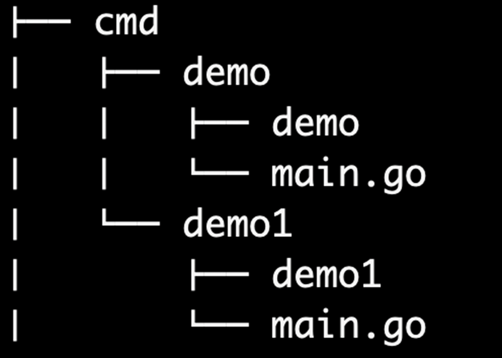

cmd 应用目录负责程序的: 启动、关闭、配置初始化等。


#### /internal 

私有应用程序和库代码。这是你不希望其他人在其应用程序或库中导入代码。请注意，这个布局模式是由 Go 编译器本身执行的。有关更多细节，请参阅Go 1.4[release notes](https://golang.org/doc/go1.4)。注意，你并不局限于顶级 internal 目录。在项目树的任何级别上都可以有多个内部目录。

你可以选择向 internal 包中添加一些额外的结构，以分隔共享和非共享的内部代码。这不是必需的(特别是对于较小的项目)，但是最好有有可视化的线索来显示预期的包的用途。你的实际应用程序代码可以放在 /internal/ap 目录下(例如/internal/app/myapp)，这些应用程序共享的代码可以放在/internal/pkg目录下(例如/internal/pkg/myprivlib)。

因为我们习惯把相关的服务，比如账号服务，内部有rpc、job、admin等，相关的服务整合一起后，需要区分app。单一的服务，可以去掉/internal/myapp。

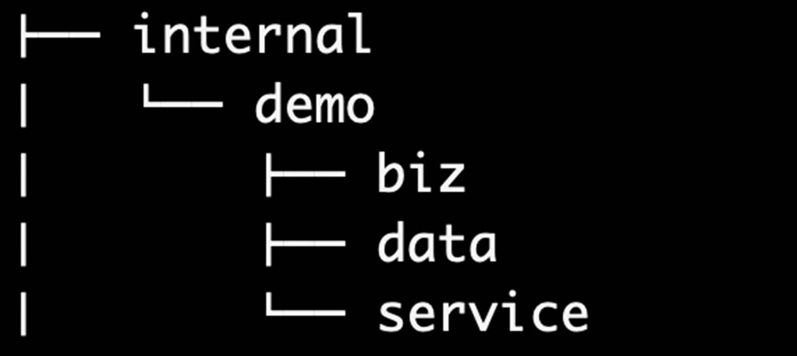

#### /pkg

外部应用程序可以使用的库代码(例如 /pkg/mypubliclib)。其他项目会导入这些库，所以在这里放东西之前要三思:-)注意，internal 目录是确保私有包不可导入的更好方法，因为它是由 Go 强制执行的。/pkg 目录仍然是一种很好的方式，可以显式地表示该目录中的代码对于其他人来说是安全使用的好方法。

/pkg 目录内，可以参考 go 标准库的组织方式，按照功能分类。/internla/pkg 一般用于项目内的 跨多个应用的公共共享代码，但其作用域仅在单个项目工程内。

由 Travis Jeffery  撰写的 I'll take pkg over internal 博客文章提供了 pkg 和 internal 目录的一个很好的概述，以及什么时候使用它们是有意义的。

当根目录包含大量非 Go 组件和目录时，这也是一种将 Go 代码分组到一个位置的方法，这使得运行各种 Go 工具变得更加容易组织。

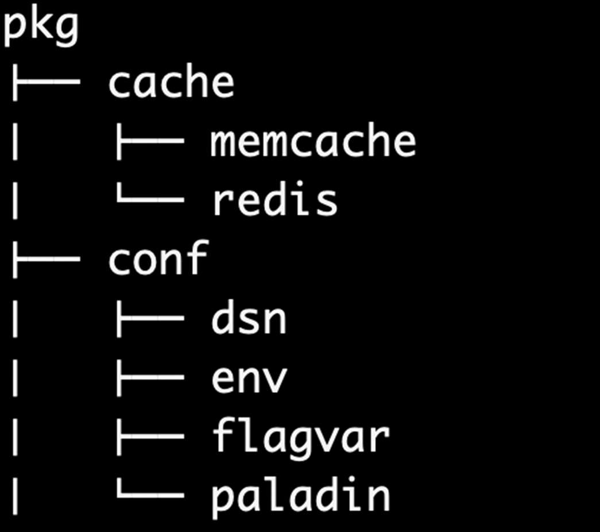

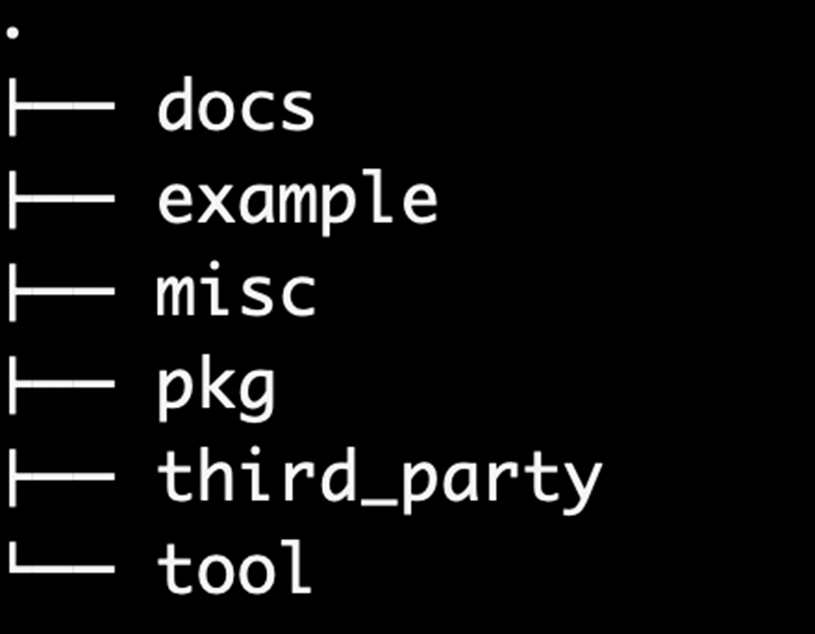

#### /api

API 协议定义目录，xxapi.proto protobuf 文件，以及生成的 go 文件。我们通常把 api 文档直接在 proto 文件中描述。

#### /configs

配置文件模板或默认配置。

#### /test

额外的外部测试应用程序和测试数据。你可以随时根据需求构造 /test 目录。对于较大的项目，有一个数据子目录是有意义的。例如，你可以使用 /test/data 或 /test/testdata (如果你需要忽略目录中的内容)。请注意，Go 还会忽略以“.”或“_”开头的目录或文件，因此在如何命名测试数据目录方面有更大的灵活性。

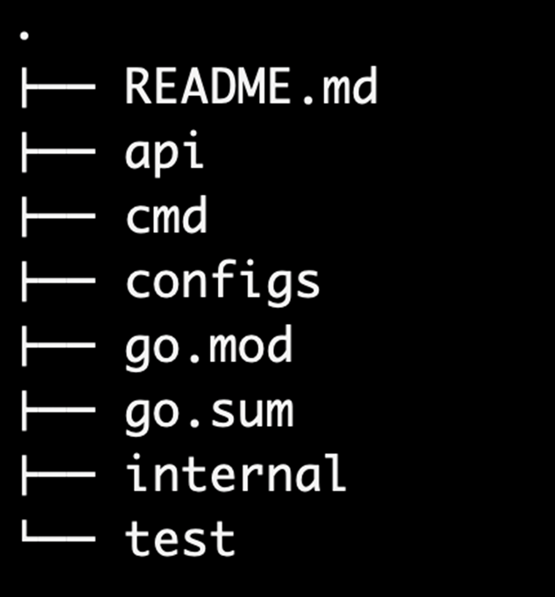

**不应该包含：/src**

有些 Go 项目确实有一个 src 文件夹，但这通常发生在开发人员有 Java 背景，在那里它是一种常见的模式。不要将项目级别 src 目录与 Go 用于其工作空间的 src 目录。


### Kit Project Layou

每个公司都应当为不同的微服务建立一个统一的 kit 工具包项目(基础库/框架) 和 app 项目。

基础库 kit 为独立项目，公司级建议只有一个，按照功能目录来拆分会带来不少的管理工作，因此建议合并整合。
`by Package Oriented Design`

`“To this end, the Kit project is not allowed to have a vendor folder. If any of packages are dependent on 3rd party packages, they must always build against the latest version of those dependences.”`
kit 项目必须具备的特点: 

- 统一
- 标准库方式布局
- 高度抽象
- 支持插件

### Service Application Project

一个 gitlab 的 project 里可以放置多个微服务的app(类似 monorepo)。也可以按照 gitlab 的 group 里建立多个 project，每个 project 对应一个 app。

- 多 app 的方式，app 目录内的每个微服务按照自己的全局唯一名称，比如 “account.service.vip” 来建立目录，如: account/vip/。
- 和 app 平级的目录 pkg 存放业务有关的公共库（非基础框架库）。如果应用不希望导出这些目录，可以放置到 myapp/internal/pkg 中。


微服务中的 app 服务类型分为4类：interface、service、job、admin。

- interface: 对外的 BFF 服务，接受来自用户的请求，比如暴露了 HTTP/gRPC 接口。
- service: 对内的微服务，仅接受来自内部其他服务或者网关的请求，比如暴露了gRPC 接口只对内服务。
- admin：区别于 service，更多是面向运营测的服务，通常数据权限更高，隔离带来更好的代码级别安全。
- job: 流式任务处理的服务，上游一般依赖 message broker。
- task: 定时任务，类似 cronjob，部署到 task 托管平台中。

### Service Application Project - v1

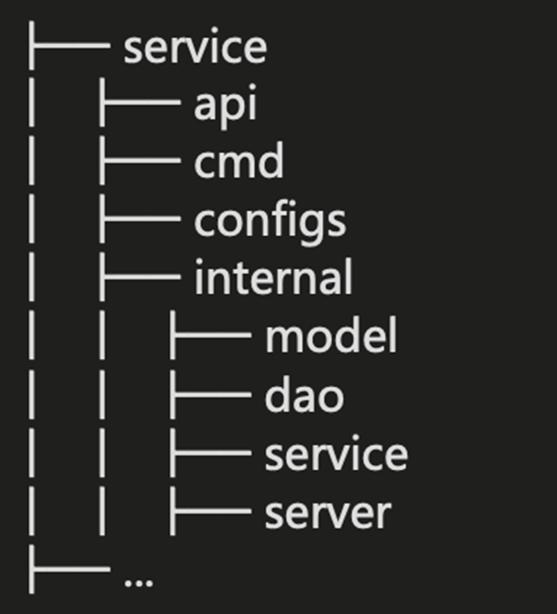

我们老的布局，app 目录下有 api、cmd、configs、internal 目录，目录里一般还会放置 README、CHANGELOG、OWNERS。

- api: 放置 API 定义(protobuf)，以及对应的生成的 client 代码，基于 pb 生成的 swagger.json。
- configs: 放服务所需要的配置文件，比如database.yaml、redis.yaml、application.yaml。
- internal: 是为了避免有同业务下有人跨目录引用了内部的 model、dao 等内部 struct。
- server: 放置 HTTP/gRPC 的路由代码，以及 DTO 转换的代码。

**DTO(Data Transfer Object)：数据传输对象，这个概念来源于J2EE 的设计模式。但在这里，泛指用于展示层/API 层与服务层(业务逻辑层)之间的数据传输对象。**

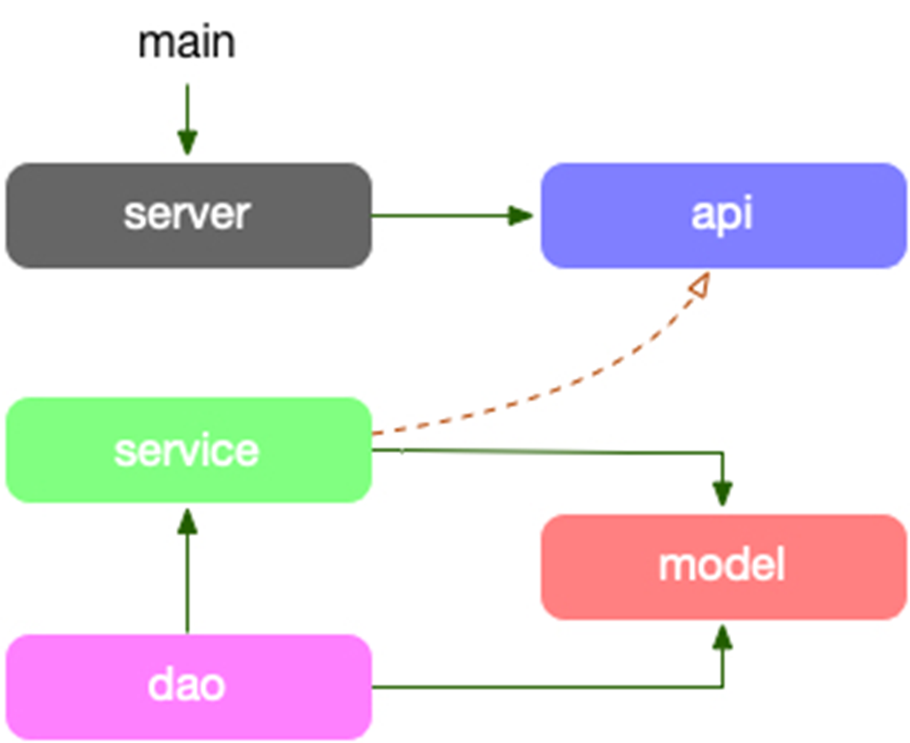

项目的依赖路径为: model -> dao -> service -> api，model struct 串联各个层，直到 api 需要做 DTO 对象转换。

- model: 放对应“存储层”的结构体，是对存储的一一隐射。
- dao: 数据读写层，数据库和缓存全部在这层统一处理，包括 cache miss 处理。
- service: 组合各种数据访问来构建业务逻辑。
- server: 依赖 proto 定义的服务作为入参，提供快捷的启动服务全局方法。
- api: 定义了 API proto 文件，和生成的 stub 代码，它生成的 interface，其实现者在 service 中。

service 的方法签名因为实现了 API 的 接口定义，DTO 直接在业务逻辑层直接使用了，更有 dao 直接使用，最简化代码。

DO(Domain Object): 领域对象，就是从现实世界中抽象出来的有形或无形的业务实体。缺乏 DTO -> DO 的对象转换。

### Service Application Project - v2

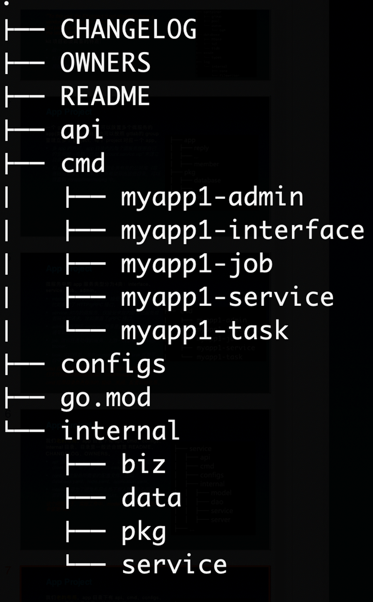

app 目录下有 api、cmd、configs、internal 目录，目录里一般还会放置 README、CHANGELOG、OWNERS。

- internal: 是为了避免有同业务下有人跨目录引用了内部的 biz、data、service 等内部 struct。
- biz: 业务逻辑的组装层，类似 DDD 的 domain 层，data 类似 DDD 的 repo，repo 接口在这里定义，使用依赖倒置的原则。
- data: 业务数据访问，包含 cache、db 等封装，实现了 biz 的 repo 接口。我们可能会把 data 与 dao 混淆在一起，data 偏重业务的含义，它所要做的是将领域对象重新拿出来，我们去掉了 DDD 的 infra层。
- service: 实现了 api 定义的服务层，类似 DDD 的 application 层，处理 DTO 到 biz 领域实体的转换(DTO -> DO)，同时协同各类 biz 交互，但是不应处理复杂逻辑。

PO(Persistent Object): 持久化对象，它跟持久层（通常是关系型数据库）的数据结构形成一一对应的映射关系，如果持久层是关系型数据库，那么数据表中的每个字段（或若干个）就对应 PO 的一个（或若干个）属性。https://github.com/facebook/ent

### Lifecycle

Lifecycle 需要考虑服务应用的对象初始化以及生命周期的管理，所有 HTTP/gRPC 依赖的前置资源初始化，包括 data、biz、service，之后再启动监听服务。我们使用 https://github.com/google/wire ，来管理所有资源的依赖注入。为何需要依赖注入？

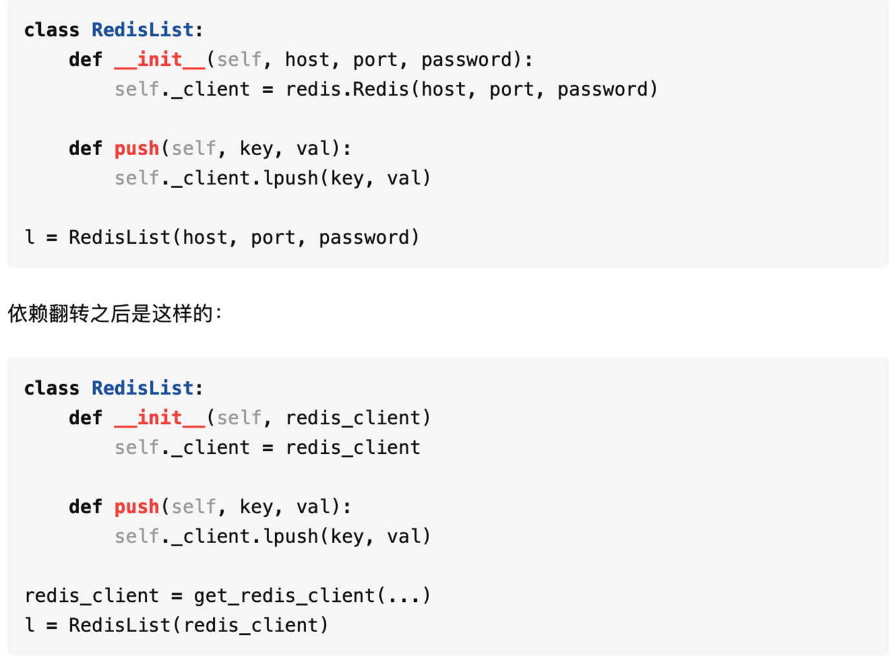

心是为了：1、方便测试；2、单次初始化和复用；

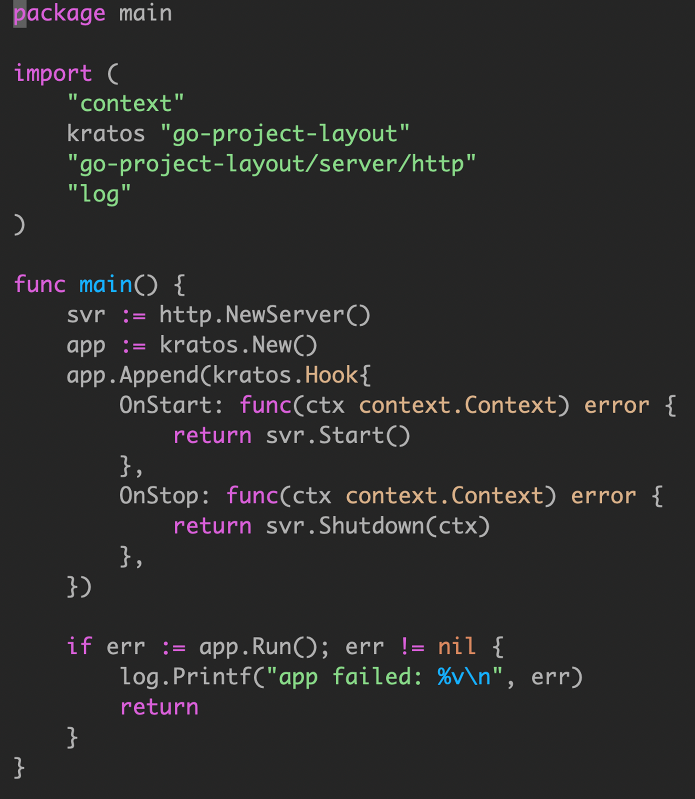

### Wire

https://blog.golang.org/wire
手撸资源的初始化和关闭是非常繁琐，容易出错的。上面提到我们使用依赖注入的思路 DI，结合 google wire，静态的 go generate 生成静态的代码，可以在很方便诊断和查看，不是在运行时利用 reflection 实现。

## API 设计

### gRPC


gRPC是什么可以用官网的一句话来概括

`“A high-performance, open-source universal RPC framework”`

- 多语言：语言中立，支持多种语言。
- 轻量级、高性能：序列化支持 PB(Protocol Buffer)和 JSON，PB 是一种语言无关的高性能序列化框架。
- 可插拔
- IDL：基于文件定义服务，通过 proto3 工具生成指定语言的数据结构、服务端接口以及客户端 Stub。
- 设计理念
- 移动端：基于标准的 HTTP2 设计，支持双向流、消息头压缩、单 TCP 的多路复用、服务端推送等特性，这些特性使得 gRPC 在移动端设备上更加省电和节省网络流量。
- 服务而非对象、消息而非引用：促进微服务的系统间粗粒度消息交互设计理念。
- 负载无关的：不同的服务需要使用不同的消息类型和编码，例如 protocol buffers、JSON、XML和Thrift。
- 流: Streaming API。
- 阻塞式和非阻塞式：支持异步和同步处理在客户端和服务端间交互的消息序列。
- 元数据交换：常见的横切关注点，如认证或跟踪，依赖数据交换。
- 标准化状态码：客户端通常以有限的方式响应 API 调用返回的错误。

不要过早关注性能问题，先标准化。

```bash
protoc --go_out=. --go_opt=paths=source_relative \
    --go-grpc_out=. --go-grpc_opt=paths=source_relative \
    helloworld/helloworld.proto
```


### API Project

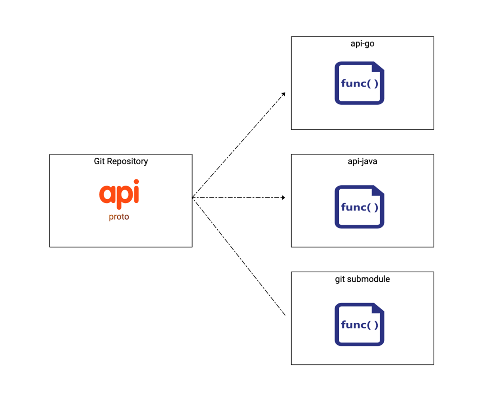

https://github.com/googleapis/googleapis
https://github.com/envoyproxy/data-plane-api
https://github.com/istio/api
为了统一检索和规范 API，我们内部建立了一个统一的 bapis 仓库，整合所有对内对外 API。

- API 仓库，方便跨部门协作。
- 版本管理，基于 git 控制。
- 规范化检查，API lint。
- API design review，变更 diff。
- 权限管理，目录 OWNERS。

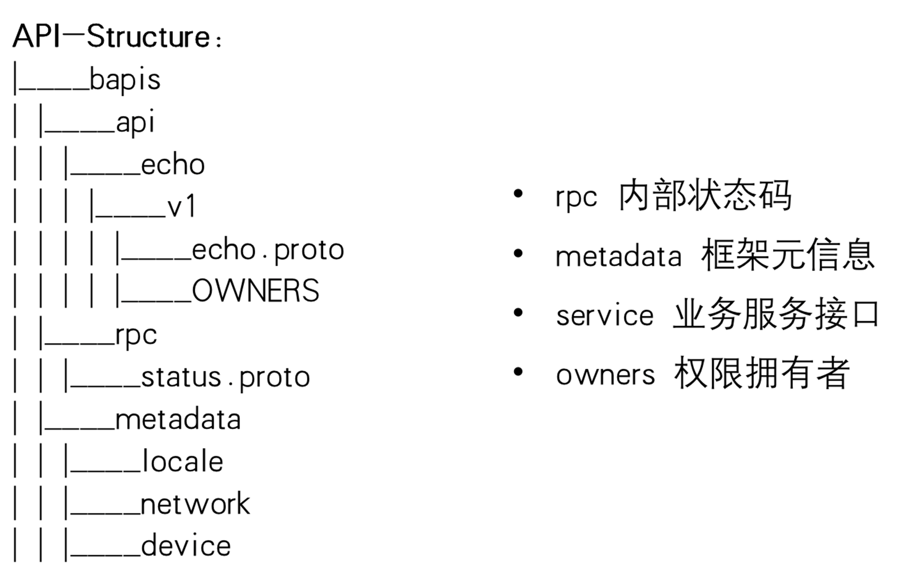

项目中定义 proto，以 api 为包名根目录:

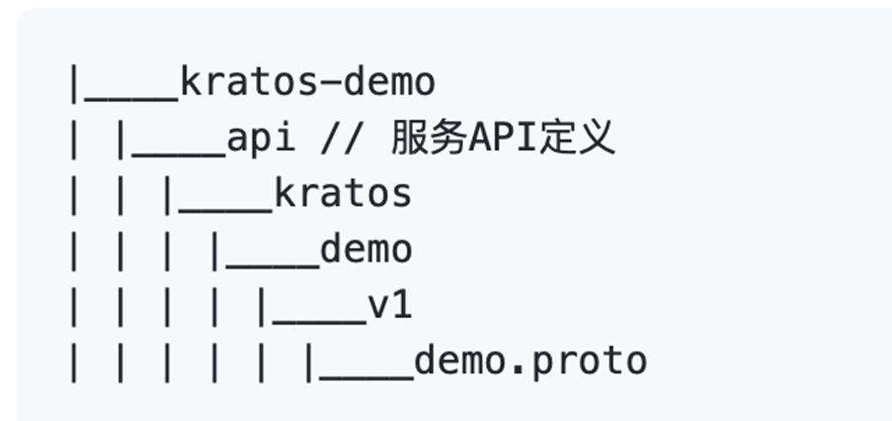

在统一仓库中管理 proto ，以仓库为包名根目录:

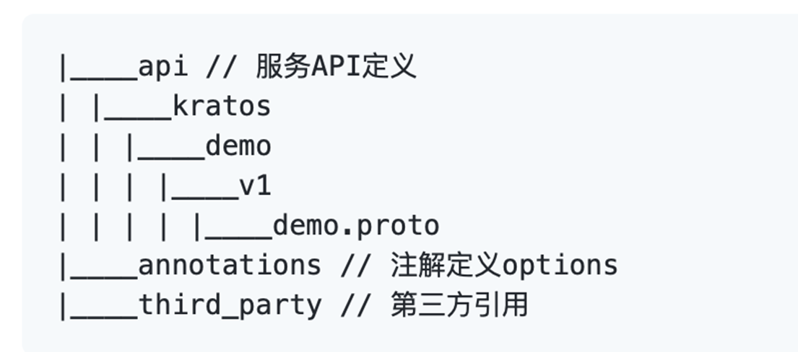

### API Compatibility

向后兼容(非破坏性)的修改
给 API 服务定义添加 API 接口
    从协议的角度来看，这始终是安全的。
给请求消息添加字段
    只要客户端在新版和旧版中对该字段的处理不保持一致，添加请求字段就是兼容的。
给响应消息添加字段
    在不改变其他响应字段的行为的前提下，非资源（例如，ListBooksResponse）的响应消息可以扩展而不必破坏客户端的兼容性。即使会引入冗余，先前在响应中填充的任何字段应继续使用相同的语义填充。


向后不兼容(破坏性)的修改
删除或重命名服务，字段，方法或枚举值
    从根本上说，如果客户端代码可以引用某些东西，那么删除或重命名它都是不兼容的变化，这时必须修改major 版本号。 
修改字段的类型
    即使新类型是传输格式兼容的，这也可能会导致客户端库生成的代码发生变化，因此必须增加major版本号。 对于编译型静态语言来说，会容易引入编译错误。
修改现有请求的可见行为
    客户端通常依赖于 API 行为和语义，即使这样的行为没有被明确支持或记录。 因此，在大多数情况下，修改 API 数据的行为或语义将被消费者视为是破坏性的。如果行为没有加密隐藏，您应该假设用户已经发现它，并将依赖于它。 
给资源消息添加 读取/写入 字段

### API Naming Conventions

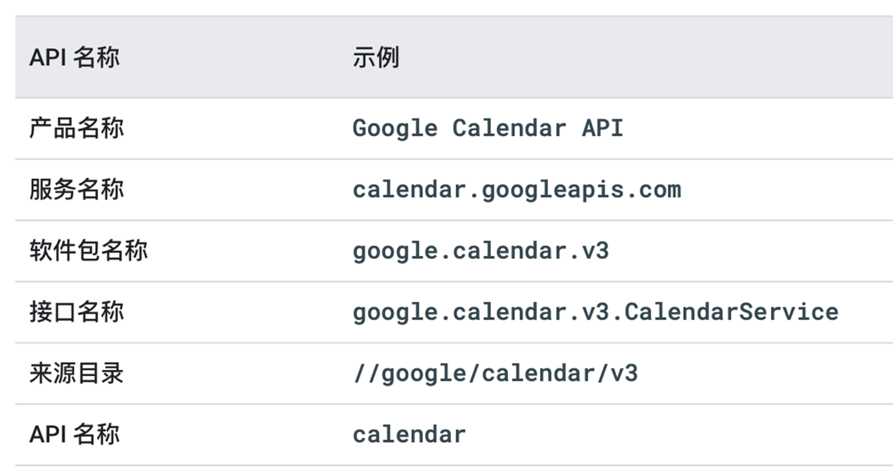

包名为应用的标识(APP_ID)，用于生成 gRPC 请求路径，或者 proto 之间进行引用 Message。文件中声明的包名称应该与产品和服务名称保持一致。带有版本的 API 的软件包名称必须以此版本结尾。

- my.package.v1，为 API 目录，定义service相关接口，用于提供业务使用。

// RequestURL: /<package_name>.<version>.<service_name>/{method}
package <package_name>.<version>;

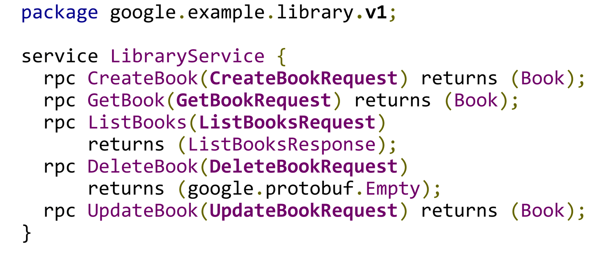

### API Primitive Fields


gRPC 默认使用 Protobuf v3 格式，因为去除了 required 和 optional 关键字，默认全部都是 optional 字段。如果没有赋值的字段，默认会基础类型字段的默认值，比如 0 或者 “”。
Protobuf v3 中，建议使用：https://github.com/protocolbuffers/protobuf/blob/master/src/google/protobuf/wrappers.proto
Warpper 类型的字段，即包装一个 message，使用时变为指针。


Protobuf 作为强 schema 的描述文件，也可以方便扩展，是不是用于配置文件定义也可？

### API Errors

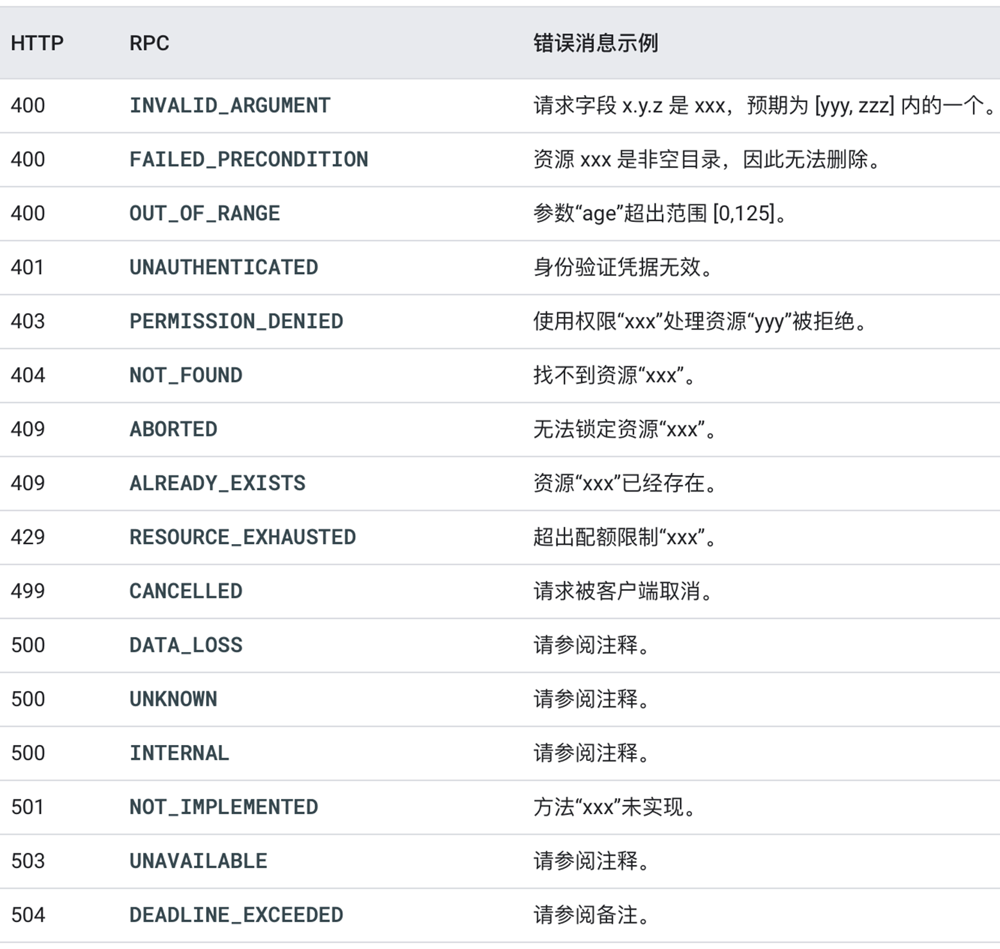

使用一小组标准错误配合大量资源

- 例如，服务器没有定义不同类型的“找不到”错误，而是使用一个标准 google.rpc.Code.NOT_FOUND 错误代码并告诉客户端找不到哪个特定资源。状态空间变小降低了文档的复杂性，在客户端库中提供了更好的惯用映射，并降低了客户端的逻辑复杂性，同时不限制是否包含可操作信息(/google/rpc/error_details)。
  

错误传播

如果您的 API 服务依赖于其他服务，则不应盲目地将这些服务的错误传播到您的客户端。在翻译错误时，我们建议执行以下操作：

- 隐藏实现详细信息和机密信息。
- 调整负责该错误的一方。例如，从另一个服务接收 INVALID_ARGUMENT 错误的服务器应该将 INTERNAL 传播给它自己的调用者。

全局错误码

全局错误码，是松散、易被破坏契约的，基于我们上述讨论的，在每个服务传播错误的时候，做一次翻译，这样保证每个服务 + 错误枚举，应该是唯一的，而且在 proto 定义中是可以写出来文档的。

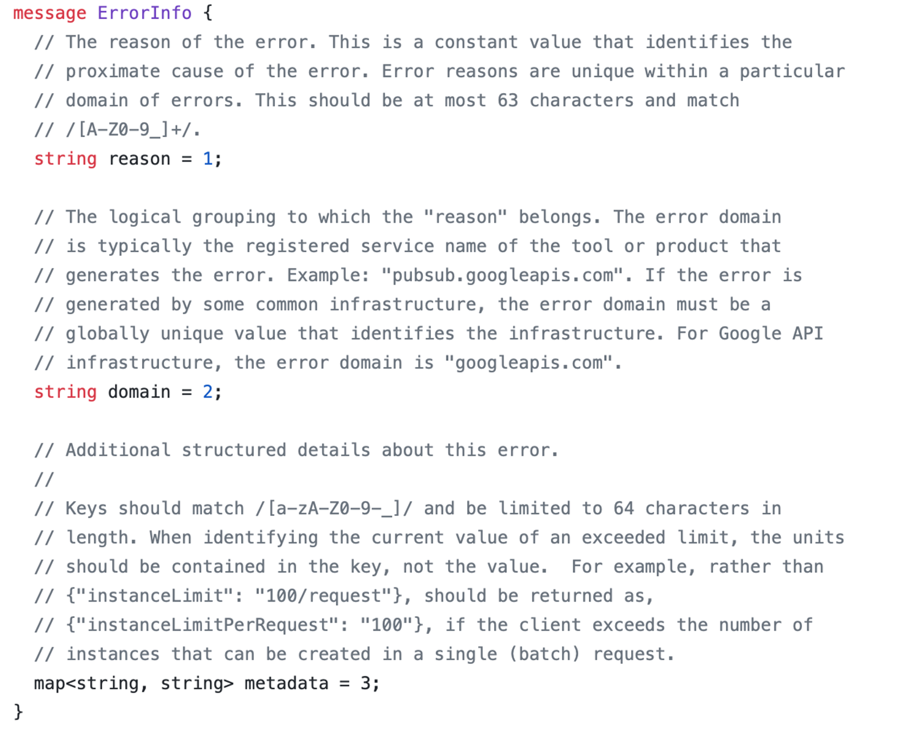


### API Design

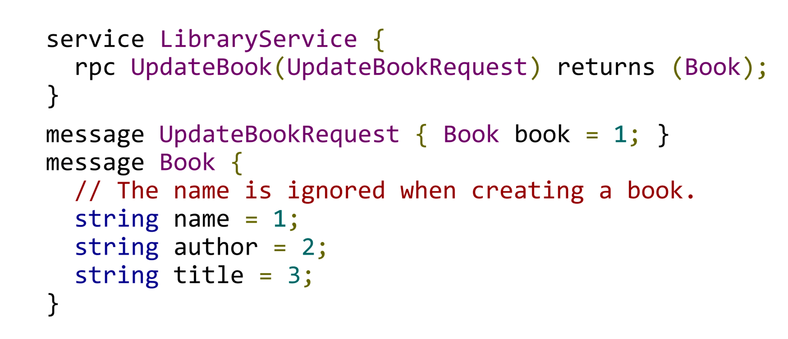

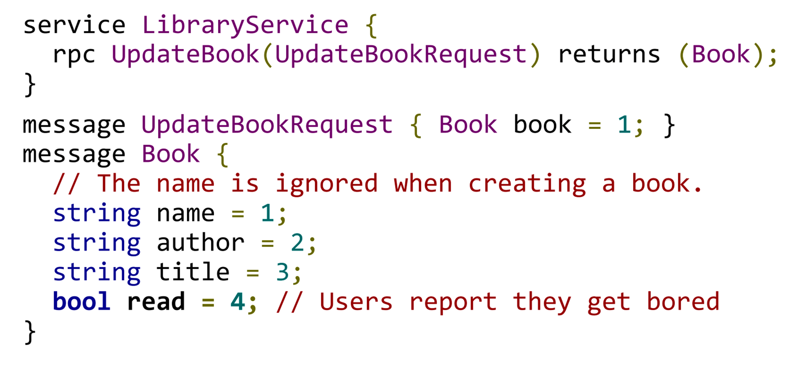

FieldMask 部分更新的方案:
• 客户端可以执行需要更新的字段信息:
paths: "author"
paths: "submessage.submessage.field"
空 FieldMask 默认应用到 “所有字段”


## 配置管理

### Configuration

- 环境变量(配置)
      Region、Zone、Cluster、Environment、Color、Discovery、AppID、Host，等之类的环境信息，都是通过在线运行时平台打入到容器或者物理机，供 kit 库读取使用。
- 静态配置
      资源需要初始化的配置信息，比如 http/gRPC server、redis、mysql 等，这类资源在线变更配置的风险非常大，我通常不鼓励 on-the-fly 变更，很可能会导致业务出现不可预期的事故，变更静态配置和发布 bianry app 没有区别，应该走一次迭代发布的流程。
- 动态配置
      应用程序可能需要一些在线的开关，来控制业务的一些简单策略，会频繁的调整和使用，我们把这类是基础类型(int, bool)等配置，用于可以动态变更业务流的收归一起，同时可以考虑结合类似 https://pkg.go.dev/expvar 来结合使用。
- 全局配置
      通常，我们依赖的各类组件、中间件都有大量的默认配置或者指定配置，在各个项目里大量拷贝复制，容易出现意外，所以我们使用全局配置模板来定制化常用的组件，然后再特化的应用里进行局部替换。

### Redis client example

```go
// DialTimeout acts like Dial for establishing the
// connection to the server, writing a command and reading a reply.
func Dial(network, address string) (Conn, error)
```

“我要自定义超时时间！”
“我要设定 Database！”
“我要控制连接池的策略！”
“我要安全使用 Redis，让我填一下 Password！”
“可以提供一下慢查询请求记录，并且可以设置 slowlog 时间？”

### Add Features

```go
// DialTimeout acts like Dial for establishing the
// connection to the server, writing a command and reading a reply.
func Dial(network, address string) (Conn, error)

// DialTimeout acts like Dial but takes timeouts for establishing the
// connection to the server, writing a command and reading a reply.
func DialTimeout(network, address string, connectTimeout, readTimeout, writeTimeout time.Duration) (Conn, error)

// DialDatabase acts like Dial but takes database for establishing the
// connection to the server, writing a command and reading a reply.
func DialDatabase(network, address string, database int) (Conn, error)

// DialPool
func DialPool...
```

### net/http

```go
package main

import (
  "log"
  "net/http"
  "time"
)

func main() {
  s := &http.Server{
  Addr: ":8080",
  Handler: nil,
  ReadTimeout: 10 * time.Second,
  WriteTimeout: 10 * time.Second,
  MaxHeaderBytes: 1 << 20,
}
  log.Fatal(s.ListenAndServe())
}

```

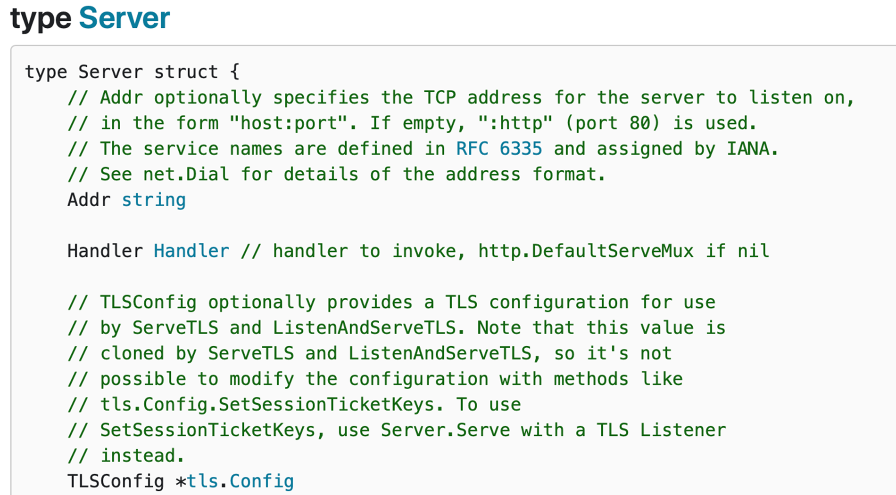

### Configuration struct API

```go
// Config redis settings.
type Config struct {
  *pool.Config
  Addr string
  Auth string
  DialTimeout time.Duration
  ReadTimeout time.Duration
  WriteTimeout time.Duration
}

// NewConn new a redis conn.
func NewConn(c *Config) (cn Conn, err error)

func main() {
  c := &redis.Config{
    Addr: "tcp://127.0.0.1:3389",
  }
  r, _ := redis.NewConn(c)
  c.Addr = "tcp://127.0.0.1:3390" // 副作用是什么？
}

```

```go
// NewConn new a redis conn.
func NewConn(c Config) (cn Conn, err error)

// NewConn new a redis conn.
func NewConn(c *Config) (cn Conn, err error)

// NewConn new a redis conn.
func NewConn(c ...*Config) (cn Conn, err error)

import (
  "github.com/go-kratos/kratos/pkg/log"
)
func main() {
  log.Init(nil) // 这样使用默认配置
  // config.fix() // 修正默认配置
}
```

`“I believe that we, as Go programmers, should work hard to ensure that nil is never a parameter that needs to be passed to any public function.” – Dave Cheney`

### Functional options

`Self-referential functions and the design of options -- Rob Pike
Functional options for friendly APIs -- Dave Cheney`

```go
// DialOption specifies an option for dialing a Redis server.
type DialOption struct {
  f func(*dialOptions)
}

// Dial connects to the Redis server at the given network and
// address using the specified options.
func Dial(network, address string, options ...DialOption) (Conn, error) {
  do := dialOptions{
    dial: net.Dial,
  }
  for _, option := range options {
    option.f(&do)
  } // ...
}

```

```go
package main
import (
  "time"
  "github.com/go-kratos/kratos/pkg/cache/redis"
)
func main() {
  c, _ := redis.Dial("tcp", "127.0.0.1:3389",
  redis.DialDatabase(0),
  redis.DialPassword("hello"),
  redis.DialReadTimeout(10*time.Second))
}

```

```go
// DialOption specifies an option for dialing a Redis server.
type DialOption func(*dialOptions)


// Dial connects to the Redis server at the given network and
// address using the specified options.
func Dial(network, address string, options ...DialOption) (Conn, error) {
  do := dialOptions{
    dial: net.Dial,
  }
  for _, option := range options {
    option(&do)
  }
  // ...
}
```

```go
type option func(f *Foo) option
// Verbosity sets Foo's verbosity level to v.
func Verbosity(v int) option {
  return func(f *Foo) option {
    prev := f.verbosity
    f.verbosity = v
    return Verbosity(prev)
  }
}
func DoSomethingVerbosely(foo *Foo, verbosity int) {
  // Could combine the next two lines,
  // with some loss of readability.
  prev := foo.Option(pkg.Verbosity(verbosity))
  defer foo.Option(prev)
  // ... do some stuff with foo under high verbosity.
}

```

```go
type GreeterClient interface {
  SayHello(ctx context.Context, in *HelloRequest, opts ...grpc.CallOption)     (*HelloReply, error)
}

type CallOption interface {
  before(*callInfo) error
  after(*callInfo)
}
// EmptyCallOption does not alter the Call configuration.
type EmptyCallOption struct{}

// TimeoutCallOption timeout option.
type TimeoutCallOption struct {
  grpc.EmptyCallOption
  Timeout time.Duration
}

```

### Hybrid APIs

```go
// Dial connects to the Redis server at the given network and
// address using the specified options.
func Dial(network, address string, options ...DialOption) (Conn, error)

// NewConn new a redis conn.
func NewConn(c *Config) (cn Conn, err error)
```

JSON/YAML 配置怎么加载，无法映射 DialOption 啊！”

“嗯，不依赖配置的走 options，配置加载走config”

### Configuration & APIs

`“For example, both your infrastructure and interface might use plain JSON. However, avoid tight coupling between the data format you use as the interface and the data format you use internally. For example, you may use a data structure internally that contains the data structure consumed from configuration. The internal data structure might also contain completely implementation-specific data that never needs to be surfaced outside of the system.”`

`-- the-site-reliability-workbook 2`

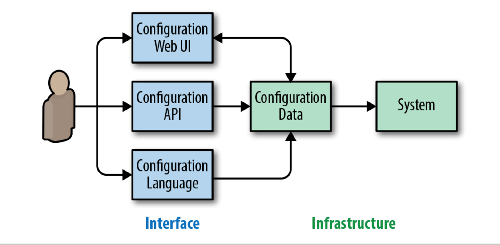

```go
// Dial connects to the Redis server at the given network and
// address using the specified options.
func Dial(network, address string, options ...DialOption) (Conn, error)
```

仅保留 options API;
config file 和 options struct 解耦;

配置工具的实践：

- 语义验证
- 高亮
- Lint
- 格式化

YAML + Protobuf

```go
// Options apply config to options.
func (c *Config) Options() []redis.Options {
  return []redis.Options{
    redis.DialDatabase(c.Database),
    redis.DialPassword(c.Password),
    redis.DialReadTimeout(c.ReadTimeout),
  }
}

func main() {
  // instead use load yaml file.
  c := &Config{
    Network: "tcp",
    Addr: "127.0.0.1:3389",
    Database: 1,
    Password: "Hello",
    ReadTimeout: 1 * time.Second,
  }
  r, _ := redis.Dial(c.Network, c.Addr, c.Options()...)
}

```

```go
package redis
// Option configures how we set up the connection.
type Option interface {
  apply(*options)
}

```

```go
func ApplyYAML(s *redis.Config, yml string) error {
  js, err := yaml.YAMLToJSON([]byte(yml))
  if err != nil {
    return err
  }
  return ApplyJSON(s, string(js))
}
// Options apply config to options.
func Options(c *redis.Config) []redis.Options {
  return []redis.Options{
    redis.DialDatabase(c.Database),
    redis.DialPassword(c.Password),
    redis.DialReadTimeout(c.ReadTimeout),
  }
}

```

```protobuf
syntax = "proto3";
import "google/protobuf/duration.proto";
package config.redis.v1;
// redis config.
message redis {
  string network = 1;
  string address = 2;
  int32 database = 3;
  string password = 4;
  google.protobuf.Duration read_timeout = 5;
}

```

```go
func main() {
  // load config file from yaml.
  c := new(redis.Config)
  _ = ApplyYAML(c, loadConfig())
  r, _ := redis.Dial(c.Network, c.Address, Options(c)...)
}

```


### Configuration Best Pratice


代码更改系统功能是一个冗长且复杂的过程，往往还涉及Review、测试等流程，但更改单个配置选项可能会对功能产生重大影响，通常配置还未经测试。配置的目标：

- 避免复杂
- 多样的配置
- 简单化努力
- 以基础设施 -> 面向用户进行转变
- 配置的必选项和可选项
- 配置的防御编程
- 权限和变更跟踪
- 配置的版本和应用对齐
- 安全的配置变更：逐步部署、回滚更改、自动回滚

## 包管理

### go mod

https://github.com/gomods/athens
https://goproxy.cn

https://blog.golang.org/modules2019
https://blog.golang.org/using-go-modules
https://blog.golang.org/migrating-to-go-modules
https://blog.golang.org/module-mirror-launch
https://blog.golang.org/publishing-go-modules
https://blog.golang.org/v2-go-modules
https://blog.golang.org/module-compatibility

## 测试

### Unittest

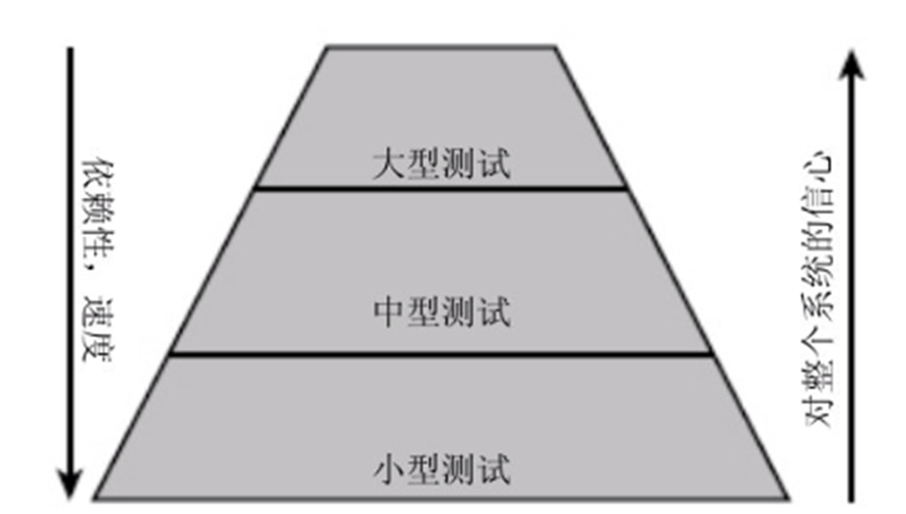

小型测试带来优秀的代码质量、良好的异常处理、优雅的错误报告；大中型测试会带来整体产品质量和数据验证。
不同类型的项目，对测试的需求不同，总体上有一个经验法则，即70/20/10原则：70%是小型测试，20%是中型测试，10%是大型测试。
如果一个项目是面向用户的，拥有较高的集成度，或者用户接口比较复杂，他们就应该有更多的中型和大型测试；如果是基础平台或者面向数据的项目，例如索引或网络爬虫，则最好有大量的小型测试，中型测试和大型测试的数量要求会少很多。

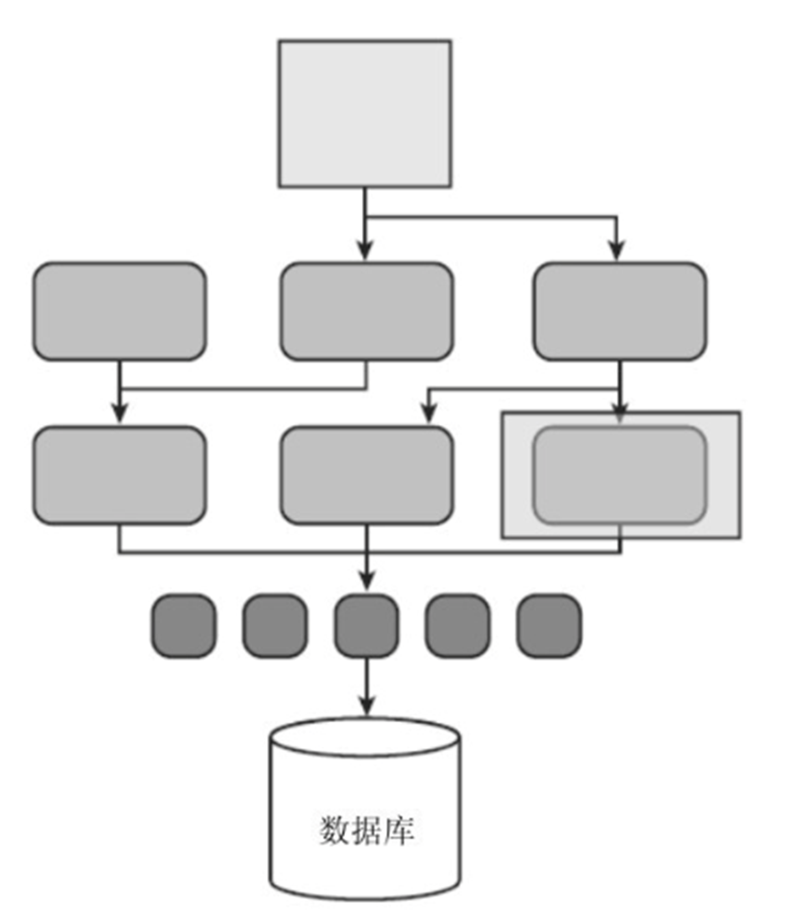

“自动化实现的，用于验证一个单独函数或独立功能模块的代码是否按照预期工作，着重于典型功能性问题、数据损坏、错误条件和大小差一错误（译注：大小差一(off-by-one)错误是一类常见的程序设计错误）等方面的验证”

- 《Google软件测试之道》

单元测试的基本要求：

- 快速
- 环境一致
- 任意顺序
- 并行

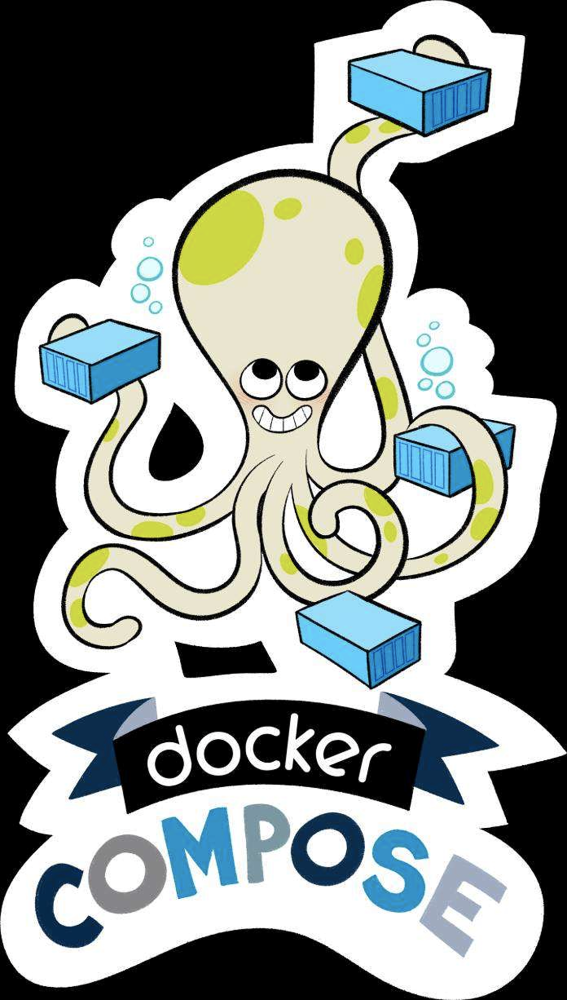

基于 docker-compose 实现跨平台跨语言环境的容器依赖管理方案，以解决运行 unittest 场景下的(mysql, redis, mc)容器依赖问题:

- 本地安装 Docker。
- 无侵入式的环境初始化。
- 快速重置环境。
- 随时随地运行(不依赖外部服务)。
- 语义式 API 声明资源。
- 真实外部依赖，而非 in-process 模拟。

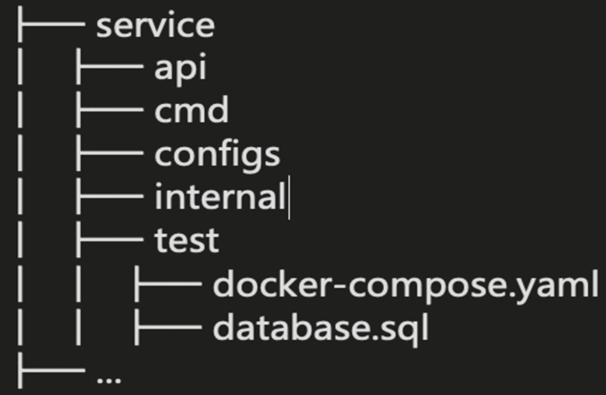

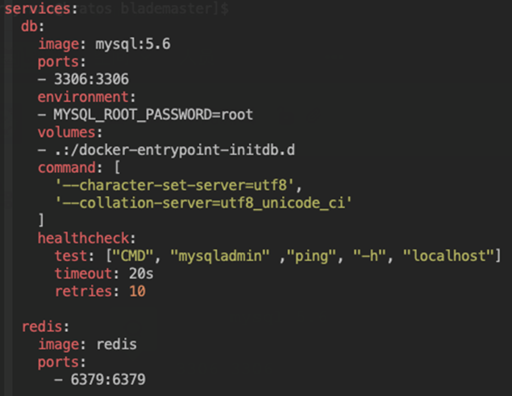

- 正确的对容器内服务进行健康检测，避免unittest 启动时候资源还未 ready。
- 应该交由 app 自己来初始化数据，比如 db 的scheme，初始的 sql 数据等，为了满足测试的一致性，在每次结束后，都会销毁容器。
- 在单元测试开始前，导入封装好的 testing 库，方便启动和销毁容器。
- 对于 service 的单元测试，使用 gomock 等库把 dao mock 掉，所以在设计包的时候，应该面向抽象编程。
- 在本地执行依赖 Docker，在 CI 环境里执行Unittest，需要考虑在物理机里的 Docker 网络，或者在 Docker 里再次启动一个 Docker。

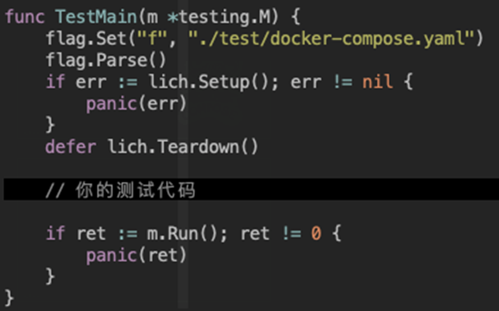

利用 go 官方提供的: Subtests  + Gomock 完成整个单元测试。
/api
    比较适合进行集成测试，直接测试 API，使用 API 测试框架(例如: yapi)，维护大量业务测试 case。
/data
    docker compose 把底层基础设施真实模拟，因此可以去掉 infra 的抽象层。
/biz
    依赖  repo、rpc client，利用 gomock 模拟 interface 的实现，来进行业务单元测试。
/service
    依赖 biz 的实现，构建 biz 的实现类传入，进行单元测试。

**基于 git branch 进行 feature 开发，本地进行 unittest，之后提交 gitlab merge request 进行 CI 的单元测试，基于 feature branch 进行构建，完成功能测试，之后合并 master，进行集成测试，上线后进行回归测试。**

## References

```
https://www.ardanlabs.com/blog/2017/02/package-oriented-design.html
https://www.ardanlabs.com/blog/2017/02/design-philosophy-on-packaging.html
https://github.com/golang-standards/project-layout
https://github.com/golang-standards/project-layout/blob/master/README_zh.md
https://www.cnblogs.com/zxf330301/p/6534643.html
https://blog.csdn.net/k6T9Q8XKs6iIkZPPIFq/article/details/109192475?ops_request_misc=%257B%2522request%255Fid%2522%253A%2522160561008419724839224387%2522%252C%2522scm%2522%253A%252220140713.130102334.pc%255Fall.%2522%257D&request_id=160561008419724839224387&biz_id=0&utm_medium=distribute.pc_search_result.none-task-blog-2~all~first_rank_v2~rank_v28-6-109192475.first_rank_ecpm_v3_pc_rank_v2&utm_term=阿里技术专家详解DDD系列&spm=1018.2118.3001.4449
https://blog.csdn.net/chikuai9995/article/details/100723540?biz_id=102&utm_term=阿里技术专家详解DDD系列&utm_medium=distribute.pc_search_result.none-task-blog-2~all~sobaiduweb~default-0-100723540&spm=1018.2118.3001.4449
https://blog.csdn.net/Taobaojishu/article/details/101444324?ops_request_misc=%257B%2522request%255Fid%2522%253A%2522160561008419724838528569%2522%252C%2522scm%2522%253A%252220140713.130102334..%2522%257D&request_id=160561008419724838528569&biz_id=0&utm_medium=distribute.pc_search_result.none-task-blog-2~all~top_click~default-1-101444324.first_rank_ecpm_v3_pc_rank_v2&utm_term=阿里技术专家详解DDD系列&spm=1018.2118.3001.4449
https://blog.csdn.net/taobaojishu/article/details/106152641
https://cloud.google.com/apis/design/errors
https://kb.cnblogs.com/page/520743/
https://zhuanlan.zhihu.com/p/105466656
https://zhuanlan.zhihu.com/p/105648986
https://zhuanlan.zhihu.com/p/106634373
https://zhuanlan.zhihu.com/p/107347593
https://zhuanlan.zhihu.com/p/109048532
https://zhuanlan.zhihu.com/p/110252394
https://www.jianshu.com/p/dfa427762975
https://www.citerus.se/go-ddd/
https://www.citerus.se/part-2-domain-driven-design-in-go/
https://www.citerus.se/part-3-domain-driven-design-in-go/
https://www.jianshu.com/p/dfa427762975
https://www.jianshu.com/p/5732b69bd1a1
https://www.cnblogs.com/qixuejia/p/10789612.html
https://www.cnblogs.com/qixuejia/p/4390086.html
https://www.cnblogs.com/qixuejia/p/10789621.html
https://zhuanlan.zhihu.com/p/46603988
https://github.com/protocolbuffers/protobuf/blob/master/src/google/protobuf/wrappers.proto
https://dave.cheney.net/2014/10/17/functional-options-for-friendly-apis
https://commandcenter.blogspot.com/2014/01/self-referential-functions-and-design.html
https://blog.csdn.net/taobaojishu/article/details/106152641
https://apisyouwonthate.com/blog/creating-good-api-errors-in-rest-graphql-and-grpc
https://blog.cleancoder.com/uncle-bob/2012/08/13/the-clean-architecture.html
https://www.youtube.com/watch?v=oL6JBUk6tj0
https://github.com/zitryss/go-sample
https://github.com/danceyoung/paper-code/blob/master/package-oriented-design/packageorienteddesign.md
https://medium.com/@eminetto/clean-architecture-using-golang-b63587aa5e3f
https://hackernoon.com/golang-clean-archithecture-efd6d7c43047
https://medium.com/@benbjohnson/standard-package-layout-7cdbc8391fc1
https://medium.com/wtf-dial/wtf-dial-domain-model-9655cd523182
https://hackernoon.com/golang-clean-archithecture-efd6d7c43047
https://hackernoon.com/trying-clean-architecture-on-golang-2-44d615bf8fdf
https://manuel.kiessling.net/2012/09/28/applying-the-clean-architecture-to-go-applications/
https://github.com/katzien/go-structure-examples
https://www.youtube.com/watch?v=MzTcsI6tn-0
https://www.appsdeveloperblog.com/dto-to-entity-and-entity-to-dto-conversion/
https://travisjeffery.com/b/2019/11/i-ll-take-pkg-over-internal/
https://github.com/google/wire/blob/master/docs/best-practices.md
https://github.com/google/wire/blob/master/docs/guide.md
https://blog.golang.org/wire
https://github.com/google/wire
https://www.ardanlabs.com/blog/2019/03/integration-testing-in-go-executing-tests-with-docker.html
https://www.ardanlabs.com/blog/2019/10/integration-testing-in-go-set-up-and-writing-tests.html
https://blog.golang.org/examples
https://blog.golang.org/subtests
https://blog.golang.org/cover
https://blog.golang.org/module-compatibility
https://blog.golang.org/v2-go-modules
https://blog.golang.org/publishing-go-modules
https://blog.golang.org/module-mirror-launch
https://blog.golang.org/migrating-to-go-modules
https://blog.golang.org/using-go-modules
https://blog.golang.org/modules2019
https://blog.codecentric.de/en/2017/08/gomock-tutorial/
https://pkg.go.dev/github.com/golang/mock/gomock
https://medium.com/better-programming/a-gomock-quick-start-guide-71bee4b3a6f1
```

