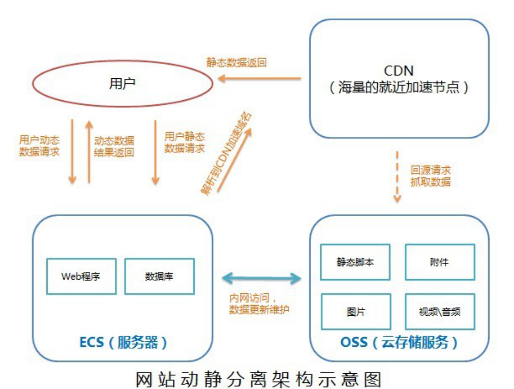

# Go 架构实践 - 微服务(微服务可用性设计)

## 隔离

隔离，本质上是对系统或资源进行分割，从而实现当系统发生故障时能限定传播范围和影响范围，即发生故障后只有出问题的服务不可用，保证其他服务仍然可用。

**服务隔离**

- 动静分离
- 读写分离

**轻重隔离**

- 核心
- 快慢
- 热点

**物理隔离**

- 线程
- 进程
- 集群
- 机房

### 服务隔离

#### 动静隔离

小到 CPU 的 cacheline false sharing、数据库 mysql 表设计中避免 bufferpool 频繁过期，隔离动静表，大到架构设计中的图片、静态资源等缓存加速。本质上都体现的一样的思路，即加速/缓存访问变换频次小的。比如 CDN 场景中，将静态资源和动态 API 分离，也是体现了隔离的思路:

- 降低应用服务器负载，静态文件访问负载全部通过CDN。
- 对象存储存储费用最低。
- 海量存储空间，无需考虑存储架构升级。
- 静态CDN带宽加速，延迟低。

## 超时控制

## 过载保护

## 限流

## 降级

## 重试

## 负载均衡

## 最佳实践

## References