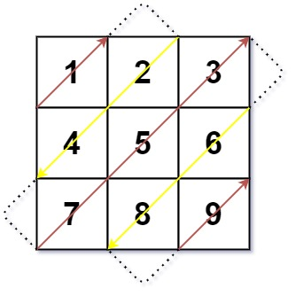

#### [498. 对角线遍历](https://leetcode.cn/problems/diagonal-traverse/)

难度中等313收藏分享切换为英文接收动态反馈

给你一个大小为 `m x n` 的矩阵 `mat` ，请以对角线遍历的顺序，用一个数组返回这个矩阵中的所有元素。

 

**示例 1：**



```
输入：mat = [[1,2,3],[4,5,6],[7,8,9]]
输出：[1,2,4,7,5,3,6,8,9]
```

**示例 2：**

```
输入：mat = [[1,2],[3,4]]
输出：[1,2,3,4]
```

 

**提示：**

- `m == mat.length`
- `n == mat[i].length`
- `1 <= m, n <= 104`
- `1 <= m * n <= 104`
- `-105 <= mat[i][j] <= 105`


```go
func findDiagonalOrder(mat [][]int) []int {
    m, n := len(mat), len(mat[0])
    ans := make([]int, 0, m*n)
    for i := 0; i < m+n-1; i++ {
        if i%2 == 1 {
            x := max(i-n+1, 0)
            y := min(i, n-1)
            for x < m && y >= 0 {
                ans = append(ans, mat[x][y])
                x++
                y--
            }
        } else {
            x := min(i, m-1)
            y := max(i-m+1, 0)
            for x >= 0 && y < n {
                ans = append(ans, mat[x][y])
                x--
                y++
            }
        }
    }
    return ans
}

func min(a, b int) int {
    if a > b {
        return b
    }
    return a
}

func max(a, b int) int {
    if b > a {
        return b
    }
    return a
}
```

```java
class Solution {
    public int[] findDiagonalOrder(int[][] mat) {
        int m = mat.length;
        int n = mat[0].length;
        int[] res = new int[m * n];
        int pos = 0;
        for (int i = 0; i < m + n - 1; i++) {
            if (i % 2 == 1) {
                int x = i < n ? 0 : i - n + 1;
                int y = i < n ? i : n - 1;
                while (x < m && y >= 0) {
                    res[pos] = mat[x][y];
                    pos++;
                    x++;
                    y--;
                }
            } else {
                int x = i < m ? i : m - 1;
                int y = i < m ? 0 : i - m + 1;
                while (x >= 0 && y < n) {
                    res[pos] = mat[x][y];
                    pos++;
                    x--;
                    y++;
                }
            }
        }
        return res;
    }
}
```

