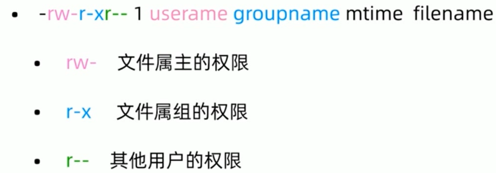
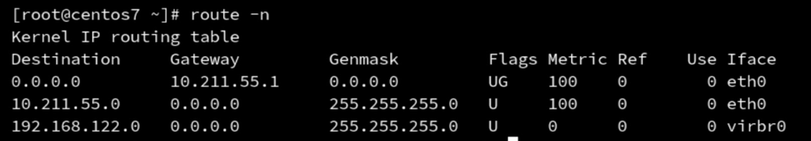

## Linux实战技能100讲

## 什么是liunx

- 一种是Liuns编写的开源操作系统的内核
- 另一种是广义的操作系统

## liunx 版本

- 内核版本

  - http://www.kernel.org/
  - 内核版本分为三个部分
  - 主版本号、次版本号、末版本号
  - 次版本号是奇数为开发版，偶数为稳定版

- 发行版本

  - RedHat Enterprise Linux

  - Fedora

  - CentOS

  - Debian

  - Ubuntu

### 终端

- 图形终端
- 命令行
-  远程终端（SSH、VNC）

### 常用目录介绍

- `/` 根目录
- `/root`  root用户的家目录
- `/home/username`普通用户的家目录
- `/etc`配置文件目录
- `/ bin`命令目录
- `/sbin`管理命令目录
- `/usr/ bin /usr/sbin`系统预装的其他命令

### 关机

```sh
init 0
```

## 万能的帮助命令

### man 帮助

- man是manual的缩写

- man帮助用法演示.

  ```sh
  man ls
  ```

- man 也是一条命令，分为9章，可以使用man命令获得man的帮助
  ```sh
  man 1 passwd
  ```

### help 帮助

- shell(命令解释器）自带的命令称为内部命令，其他的是外部命令

- 内部命令使用help帮助
  ```sh
  help cd
  ```

- 外部命令使用help帮助

  ```sh
  ls--help
  ```
### info 帮助

info帮助比 help更详细，作为help 的补充

```sh
info ls
```

## pwd命令
pwd 显示当前的目录名称

```sh
pwd
```

## cd命令
cd 更改当前的操作目录

```sh
cd /path/to/l.... 绝对路径
cd ./path/to/... 相对路径
cd ../path/tol... 相对路径
```

```sh
cd - 返回上个目录
```


## ls命令

 ls 查看当前目录下的文件

- ls [选项，选项...]参数...

常用参数:

- -l 长格式显示文件
- -a 显示隐藏文件
- -r 逆序显示
- -t 按照时间顺序显示
- -R 递归显示

显示多个目录

```sh
ls /root /
```

## mkdir命令

创建目录

- -p 创建多级目录

```sh
mkdir a/b/c
```

## rmdir 命令

删除空目录

rm -r 删除非空目录

## cp 命令

cp复制文件和目录

- cp[选项] 文件路径
- cp[选项] 文件...路径

常用参数

- -r 复制目录
- -p 保留用户、权限、时间等文件属性
- -a 等同于-dpR

## mv命令

mv 移动文件

- mv[选项] 源文件 目标文件
- mv[选项] 源文件 目录

## 通配符

- 定义: shell 内建的符号
- 用途:操作多个相似（有简单规律)的文件
- 常用通配符

```
* 匹配任何字符串
? 匹配1个字符串
[xyz] 匹配xyz任意一个字符
[a-z] 匹配一个范围
[!xyz]或[^xyz] 不匹配
```

## 文本查看命令

- cat 文本内容显示到终端

- head 查看文件开头

  ```sh
  head -10 a.txt # 查看头10行
  ```

- tail 查看文件结尾
  - 常用参数-f 文件内容更新后，显示信息同步更新
  ```sh
  tail -10 a.txt # 查看尾10行
  ```
  
- wc 统计文件内容信息

  ```sh
  wc -l a.txt # 查看行数
  ```

## Vi/Vim 多模式文本编辑器

四种模式

- 正常模式(Normal-mode)
- 插入模式(Insert-mode)
- 命令模式(Command-mode)
- 可视模式(Visual-mode)

## 打包与压缩

### Linux的备份压缩

- 最早的Linux备份介质是磁带，使用的命令是tar
- 可以打包后的磁带文件进行压缩储存，压缩的命令是gzip和bzip2
- 经常使用的扩展名是.tar.gz   .tar.bz2 .   tgz

## 打包命令

tar 打包命令

常用参数

- c 打包
- x 解压
- f 指定操作类型为文件

**压缩**

```
tar –cvf jpg.tar *.jpg       // 将目录里所有jpg文件打包成 tar.jpg 
tar –czf jpg.tar.gz *.jpg    // 将目录里所有jpg文件打包成 jpg.tar 后，并且将其用 gzip 压缩，生成一个 gzip 压缩过的包，命名为 jpg.tar.gz 
tar –cjf jpg.tar.bz2 *.jpg   // 将目录里所有jpg文件打包成 jpg.tar 后，并且将其用 bzip2 压缩，生成一个 bzip2 压缩过的包，命名为jpg.tar.bz2 
tar –cZf jpg.tar.Z *.jpg     // 将目录里所有 jpg 文件打包成 jpg.tar 后，并且将其用 compress 压缩，生成一个 umcompress 压缩过的包，命名为jpg.tar.Z 
rar a jpg.rar *.jpg          // rar格式的压缩，需要先下载 rar for linux 
zip jpg.zip *.jpg            // zip格式的压缩，需要先下载 zip for linux
```

**解压**

```
tar –xvf file.tar         // 解压 tar 包 
tar -xzvf file.tar.gz     // 解压 tar.gz 
tar -xjvf file.tar.bz2    // 解压 tar.bz2 
tar –xZvf file.tar.Z      // 解压 tar.Z 
unrar e file.rar          // 解压 rar 
unzip file.zip            // 解压 zip 
```

**总结**

```
1、*.tar 用 tar –xvf 解压 
2、*.gz 用 gzip -d或者gunzip 解压 
3、*.tar.gz和*.tgz 用 tar –xzf 解压 
4、*.bz2 用 bzip2 -d或者用bunzip2 解压 
5、*.tar.bz2用tar –xjf 解压 
6、*.Z 用 uncompress 解压 
7、*.tar.Z 用tar –xZf 解压 
8、*.rar 用 unrar e解压 
9、*.zip 用 unzip 解压
```

## 用户与权限管理

- useradd   新建用户
- userdel    删除用户
- passwd    修改用户密码
- usermod 修改用户属性
- chage       修改用户属性

### 用户配置文件

```sh
#/etc/passwd 用户信息
#/etc/shadow 用户密码
```


## 组管理命令

- groupadd 新建用户组
- groupdel 删除用户组

## 用户切换

- su 切换用户
  - su -USERNAME 使用 login shell 方式切换用户
- sudo 以其他用户身份执行命令
  - visudo 设置需要使用sudo的用户（组）

授予user3 访问`shutdown -h` 命令

```sh
#1 
visudo

#2 添加配置
user3 ALL=/sbin/shutdown -c 
```

## 查看文件权限的方式


## 文件类型

- -普通文件
- d目录文件
- b 块特殊文件
- c 字符特殊文件
- l 符号链接
- f 命名管道
- s 套接字文件

## 文件权限的表示方式

- 字符权限表示方法
  - r 读
  - w 写
  - x 执行
- 数字权限表示方法
  - r = 4 
  - w = 2
  - x = 1 



- 创建新文件有默认权限，根据umask值计算，属主和属组根据当前进程的用户来设定

## 目录权限的表示方法

- x 进入目录
- rx 显示目录内的文件名
- wx 修改目录内的文件名

## 修改权限命令

- chmod 修改文件、目录权限
  - chmod   u+x    /tmp/testfile
  - chmod    755    /tmp/testfile
- chown 更改属主、属组
- chgrp 可以单独更改属组，不常用

## 特殊权限

- SUID 用于二进制可执行文件，执行命令时取得文件属主权限
  - 如 `usr/bin/passwd`
- SGID 用于目录，在该目录下创建新的文件和目录，权限自动更改为该目录的属组
- SBIT  用于目录，该目录下新建的文件和目录，仅root和自己可以删除
  - 如 /tmp


## 网络管理

- 网络状态查看
- 网络配置
- 路由命令
- 网络故障排除
- 网络服务管理
- 常用网络配置文件

## 网络状态查看

net-tools vs iproute

### 1.net-tools

- ifconfig
- route
- netstat

### 2.iproute2

- ip
- ss

## ifconfig 

- etho第一块网卡（网络接口)

- 你的第一个网络接口可能叫做下面的名字
  - eno1           板载网卡
  - ens33         PCl-E网卡
  - enp0s3       无法获取物理信息的PCI-E网卡
  - centOS 7    使用了一致性网络设备命名，以上都不匹配则使用etho

## 网络接口命名修改

- 网卡命名规则受biosdevname和net.ifnames两个参数影响

- 编辑/etc/default/grub文件，增加biosdevname=0 net.ifnames=0

- 更新grub

   grub2-mkconfig -o /boot/grub2/grub.cfg


- 重启

  reboot

  |       | biosdevname | net.ifnames | 网卡名 |
  | :---: | :---------: | :---------: | :----: |
  | 默认  |      0      |      1      | ens33  |
  | 组合1 |      1      |      0      |  em1   |
  | 组合2 |      0      |      0      |  eth0  |


## 查看网卡物理连接情况

- mii-tool eth0

## 查看网关

- route -n
- 使用-n参数不解析主机名

##  网络配置命令

- ifconfig <接口> <ip 地址>[netmask 子网掩码]  修改网卡配置

  ```sh
  ifconfig eth0 10.211.55.4 netmask 255.255.255.0 #修改 eth0 的ip和子网掩码
  ```

- ifup <接口>  开启网卡

  ```sh
  ifup eth0
  ```

- ifdown <接口> 关闭网卡
  ```sh
  ifdown eth0
  ```

## 网关配置命令

- route add default gw <网关ip>
- route add -host <指定ip> gw <网关ip>
- route add -net <指定网段> netmask <子网掩码>  gw <网关ip>

例子（修改默认网关）



```sh
route  del default gw 10.211.55.1  # 先删除默认网关
route add default gw 10.211.55.2   # 再添加新网关
route add -host 10.0.0.1 gw 10.211.55.1  # 指定ip的网关
route add-net 192.168.0.0 netmask 255.255.255.0 gw 10.211.55.1  # 指定网端的网关
```

## 网络故障排除命令

- ping    

  ```
   ping 命令用于检测主机。
  执行 ping 指令会使用 ICMP 传输协议，发出要求回应的信息，若远端主机的网络功能没有问题，就会回应该信息，因而得知该主机运作正常。
  ```

- traceroute

  ```sh
  traceroute命令用于显示数据包到主机间的路径。
  traceroute指令让你追踪网络数据包的路由途径，预设数据包大小是40Bytes，用户可另行设置。
  ```

- mtr

  ```
  mtr在单个网络诊断工具中结合了traceroute和ping程序的功能。当mtr启动时，它调查运行在主机mtr和主机名之间的网络连接。
  
  通过发送有目的的低TTL的包。它继续以较低的TTL发送数据包，记录中间路由器。这允许MTR打印Internet路由的响应百分比和响应时间。到主机名。包丢失或响应时间的突然增加通常是坏的（或仅仅是过度的）迹象。已加载）链接。结果通常以往返响应时间（毫秒）和包丢失百分比报告。
  ```

- nslookup

  ```
  nslookup命令用于查询DNS的记录，查看域名解析是否正常，在网络故障的时候用来诊断网络问题。
  ```

- telnet

  ```
  telnet命令用于远端登入和远程ip端口检测。
  检测 百度的80端口
  telnet www.baidu.com 80
  
  
  执行telnet指令开启终端机阶段作业，并登入远端主机。
  ```

- tcpdump

  ```
  tcpdump命令用于倾倒网络传输数据。
  
  抓取任意网卡的的80端口
  tcpdump -i any -n port 80
  -i<网络界面> 使用指定的网络截面送出数据包。
  -n 不把主机的网络地址转换成名字。
  
  执行tcpdump指令可列出经过指定网络界面的数据包文件头，在Linux操作系统中，你必须是系统管理员。
  ```

- netstat

  ```
  netstat 命令用于显示网络状态。
  
  利用 netstat 指令可让你得知整个 Linux 系统的网络情况。
  ```

- ss

  ```
  ss是Socket Statistics的缩写。ss命令用来显示处于活动状态的套接字信息。它可以显示和netstat类似的内容。但ss的优势在于它能够显示更多更详细的有关TCP和连接状态的信息，而且比netstat更快速更高效。
  ```

## 网络服务管理

网络服务管理程序分为两种，分别为SysV和systemd

- service network start|stop|restart
- chkconfig --list network
- systemctl list-unit-files NetworkManager.service
- systemctl start|stop|restart NetworkManger
- systemctl enable|disable NetworkManger

## 网络配置文件

- ifcfg-eth0 网卡配置
- /etc/hosts 域名设置

```
# 查看网络状态
service network status
# 重启网络昨天
service network restart
# 查看network服务
chkconfig --list network
# 关闭network服务
chkconfig --level 2345 network off
# 关闭NetworkManger服务
systemctl  disable  NetworkManger
# hostname 修改主机名
hostname myname
hostnamectl set-hostname  myname 永久生效
```

## 软件安装

## 软件包管理器

包管理器是方便软件安装、卸载，解决软件依赖关系的重要工具

- Centos、RedHat使用yum包管理器，软件安装包格式为rpm
- Debian、Ubuntu使用apt包管理器，软件安装包格式为deb

### rpm包


rpm 命令

- -q 查询软件包
- -i 安装软件包
- -e 卸载软件包

## yum 包管理器

rpm 包的问题

- 需要自己解决依赖关系
- 软件包来源不可靠

Centos yum 源

https://mirror.centos.org/centos/7/

国内 yum源

https://developer.aliyun.com/mirror

### yum 配置文件

- /etc/yum.repos.d/CentOS-Base.repo 

- wget -O /etc/yum.repos.d/CentOS-Base.repo https://mirrors.aliyun.com/repo/Centos-7.repo

### yum 命令常用选型

- install     安装软件包
- remove  卸载软件包
- list |  grouplist 查看软件包
- update       升级软件包

替换阿里源包

```sh
1. 备份
mv /etc/yum.repos.d/CentOS-Base.repo /etc/yum.repos.d/CentOS-Base.repo.backup
2. 下载新的 CentOS-Base.repo 到 /etc/yum.repos.d/
wget -O /etc/yum.repos.d/CentOS-Base.repo https://mirrors.aliyun.com/repo/Centos-7.repo
3. 运行 yum makecache 生成缓存
yum makecache
```

## 其他方式安装

- 二进制安装
- 源代码编译安装
  - wget https://openresty.org/download/openresty-1.15.8.1.tar.gz
  - tar -zxf openresty-VERSION.tar.gz
  - cd openresty-VERSION/
  - ./configure --prefix=/usr/local/openresy
  - make -j2
  - make install 

## 升级内核

rpm 格式内核

- 查看内核版本
  - uname -r
- 升级内核版本
  - yum install kernel-3.10.0
- 升级已安装的其他软件包和补丁
  - yum update

源代码编译安装内核

- 安装依赖包 
  - yum install gcc gcc-c++ make ncurses-devel openssl-devel elfutils-libelf-devel
- 下载并解压内核
  - https://www.kernel.org
  - tar xvf liunx-5.1.10.tar.xz -C /usr/src/kernels

- 配置内核编译参数
  - cd /usrlsrc/kernels/linux-5.1.10/
  - make menuconfig | allyesconfig | allnoconfig
- 使用当前系统内核配置
  - cp / boot/config-kernelversion.platform /usrlsrc/kernels/linux-5.1.10/.config
- 查看CPU
  - lscpu
- 编译
  - make -j2 all
- 安装内核
  - make modules_install
  - make install

## grub 配置文件

grub 是什么

grub 配置文件

- /etc/default/grub
- /etc/grub.d/
- / boot/grub2/grub.cfg
- grub2-mkconfig -o /boot/grub2/grub.cfg

使用单用户进入系统 （忘记root密码）

## 进程管理

## 进程的概念

进程—运行中的程序，从程序开始运行到终止的整个生命周期是可管理的

C程序的启动是从main函数开始的

- int main(int agrc, char *argv[])
- 终止的方式并不唯一，分为正常终止和异常终止
  - 正常终止也分为从main返回、调用exit等方式
  - 异常终止分为调用abort、接收信号等

## 进程的查看命令

查看命令

- ps

  ```
  显示当前进程的状态
  ```

- pstree 

  ```
  将所有进程以树状图显示，树状图将会以 pid (如果有指定) 或是以 init 这个基本进程为根 (root)，如果有指定使用者 id，则树状图会只显示该使用者所拥有的进程。
  ```

- top

  ```
  Linux top命令用于实时显示 process 的动态。
  
  使用权限：所有使用者。
  ```

结论：

- 进程也是树形结构
- 进程和权限有着密不可分的关系

## 进程的优先级调整

调整优先级

- nice范围从-20到19，值越小优先级越高，抢占资源就越多.
- renice重新设置优先级

进程的作业控制

- jobs

  ```
  jobs命令 用于显示Linux中的任务列表及任务状态，包括后台运行的任务。该命令可以显示任务号及其对应的进程号。其中，任务号是以普通用户的角度进行的，而进程号则是从系统管理员的角度来看的。一个任务可以对应于一个或者多个进程号。
  
  在Linux系统中执行某些操作时候，有时需要将当前任务暂停调至后台，或有时须将后台暂停的任务重启开启并调至前台，这一序列的操作将会使用到 jobs、bg、和 fg 三个命令以及两个快捷键来完成。
  ```

- nohup 

  ```
  nohup 英文全称 no hang up（不挂起），用于在系统后台不挂断地运行命令，退出终端不会影响程序的运行。
  
  nohup 命令，在默认情况下（非重定向时），会输出一个名叫 nohup.out 的文件到当前目录下，如果当前目录的 nohup.out 文件不可写，输出重定向到 $HOME/nohup.out 文件中。
  
  nohup ./a.sh &
  ```

- & 符号 让进程后台执行

## 进程间通信

信号是进程间通信方式之一，典型用法是:

- 终端用户输入中断命令，通过信号机制停止一个程序的运行。

使用信号的常用快捷键和命令

- kill  命令

  ```
  kill 命令用于删除执行中的程序或工作。
  
  kill 可将指定的信息送至程序。预设的信息为 SIGTERM(15)，可将指定程序终止。若仍无法终止该程序，可使用 SIGKILL(9) 信息尝试强制删除程序。程序或工作的编号可利用 ps 指令或 jobs 指令查看。
  ```

- kill -l   显示信号
  - SIGINT   通知前台进程组终止进程 ctrl+ c
  - SIGKILL  立即结束程序，不能被阻塞和处理  kill -9 pid

## 守护进程

守护进程也称为精灵进程(Daemon)，是一个在后台运行且不受任何终端控制的特殊进程，用于执行特定的系统任务。很多守护进程在系统引导的时候启动，并且一直运行直到系统关闭。另一些只在需要的时候才启动，完成任务后就自动结束。

它独立于控制终端并且周期性的执行某种发生的事件。守护进程是一种很有用的进程。Linux的大多数服务器就是用守护进程实现的。

Linux系统启动时会启动很多系统服务进程，这些系统服务进程没有控制终端，不能直接和用户交互。其他进程都是在用户登录或运行程序时创建，在运行结束或用户注销时终止，但系统服务进程(守护进程)不受用户登录注销的影响，它们一直在运行着。这种进程有一个名称叫守护进程(Daemon)。

**守护进程的特点**

(1)在Linux中，每个系统与用户进行交流的界面成为终端，每一个从此终端开始运行的进程都会依附于这个终端，这个终端被称为这些进程的控制终端；

(2)当控制终端被关闭的时候，相应的进程都会自动关闭。但是守护进程却能突破这种限制，它脱离于终端并且在后台运行，(脱离终端的目的是为了避免进程在运行的过程中的信息在任何终端中显示并且进程也不会被任何终端所产生的终端信息所打断)，它从被执行的时候开始运转，直到整个系统关闭才退出(当然可以认为是杀死相应的守护进程)；

(3)如果想让某个进程不因为用户或中断或其他变化而影响，那么就必须把这个进程变成一个守护进程。

## screen命令

Linux screen命令用于多重视窗管理程序。

screen为多重视窗管理程序。此处所谓的视窗，是指一个全屏幕的文字模式画面。通常只有在使用telnet登入主机或是使用老式的终端机时，才有可能用到screen程序。

创建 screen 终端

```sh
screen 
```

创建 screen 终端 并执行任务

```sh
screen vi ~/main.c //创建 screen 终端 ，并执行 vi命令
```

离开 screen 终端

```
在 screen 终端 下 按下 Ctrl+a d键
```

重新连接离开的 screen 终端

```sh
screen -ls  //显示已创建的screen终端 
There are screens on:
2433.pts-3.linux    (2013年10月20日 16时48分59秒)    (Detached)
2428.pts-3.linux    (2013年10月20日 16时48分05秒)    (Detached)
2284.pts-3.linux    (2013年10月20日 16时14分55秒)    (Detached)
2276.pts-3.linux    (2013年10月20日 16时13分18秒)    (Detached)
4 Sockets in /var/run/screen/S-root.

screen -r 2276 //连接 screen_id 为 2276 的 screen终端
```

## 系统日志

```sh
/var/log
```

## systemctl 服务管理工具

Systemctl是一个systemd工具，主要负责控制systemd系统和服务管理器。

Systemd是一个系统管理守护进程、工具和库的集合，用于取代System V初始进程。Systemd的功能是用于集中管理和配置类UNIX系统。

systemctl 命令有两大类功能：

1. 控制 systemd 系统
2. 管理系统上运行的服务

管理单个unit 

systemctl 提供了一组子命令来管理单个的 unit，其命令格式为：

`systemctl [command] [unit]`

```sh
command 主要有：
start：立刻启动后面接的 unit。
stop：立刻关闭后面接的 unit。
restart：立刻关闭后启动后面接的 unit，亦即执行 stop 再 start 的意思。
reload：不关闭 unit 的情况下，重新载入配置文件，让设置生效。
enable：设置下次开机时，后面接的 unit 会被启动。
disable：设置下次开机时，后面接的 unit 不会被启动。
status：目前后面接的这个 unit 的状态，会列出有没有正在执行、开机时是否启动等信息。
is-active：目前有没有正在运行中。
is-enable：开机时有没有默认要启用这个 unit。
kill ：不要被 kill 这个名字吓着了，它其实是向运行 unit 的进程发送信号。
show：列出 unit 的配置。
mask：注销 unit，注销后你就无法启动这个 unit 了。
unmask：取消对 unit 的注销。
```

所有的*.service 文件都存放在`/lib/systemd/system`目录下面,

## SELinux 简介

- MAC (强制访问控制)与DAC (自主访问控制)
- 查看SELinux的命令
  - getenforce
  - /usr/sbin/sestatus
  - ps-Z and ls-Z and id -Z
- 关闭SELinux
  - setenforce 0
  - /etc/selinux/sysconfig

## 内存使用率的查看

top和free 命令

## free命令

free命令用于显示内存状态。

free指令会显示内存的使用情况，包括实体内存，虚拟的交换文件内存，共享内存区段，以及系统核心使用的缓冲区等。

**参数说明**：

- -b 　以Byte为单位显示内存使用情况。

- -k 　以KB为单位显示内存使用情况。

- -m 　以MB为单位显示内存使用情况。

- -h 　以合适的单位显示内存使用情况，最大为三位数，自动计算对应的单位值。单位有：

  ```
  B = bytes
  K = kilos
  M = megas
  G = gigas
  T = teras
  ```

- -o 　不显示缓冲区调节列。

- -s<间隔秒数> 　持续观察内存使用状况。

- -t 　显示内存总和列。

- -V 　显示版本信息。

实例

显示内存使用情况

```
# free //显示内存使用信息
total used free shared buffers cached
Mem: 254772 184568 70204 0 5692 89892
-/+ buffers/cache: 88984 165788
Swap: 524280 65116 459164
```

以总和的形式显示内存的使用信息

```
# free -t //以总和的形式查询内存的使用信息
total used free shared buffers cached
Mem: 254772 184868 69904 0 5936 89908
-/+ buffers/cache: 89024 165748
Swap: 524280 65116 459164
Total: 779052 249984 529068
```

周期性的查询内存使用信息

```
# free -s 10 //每10s 执行一次命令
total used free shared buffers cached
Mem: 254772 187628 67144 0 6140 89964
-/+ buffers/cache: 91524 163248
Swap: 524280 65116 459164

total used free shared buffers cached
Mem: 254772 187748 67024 0 6164 89940
-/+ buffers/cache: 91644 163128
Swap: 524280 65116 459164
```

