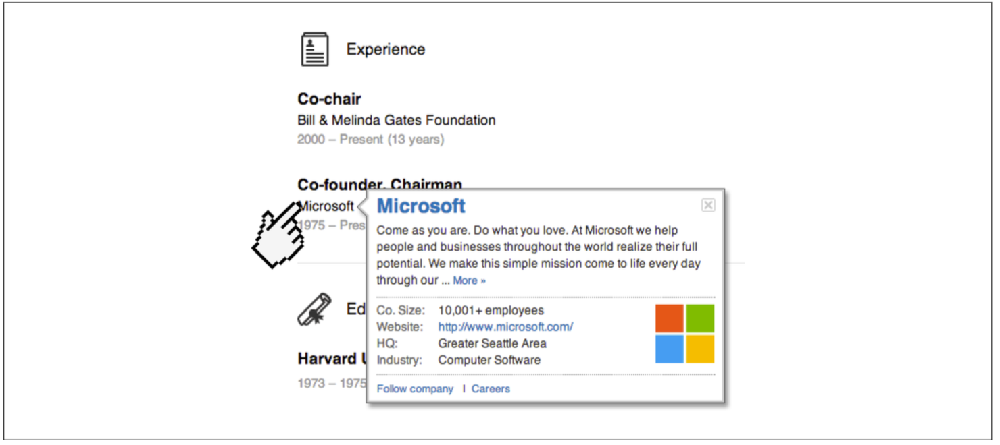

# 第二章 数据模型与查询语言

> 语言的边界就是世界的边界。
>
> ——Ludwig Wittgenstein, 《逻辑哲学论》 （1922）

数据模型可能是开发软件最重要的部分，它们不仅对软件的编写方式，而且还对如何思考待解决的问题都有深远的影响。

大多数应用程序是通过一层一层叠加数据模型来构建的。每一层都面临的关键问题是：如何将其用下一层来表示？例如：

1. 作为一名应用程序开发人员，观测现实世界（其中包括人员、组织、货物、行为、资金流动、传感器等），通过对象或数据结构，以及操作这些数据结构的API来对其建模。这些数据结构往往特定于该应用。
2. 当需要存储这些数据结构时，可以采用通用数据模型（例如JSON或XML文档、关系数据库中的表或图模型）来表示。
3. 数据库工程师接着决定用何种内存、磁盘或网络的字节格式来表示上述JSON/XML/关系/图形数据。数据表示需要支持多种方式的查询、搜索、操作和处理数据。
4. 在更下一层， 硬件工程师则需要考虑用电流、光脉冲、磁场等来表示字节。

复杂的应用程序可能会有更多的中间层，例如基于API来构建上层API，但是基本思想相同：每层都通过提供一个简洁的数据模型来隐藏下层的复杂性。这些抽象机制使得不同的人群可以高效协作，例如数据厂商的工程师和使用数据库的应用程序开发人员一起合作。

有许多不同类型的数据模型，每种数据模型都有其最佳使用的若干假设。有些用法很简单，有些则根本不支持;有些操作性能很快，有些则很差;有些数据转换非常自然，有些则异常笨拙。

精通一种数据模型都需要很大功夫（试想有多少关于关系数据建模的书籍）。即使只使用一种数据模型且不用担心内部机制，构建软件也很有挑战。然而考虑到数据模型对其上的软件应用有着巨大影响（哪些可以做和哪些不能做），因此需要慎重选择合适的数据模型。

本章将介绍一系列用于数据存储和查询的通用数据模型（上一列表中的第2点）。特别地，我们将比较关系模型、文档模型和一些基于图的数据模型。我们还将讨论多种查询语言并比较它们的使用场景。第3章将讨论存储引擎，即这些数据模型是如何实现的（列表的第3点）。

## 关系模型与文档模型

现在最著名的数据模型可能是SQL，它基于Edgar Codd于1970年提出的关系模型：数据被组织成关系（relations） ，在SQL中称为表（table） ，其中每个关系都是元组（tuples）的无序集合（在SQL中称为行）。

关系模型曾经只是一个理论建议，当时很多人怀疑它是否能够被高效地实现。然而，到了20世纪80年代中期，关系数据库管理系统（RDBMS）和SQL已经成为大多数需要存储、查询具有某种规则结构数据的首选工具。关系数据库的主导地位已经持续了25~30年，这在计算机历史称得上一段不朽传奇。

关系数据库的核心在于商业数据处理，20世纪60年代和70年代主要运行在大型计算机之上。从今天的角度来看，用例看起来很常见，主要是事务处理（ 包括输入销售和银行交易、航空公司订票、仓库库存）和批处理（ 例如客户发票、工资单、报告）。

当时的其他数据库迫使应用开发人员考虑数据的内部表示。关系模型的目标就是将实现细节隐藏在更简洁的接口后面。

多年来，在数据存储和查询方面存在着其他许多竞争技术。在20世纪70年 代和80年代初期，网络模型和层次模型是两个主要的选择，但最终关系模型主宰了这个领域。对象数据库曾在20世纪80年代后期和90年代初期起起伏伏。XML数据库则出现在21世纪初，但也仅限于利基市场。关系模型的每个竞争者都曾聒噪一时，可惜无一持久。

随着计算机变得越来越强大和网络化，服务目的日益多样化。值得注意的是，关系数据库超出了它们最初的商业数据处理范围，顺利推广到了各种各样的用例。当前在网上看到的大部分内容很多仍然是由关系数据库所支撑的，无论是在线发布、论坛、社交网络、电子商务、游戏、SaaS等 。

### NoSQL 的诞生

进入21世纪，NoSQL成为推翻关系模式主导地位的又一个竞争者。“NoSQL” 这个名字是不恰当的，因为它其实并不代表具体的某些技术，它最初只是作为一个吸引人眼球的Twitter标签频频出现在2009年的开源、分布式以及非关系数据库的见面会上。尽管如此，这个称呼还是让人有所触动，并迅速传遍了网络创业社区。现在很多新兴的数据库系统总是会打上NoSQL的标签，而其含义也已经被逆向重新解释为 “不仅仅是SQL” 。

采用NoSQL数据库有这样几个驱动因素 ，包括：

- 比关系数据库更好的扩展性需求，包括支持超大数据集或超高写入吞吐量。
- 普遍偏爱免费和开源软件而不是商业数据库产品。
- 关系模型不能很好地支持一些特定的查询操作。
- 对关系模式一些限制性感到沮丧，渴望更具动态和表达力的数据模型。

不同的应用程序有不同的需求，某个用例的最佳的技术选择未必适合另一个用例。 因此，在可预见的将来，关系数据库可能仍将继续与各种非关系数据存储一起使用， 这种思路有时也被称为混合持久化。

### 对象-关系不匹配

现在大多数应用开发都采用面向对象的编程语言，由于兼容性问题，普遍对SQL数据模型存在抱怨：如果数据存储在关系表中，那么应用层代码中的对象与表、行和列的数据库模型之间需要一个笨拙的转换层。模型之间的脱离有时被称为阻抗失谐。

ActiveRecord和Hibernate这样的对象-关系映射（ORM）框架则减少了此转换层所需的样板代码量，但是他们并不能完全隐藏两个模型之间的差异。

> 阻抗失谐
>
> 从电子学借用的一个术语。每个电路的输入和输出都有一定的阻抗（交流电阻）。将一个电路的输出连接到另一个电路的输入时，如果两个电路的输出和输入阻抗匹配，则连接上的功率传输将被最大化。阻抗不匹配会导致信号反射和其他故障，。

![fig2-1]（images/fig2-1.png）

图2-1 使用关系型模式来表示领英简介

例如，图2-1展示了如何在关系模式中表示简历（类似LinkedIn profile） 。整个简历可以通过唯一的标识符user_ id来标识。像first_ name和last_ name这样的字段在每个用户中只出现一次，所以可以将其建模为users表中的列。然而，大多数人在他们的职业（职位）中有一个以上的工作，并且可能有多个教育阶段和任意数量的联系信息。用户与这些项目之间存在一对多的关系，可以用多种方式来表示：

- 在传统的SQL模型（SQL： 1999之前） 中，最常见的规范化表示是将职位、教育和联系信息放在单独的表中，并使用外键引用users表，如图2-1所示。
- 之后的SQL标准增加了对结构化数据类型和XML数据的支持。这允许将多值数据存储在单行内，并支持在这些文档中查询和索引。Oracle、IBM DB2、MSSQL Server和PostgreSQL都不同程度上支持这些功能。一些数据库也支持JSON数据类型，例如IBM DB2、MySQL和PostgreSQL。
- 第三个选项是将工作、教育和联系信息编码为JSON或XML文档，将其存储在数据库的文本列中，并由应用程序解释其结构和内容。对于此方法，通常不能使用数据库查询该编码列中的值。

对于像简历这样的数据结构，它主要是一个自包含的文档（document） ，因此用JSON表示非常合适，参见示例2-1。与XML相比，JSON的吸引力在于它更简单。面向文档的数据库（ 如MongoDB 、 RethinkDB、 CouchDB 和Espresso） 都支持该数据模型。

示例2-1：将LinkedIn简历表示为JSON文档

```json
{
  "user_id"： 251,
  "first_name"： "Bill",
  "last_name"： "Gates",
  "summary"： "Co-chair of the Bill & Melinda Gates... Active blogger.",
  "region_id"： "us：91",
  "industry_id"： 131,
  "photo_url"： "/p/7/000/253/05b/308dd6e.jpg",
  "positions"： [
    {
      "job_title"： "Co-chair",
      "organization"： "Bill & Melinda Gates Foundation"
    },
    {
      "job_title"： "Co-founder, Chairman",
      "organization"： "Microsoft"
    }
  ],
  "education"： [
    {
      "school_name"： "Harvard University",
      "start"： 1973,
      "end"： 1975
    },
    {
      "school_name"： "Lakeside School, Seattle",
      "start"： null,
      "end"： null
    }
  ],
  "contact_info"： {
    "blog"： "http：//thegatesnotes.com",
    "twitter"： "http：//twitter.com/BillGates"
  }
}
```

一些开发人员认为JSON模型减少了应用程序代码和存储层之间的阻抗失配。然而，正如我们将在第4章中看到的那样，JSON作为数据编码格式也存在问题。缺乏模式常常被认为是一个优势，我们将在本章后面“文档模型的模式灵活性”中讨论这个问题。

JSON表示比图2-1的多表模式具有更好的局部性。如果要在关系模式中读取一份简历，那么要么执行多个查询（通过user_ id查询每个表），要么在users表及其从属表之间执行混乱的多路联结。而对于JSON表示方法，所有的相关信息都在一个地方，一次查询就够了。

用户简历到用户的职位、教育历史和联系信息的一对多关系，意味着数据存在树状结构，JSON表示将该树结构显式化（见图2-2）。

![fig2-2]（images/fig2-2.png）

图2-2 一对多关系构建了一个树结构

### 多对一与多对多的关系

在示例2- 1中，region_ id和industry_ id定义为ID，而不是纯文本字符串形式，例如“Greater Seattle Area”和“Philanthropy”。为什么这样做呢？

如果用户界面是可以输入地区或行业的自由文本字段，则将其存储为纯文本字符串更有意义。但是，拥有地理区域和行业的标准化列表，并让用户从下拉列表或自动填充器中进行选择会更有优势，这样：

- 所有的简历保持样式和输入值一致。
- 避免歧义（例如，如果存在一些同名的城市）。
- 易于更新：名字只保存一次，因此，如果需要改变（例如，由于政治事件而更改城市名称），可以很容易全面更新。
- 本地化支持：当网站被翻译成其他语言时，标准化的列表可以方便本地化，因此地区和行业可以用查看者的母语来显示。
- 更好的搜索支持：例如，搜索华盛顿州的慈善家可以匹配到这个简历，这是因为地区列表可以将西雅图属于华盛顿的信息编码进来（而从“大西雅图地区”字符串中并不能看出来西雅图属于华盛顿）。

无论是存储ID还是文本字符串，都涉及内容重复的问题。当使用ID时，对人类有意义的信息（例如慈善这个词）只存储在一个地方，引用它的所有内容都使用ID （ID只在数据库中有意义）。当直接存储文本时，则使用它的每条记录中都保存了一份这样可读信息。

使用ID的好处是，因为它对人类没有任何直接意义，所以永远不需要直接改变：即使ID标识的信息发生了变化，它也可以保持不变。任何对人类有意义的东西都可能在将来某个时刻发生变更。如果这些信息被复制，那么所有的冗余副本也都需要更新。这会导致更多写入开销，并且存在数据不一致的风险（信息的一些副本被更新，而其他副本未更新）。消除这种重复正是数据库规范化的核心思想性。

> 关于关系模型的丈献还区分了多种不同的范式，但这些区分的实际价值上并不大一个经验法则是，如采复制了多份重复的数据 那么该模式通常就违背了规范化。

数据库管理员和开发人员有时喜欢争论规范化与反规范化，此处我们暂不做评论。在本书的第三部分，我们将重回这个话题，并探索处理缓存、反规范化和派生数据更为系统化的方法。

然而这种数据规范化需要表达多对一的关系（许多人生活在同一地区，许多人在同一行业工作），这并不是很适合文档模型。对于关系数据库，由于支持联结操作，可以很方便地通过ID来引用其他表中的行。而在文档数据库中，一对多的树状结构不需要联结，支持联结通常也很弱。

> 在编写本书时， RethinkDB 支持联结， MongoDB 不支持联结 ，在CouchDB 中，只有预先卢明的视图支持联结。

如果数据库本身不支持联结，则必须在应用程序代码中，通过对数据库进行多次查询来模拟联结（对于上述例子，地区和行业的列表很小且一段时间内不太可能发生变化，应用程序可以简单地将它们缓存在内存中。但无论如何，联结的工作其实从数据库转移到了应用层）。

即使应用程序的初始版本非常适合采用无联结的文档模型，但随着应用支持越来越多的功能，数据也变得更加互联一体化。例如，考虑以下我们可能对简历进行的修改或扩充：

**组织和学校作为实体**

在前面的定义中，organization （用户所在的公司）和school_ name（用户所在的学校）都是字符串。也许他们应该定义为实体的引用？然后每个组织、学校或大学都可以拥有自己的网页（logo、 新闻发布源等）。每个简历都可以链接到相关组织和学校，包括他们的logo和其他信息（来自LinkedIn的一个例子，见图2-3）。



图2-3 公司名称不是一个字符串，而是一个指向公司实体的链接（上述例子为linkedin.com 截图）

**推荐**

假设添加这样一个新功能： 一个用户可以推荐其他用户。推荐显示在被推荐者的简历上，并附上推荐人的姓名和照片。如果推荐人更新了他们的照片，他们所写的任何推荐都需要显示新照片。因此，推荐需要有一个到作者简历的引用。

图2-4展示了这些新功能如何定义多对多的关系。每个虚线矩形框内的数据可以组织为一个文档，但是指向组织、学校以及其他用户的关系则需要表示为引用，并且在查询时需要联结操作。

### 文档数据库是否在重演历史？